# Develop in Swift Data Collections

## Unit 1 Tables and Persistence

- In this unit, you'll learn three important sets of techniques in app development, which—taken together—will enable you to build more much complex apps.
  - First, you'll learn how to use tables to display lists of information, and to use the master-detail design pattern to allow users to interact with the information.
  - Second, you'll learn how to organize the files, structures, and classes in your apps, making it easier for you (or other developers) to work with them in the future.
  - Third, you'll learn about an approach for saving data to the device, so that any information the user enters or changes in your app will still be there the next time they open the app.
  - By the end of this unit, you'll be comfortable building many useful apps that display all kinds of information and that allow users to enter, edit, and save in-app information.

### Lesson 1.1 Protocols

- A protocol is a set of rules or procedures that define how things are done. Computers communicate with each other using protocols like HTTP (Hyper Text Transfer Protocol) and TCP/IP (Transmission Control Protocol/Internet Protocol).
  - HTTP is a standard that defines how website data is communicated between two computers.
  - TCP/IP is a communications standard that defines how computers find and send data to each other.
- In programming, a protocol defines the properties or methods that an object must have to complete a task. For example, the `Equatable` protocol says that a type must define a `==` method to check whether two instances are equal to each other.
- In this lesson, you'll learn what protocols are, when to use them, and how to write your own. You'll also learn about delegation, a pattern for enabling objects to communicate with each other.
- A protocol defines a blueprint of methods, properties, and other requirements that suit a particular task or piece of functionality. The protocol can then be adopted by another type, which provides the actual implementation for those requirements. Any type that satisfies the requirements of a protocol conforms to that protocol.
- The Swift standard library defines many protocols that you'll use when building apps. In the following sections, you'll look at four of them:
  - `CustomStringConvertible`, which allows you to control how your custom objects are printed to the console;
  - `Equatable`, which allows you to define how instances of the same type are equal to each other;
  - `Comparable`, which allows you to define how instances of the same type are sorted; and
  - `Codable`, which allows you to encode your type's properties as key/value pairs that can then be saved between app launches.
- When you adopt a protocol in Swift, you're promising to implement all the methods required by that protocol. The compiler will check that everything's in order and won't build your program if anything is missing.
- Why might you use protocols when building an app?
  - To share attributes and functionality across different types
  - To make custom types work well with system or debugging functionality
  - To enforce similarity and provide type functionality
  - To define events but delegate implementation to an instance of another type

#### Printing Information with `CustomStringConvertible`

- You can begin to understand the role of a protocol by considering how objects are printed to the console using the `print()` function. As you've learned, running the print() function on a variable will write the textual representation of the object to the console. You can print String values, Int values, and Bool values with predictable results.
- But what if you define a Shoe class?

  - ```swift
      class Shoe {
        let color: String
        let size: Int
        let hasLaces: Bool
       
        init(color: String, size: Int, hasLaces: Bool) {
          self.color = color
          self.size = size
          self.hasLaces = hasLaces
        }
      }
       
      let myShoe = Shoe(color: "Black", size: 12, hasLaces: true)
      let yourShoe = Shoe(color: "Red", size: 8, hasLaces: false)
      print(myShoe)
      print(yourShoe)
      Console Output:
      Shoe
      Shoe
    ```

- (Your print statement is likely prefixed by something like \_lldb_expr_1, which you can ignore.)
- As you can see, this print statement isn't at all helpful. Swift defines a protocol called CustomStringConvertible to address this kind of situation.
- CustomStringConvertible has one required computed property, description, which returns a String representation of the instance. If you adopt the protocol, you control exactly how your custom types are represented as printable String values.

  - First, adopt the protocol by adding a colon and the name of the protocol you want to adopt:

    - ```swift
        class Shoe: CustomStringConvertible {
          let color: String
          let size: Int
          let hasLaces: Bool
        }
      ```

  - Second, conform to the protocol by adding the required functions or variables. In this example, you'll add the description computed property. If you don't complete this step, the compiler will display an error that says you're not conforming to the protocol.
  - In the Strings lesson, you learned how to use string interpolation to interweave constants or variables into a String value. The description property in the following code uses string interpolation to create a String that includes each property of the Shoe instance.

    - ```swift
        class Shoe: CustomStringConvertible {
            let color: String
            let size: Int
            let hasLaces: Bool
         
            init(color: String, size: Int, hasLaces: Bool) {
                self.color = color
                self.size = size
                self.hasLaces = hasLaces
            }
         
            var description: String {
                return "Shoe(color: \(color), size: \(size), hasLaces: \(hasLaces))"
            }
        }
        let myShoe = Shoe(color: "Black", size: 12, hasLaces: true)
        let yourShoe = Shoe(color: "Red", size: 8, hasLaces: false)
        print(myShoe)
        print(yourShoe)

        Console Output:
        Shoe(color: Black, size: 12, hasLaces: true)
        Shoe(color: Red, size: 8, hasLaces: false)
      ```

  - Note that this code prints out what looks like an initializer for each object. That's a common practice, because it enables you to see each property on the object in a familiar, concise format. However, you can print anything you want:

    - ```swift
        var description: String {
            let doesOrDoesNot = hasLaces ? "does" : "does not"
            return "This shoe is \(color), size \(size), and \(doesOrDoesNot) have laces."
        }
         
        let myShoe = Shoe(color: "Black", size: 12, hasLaces: true)
        let yourShoe = Shoe(color: "Red", size: 8, hasLaces: false)
        print(myShoe)
        print(yourShoe)

        Console Output:
        This shoe is Black, size 12, and does have laces.
        This shoe is Red, size 8, and does not have laces.
      ```

#### Comparing Information with `Equatable`

- Imagine your team is building an employee directory app for your company. You're tasked with building the data model to represent all the employees, their job titles, and their phone numbers.

  - ```swift
      struct Employee {
        var firstName: String
        var lastName: String
        var jobTitle: String
        var phoneNumber: String
      }
       
      struct Company {
        var name: String
        var employees: [Employee]
      }
    ```

- While building the app, you're asked to build a feature that allows any employee to edit their own information and prevents them from editing anyone else's information. You'll accomplish this by displaying an Edit button when the user navigates to their own detail screen.
- But how can you make sure it's the right employee? Each time the current employee navigates to an employee detail screen, you'll need to compare that employee to the employee whose information is displayed.
- Imagine you have access to the current employee with a `Session.currentEmployee` variable, which returns an Employee instance matching the current user. The view controller in charge of displaying the employee detail screen has an employee property. When the app loads a new employee detail screen, you'll need to check whether Session.currentEmployee and employee are equal. If so, you'll enable the Edit button. If not, you'll hide the button.
- You might consider writing something like the following:

  - ```swift
      let currentEmployee = Session.currentEmployee
      // Employee(firstName: "Daren", lastName: "Estrada", jobTitle: "Product Manager", phoneNumber: "415-555-0692")

      let selectedEmployee = Employee(firstName: "James", lastName: "Kittel", jobTitle: "Marketing Director", phoneNumber: "415-555-9293")
       
      if currentEmployee == selectedEmployee {
        // Enable "Edit" button
      }
    ```

- The code above is a good thought. The == operator checks whether two values are equal. But because Employee is a custom type, you must tell Swift exactly how to compare two instances for equality. You'll do this by adopting the Equatable protocol.
- The Equatable protocol requires you to provide an implementation for the == operator on your custom type with a static == function that takes lhs (left-hand side) and rhs (right-hand side) parameters and returns a Bool that says whether the two values are equal:

  - ```swift
      struct Employee: Equatable {
        var firstName: String
        var lastName: String
        var jobTitle: String
        var phoneNumber: String
       
        static func ==(lhs: Employee, rhs: Employee) -> Bool {
          // Logic that determines whether the value on the left-hand side and right-hand side are equal
        }
       
      }
    ```

- Consider the example above with two employees. How might you determine whether the two employees are equal? The following code returns true if both the firstName and lastName values are the same for both employees:

  - ```swift
      struct Employee: Equatable {
        var firstName: String
        var lastName: String
        var jobTitle: String
        var phoneNumber: String
       
        static func ==(lhs: Employee, rhs: Employee) -> Bool {
          return lhs.firstName == rhs.firstName && lhs.lastName == rhs.lastName
        }
      }
    ```

- That wasn't a bad start at implementing an equality check. But it breaks down quickly. Consider two different employees with the same name:

  - ```swift
      let currentEmployee = Employee(firstName: "James", lastName: "Kittel", jobTitle: "Industrial Designer", phoneNumber: "415-555-7766")
      let selectedEmployee = Employee(firstName: "James", lastName: "Kittel", jobTitle: "Marketing Director", phoneNumber: "415-555-9293")
       
      if currentEmployee == selectedEmployee {
        // Enable "Edit" button
      }
    ```

- This code returns true, so the employees would be able to edit each other's information in the directory.
- How can you design a better check to see whether two Employee instances are equal? You can update the == method to check for each property:

  - ```swift
      struct Employee: Equatable {
        var firstName: String
        var lastName: String
        var jobTitle: String
        var phoneNumber: String
       
        static func ==(lhs: Employee, rhs: Employee) -> Bool {
            return lhs.firstName == rhs.firstName && lhs.lastName == rhs.lastName && lhs.jobTitle == rhs.jobTitle && lhs.phoneNumber == rhs.phoneNumber
        }
      }
    ```

- If you compare the first names, last names, job titles, and phone numbers, you'll get a more reliable result. As you grow as a programmer, you'll start to recognize these types of edge cases, and you'll learn how to account for them in your code.
- Sometimes, the requirements of a protocol can be autogenerated for you. For example, if you specify that one of your types adopts Equatable and don't write your own == method, the Swift compiler will autogenerate an implementation that compares all the instance properties, like the one you just saw. So if all your == method is going to do is compare all the instance properties, you don't have to write it. The compiler will take care of it for you.
- To use autogeneration, your type must be a `struct` or `enum` — classes do not support autogeneration. Also, each property's type must also conform to Equatable.

  - ```swift
      struct Employee: Equatable {
        var firstName: String
        var lastName: String
        var jobTitle: String
        var phoneNumber: String
      }
    ```

#### Sorting Information with `Comparable`

- Now imagine you're tasked with displaying a list of all the employees, sorted alphabetically by last name. Your manager gives you a sample list of five employees so you can experiment with writing code that will sort the list in the correct order.
- You start out with the following:

  - ```swift
      let employee1 = Employee(firstName: "Ben", lastName: "Stott", jobTitle: "Front Desk", phoneNumber: "415-555-7767")
      let employee2 = Employee(firstName: "Vera", lastName: "Carr", jobTitle: "CEO", phoneNumber: "415-555-7768")
      let employee3 = Employee(firstName: "Glenn", lastName: "Parker", jobTitle: "Senior Manager", phoneNumber: "415-555-7770")
      let employee4 = Employee(firstName: "Stella", lastName: "Lee", jobTitle: "Accountant", phoneNumber: "415-555-7771")
      let employee5 = Employee(firstName: "Daren", lastName: "Estrada", jobTitle: "Sales Lead", phoneNumber: "415-555-7772")
       
      let employees = [employee1, employee2, employee3, employee4, employee5]
    ```

- Note that the list above isn't in any particular order.
- Swift provides a protocol named `Comparable`, that allows you to define how to sort objects using the <, <=, >, or >= operators.
- `Comparable` has two requirements: It requires that the type also adopt the Equatable protocol, and it requires the type to implement the < operator, which returns a Bool for whether the left-hand value is less than the right-hand value.
- In this case, you want to sort the employees alphabetically by last name. The String type is itself Comparable and uses the < operator to sort strings alphabetically, so you can implement the < function on Employee to return true if the last name of the left-hand value comes before the last name of the right-hand value alphabetically:

  - ```swift
      struct Employee: Equatable, Comparable {
        var firstName: String
        var lastName: String
        var jobTitle: String
        var phoneNumber: String
       
        static func < (lhs: Employee, rhs: Employee) -> Bool {
            return lhs.lastName < rhs.lastName
        }
      }
    ```

- You can then use the `sorted(by:)` function to return the array of employees sorted by last name:

  - ```swift
      let employees = [employee1, employee2, employee3, employee4, employee5]
       
      let sortedEmployees = employees.sorted(by: <)
       
      for employee in sortedEmployees {
        print(employee)
      }

      Console Output:
      Employee(firstName: "Vera", lastName: "Carr", jobTitle: "CEO", phoneNumber: "415-555-7768")
      Employee(firstName: "Daren", lastName: "Estrada", jobTitle: "Sales Lead", phoneNumber: "415-555-7772")
      Employee(firstName: "Stella", lastName: "Lee", jobTitle: "Accountant", phoneNumber: "415-555-7771")
      Employee(firstName: "Glenn", lastName: "Parker", jobTitle: "Senior Manager", phoneNumber: "415-555-7770")
      Employee(firstName: "Ben", lastName: "Stott", jobTitle: "Front Desk", phoneNumber: "415-555-7767")


      let sortedEmployees2 = employees.sorted(by:>)
       
      for employee in sortedEmployees2 {
        print(employee)
      }
      Console Output:
      Employee(firstName: "Ben", lastName: "Stott", jobTitle: "Front Desk", phoneNumber: "415-555-7767")
      Employee(firstName: "Glenn", lastName: "Parker", jobTitle: "Senior Manager", phoneNumber: "415-555-7770")
      Employee(firstName: "Stella", lastName: "Lee", jobTitle: "Accountant", phoneNumber: "415-555-7771")
      Employee(firstName: "Daren", lastName: "Estrada", jobTitle: "Sales Lead", phoneNumber: "415-555-7772")
      Employee(firstName: "Vera", lastName: "Carr", jobTitle: "CEO", phoneNumber: "415-555-7768")
    ```

- Swift is smart. It can use both the == operator and the < operator that you defined for the Equatable and Comparable protocols to provide functionality for the !=, <=, >, and >= operators as well.

#### Encoding and Decoding Objects with `Codable`

- Many apps save user input so that the data still exists the next time the user opens the app. To save user data, the values that live in memory must to be encoded to a form of data that can be written to a file. The Codable protocol makes this simple by creating key/value pairs from your object's property names and values that can then be used by an Encoder or Decoder object.
- Most Swift types that you use from the standard library already conform to Codable. If all of your custom type's properties conform to Codable, then all you have to do is add Codable to the type declaration, and the Swift compiler will autogenerate the necessary implementation.

  - ```swift
      struct Employee: Equatable, Comparable, Codable {
          var firstName: String
          var lastName: String
          var jobTitle: String
          var phoneNumber: String
       
          static func < (lhs: Employee, rhs: Employee) -> Bool {
              return lhs.lastName < rhs.lastName
          }
      }
    ```

- This lets an Encoder or Decoder object know that your type has all of the information it needs to be able to encode your object to or decode it from a certain data format.
- Take `JSONEncoder` as an example. The JSON data format, commonly used when working with web services, is essentially a list of key/value pairs that represent information. A JSONEncoder can convert an object conforming to Codable to JSON, which can then easily be encoded as Data or displayed as a String showing the list of key/value pairs.
- The `encode(_:)` method on JSONEncoder is a throwing function — a special type of Swift function that can return specific types of errors. You'll see the `try?` syntax, which allows the function to return an optional value, in the following sample code. If there's no error, the optional will hold the expected value; if there is an error, the optional will be nil. You'll learn more about try? in another lesson. If you get an error saying "Use of unresolved identifier JSONEncoder," make sure you import `Foundation`, the framework in which JSONEncoder is defined.

  - ```swift
      import Foundation
       
      let ben = Employee(firstName: "Ben", lastName: "Stott", jobTitle: "Front Desk", phoneNumber: "415-555-7767")
       
      let jsonEncoder = JSONEncoder()
      if let jsonData = try? jsonEncoder.encode(ben),
          let jsonString = String(data: jsonData, encoding: .utf8) {
          print(jsonString)
      }
       
      {"firstName":"Ben","lastName":"Stott","jobTitle":"Front Desk","phoneNumber":"415-555-7767"}
    ```

- The string printed to the console gives you a glimpse of how your object was converted into a different format but still represents the same information. By using Codable, you can easily convert your app's information to and from a variety of formats. The Codable protocol will come in handy in future lessons when you are saving user data or working with web services.

#### Creating a Protocol

- You've learned about four protocols defined in the Swift standard library, but you can also write your own protocols.
- Remember how to define structures, classes, and enumerations? You define a protocol in a very similar way. Use the protocol keyword followed by the name you want to use, and then define the requirements in a set of curly braces.
- When requiring a property, you must define whether the property is read-only or read/write. Read-only means you can get the variable, but you can't set it. Read/write means you can both get and set the value. If a property is read-only, you can implement it using a computed property. If it's read/write, it should be a regular property.
- When requiring a method, you need to specify the name, parameters, and return type of the method.
- The following code defines a FullyNamed protocol that requires a fullName property and a sayFullName() method. You can see that it looks similar to a type definition:

  - ```swift
      protocol FullyNamed {
        var fullName: String { get }
        // settable property
        // var fullName: String { get set }

        func sayFullName()
      }
    ```

- Just like with the Swift protocols earlier in this lesson, your types can then adopt the protocol by adding a colon and appending the name of the protocol.

  - ```swift
      struct Person: FullyNamed {
        var firstName: String
        var lastName: String
      }
    ```

- The compiler recognizes that the Person struct has adopted the protocol, but also recognizes that the struct doesn't yet meet the protocol's requirements. If you adopt a protocol but don't meet its requirements, you won't be able to build or run your code until you address the error.
- Notice how simple it is to conform to the protocol in the following code. The Person struct is updated with a fullyNamed computed property and a sayFullName() function that prints the full name to the console.

  - ```swift
      struct Person: FullyNamed {
        var firstName: String
        var lastName: String
       
        var fullName: String {
          return "\(firstName) \(lastName)"
        }
       
        func sayFullName() {
          print(fullName)
        }
      }
    ```

- You may have noticed that the syntax for adopting a protocol is similar to the syntax for declaring a subclass. That's not coincidental. Protocols and class inheritance are two ways to adopt a shared set of properties and functionality. In fact, you can use a protocol to provide a default implementation, just as a class can inherit an implementation from a superclass. You'll learn more about protocols and default implementations as you learn more about Swift.

#### Delegation

- Delegation is a design pattern, or common practice, that enables a class or structure to hand off, or delegate, some of its responsibilities to an instance of another type.
- It can help to think about delegation in the real world. If you delegate a task, you assign it to another person and expect them to handle it. For example, a manager may delegate a presentation to one of her employees, who would then be expected to prepare and deliver the presentation. Or a parent may delegate vacuuming the floor to one of their children, who would then handle the chore.
- The important thing to understand is that there are two sides: the one who's delegating the task, and the delegate whose job it is to actually do the task.
- This relationship is the same in programming. You might have an object that needs a task done, but it might not be the object that actually implements the code to make it happen. Types that delegate implementation to other types typically do so by defining a protocol. The protocol defines the responsibilities that can be delegated, and the delegate adopts the protocol to execute the actual task.
- The delegate pattern is especially important for working with frameworks which have objects that define built-in functionality but require you to provide behavior specific to your app. UIKit and other iOS frameworks use delegation extensively. They provide objects such as `UIApplication`, `UITextField`, and `UITableView`, which use delegation to customize their behavior. For example, a `UIApplicationDelegate` can define how an app responds to remote notifications, a `UITextFieldDelegate` can validate text input, and a `UITableViewDelegate` can perform actions when a row is tapped.
- You'll work more with the delegate pattern in future lessons.
- Protocols are one of the more advanced Swift topics you'll use in this course. Don't be intimidated. You'll learn to master protocols as you use them while working your way through the course.

#### Lab

- App Exercise - Heart Rate Delegate
- These exercises reinforce Swift concepts in the context of a fitness tracking app.
- Your fitness tracking app will likely have a class dedicated to receiving information from the fitness tracking hardware. The HeartRateReceiver class below represents a very simplified example of what this may look like with monitoring heart rate. The function startHeartRateMonitoringExample will generate random heart rates and assign them to currentHR, simulating how an instance of HeartRateReceiver may pick up on new heart rate readings at specific intervals.
- HeartRateViewController below is a view controller that will present the heart rate information to the user. Throughout the exercises below you'll use the delegate pattern to pass information from an instance of HeartRateReceiver to the view controller so that anytime new information is obtained it is presented to the user.

  - ```swift
      class HeartRateReceiver {
          var currentHR: Int? {
              didSet {
                  if let currentHR = currentHR {
                      print("The most recent heart rate reading is \(currentHR).")
                  } else {
                      print("Looks like we can't pick up a heart rate.")
                  }
              }
          }

          func startHeartRateMonitoringExample() {
              for _ in 1...10 {
                  let randomHR = 60 + Int(arc4random_uniform(UInt32(15)))
                  currentHR = randomHR
                  Thread.sleep(forTimeInterval: 2)
              }
          }
      }

      class HeartRateViewController: UIViewController {
          var heartRateLabel: UILabel = UILabel()
      }
    ```

- First, create an instance of HeartRateReceiver and call startHeartRateMonitoringExample. Notice that every two seconds currentHR get set and prints the new heart rate reading to the console.

  - ```swift
      let receiver1 = HeartRateReceiver()
      receiver1.startHeartRateMonitoringExample()

      console:
      The most recent heart rate reading is 66.
      The most recent heart rate reading is 72.
      The most recent heart rate reading is 68.
      The most recent heart rate reading is 70.
      The most recent heart rate reading is 70.
      The most recent heart rate reading is 71.
      The most recent heart rate reading is 71.
      The most recent heart rate reading is 60.
      The most recent heart rate reading is 70.
      The most recent heart rate reading is 62.
    ```

- In a real app, printing to the console does not show information to the user. You need a way of passing information from the `HeartRateReceiver` to the `HeartRateViewController`. To do this, create a protocol called `HeartRateReceiverDelegate` that requires a method `heartRateUpdated(to bpm:)` where `bpm` is of type `Int` and represents the new rate as _beats per minute_. Since playgrounds read from top to bottom and the two previously declared classes will need to use this protocol, you'll need to declare this protocol above the declaration of `HeartRateReceiver`.

  - ```swift
      protocol HeartRateReceiverDelegate {
          func heartRateUpdated(to bpm: Int)
      }
    ```

- Now make `HeartRateViewController` adopt the protocol you've just created. Inside the body of the required method you should set the text of `heartRateLabel` and print "The user has been shown a heart rate of <INSERT HEART RATE HERE>."

  - ```swift
      protocol HeartRateReceiverDelegate {
          func heartRateUpdated(to bpm: Int)
      }
      class HeartRateViewController: UIViewController, HeartRateReceiverDelegate {
          var heartRateLabel: UILabel = UILabel()

          func heartRateUpdated(to bpm: Int) {
              heartRateLabel.text = "The user has been shown a heart rate of \(bpm)"
              print("The user has been shown a heart rate of \(bpm)")
          }
      }
    ```

- Now add a property called `delegate` to `HeartRateReceiver` that is of type `HeartRateReceiverDelegate?`. In the `didSet` of `currentHR` where `currentHR` is successfully unwrapped, call `heartRateUpdated(to bpm:)` on the `delegate` property.

  - ```swift
      class HeartRateReceiver {
          var currentHR: Int? {
              didSet {
                  if let currentHR = currentHR {
                      print("The most recent heart rate reading is \(currentHR).")
                      delegate?.heartRateUpdated(to: currentHR)
                  } else {
                      print("Looks like we can't pick up a heart rate.")
                  }
              }
          }
          var delegate: HeartRateReceiverDelegate?

          ...
      }
    ```

- Finally, return to the line of code just after you initialized an instance of `HeartRateReceiver`. Initialize an instance of `HeartRateViewController`. Then, set the `delegate` property of your instance of `HeartRateReceiver` to be the instance of `HeartRateViewController` that you just created. Wait for your code to compile and observe what is printed to the console. Every time that `currentHR` gets set, you should see both a printout of the most recent heart rate, and the print statement stating that the heart rate was shown to the user.

  - ```swift
      let receiver2 = HeartRateReceiver()
      let hrController = HeartRateViewController()
      receiver2.delegate = hrController
      receiver2.startHeartRateMonitoringExample()

      Console:
      The most recent heart rate reading is 61.
      The user has been shown a heart rate of 61
      The most recent heart rate reading is 61.
      The user has been shown a heart rate of 61
      The most recent heart rate reading is 68.
      The user has been shown a heart rate of 68
      The most recent heart rate reading is 64.
      The user has been shown a heart rate of 64
      The most recent heart rate reading is 64.
      The user has been shown a heart rate of 64
      The most recent heart rate reading is 63.
      The user has been shown a heart rate of 63
      The most recent heart rate reading is 64.
      The user has been shown a heart rate of 64
      The most recent heart rate reading is 67.
      The user has been shown a heart rate of 67
      The most recent heart rate reading is 62.
      The user has been shown a heart rate of 62
      The most recent heart rate reading is 70.
      The user has been shown a heart rate of 70
    ```

- The final

  - ```swift
      class HeartRateReceiver {
          var currentHR: Int? {
              didSet {
                  if let currentHR = currentHR {
                      print("The most recent heart rate reading is \(currentHR).")
                      delegate?.heartRateUpdated(to: currentHR)
                  } else {
                      print("Looks like we can't pick up a heart rate.")
                  }
              }
          }

          var delegate: HeartRateReceiverDelegate?

          func startHeartRateMonitoringExample() {
              for _ in 1...10 {
                  let randomHR = 60 + Int(arc4random_uniform(UInt32(15)))
                  currentHR = randomHR
                  Thread.sleep(forTimeInterval: 2)
              }
          }
      }

      class HeartRateViewController: UIViewController, HeartRateReceiverDelegate {
          var heartRateLabel: UILabel = UILabel()

          func heartRateUpdated(to bpm: Int) {
              heartRateLabel.text = "The user has been shown a heart rate of \(bpm)"
              print("The user has been shown a heart rate of \(bpm)")
          }
      }
      //let receiver1 = HeartRateReceiver()
      //receiver1.startHeartRateMonitoringExample()

      protocol HeartRateReceiverDelegate {
          func heartRateUpdated(to bpm: Int)
      }

      let receiver2 = HeartRateReceiver()
      let hrController = HeartRateViewController()
      receiver2.delegate = hrController
      receiver2.startHeartRateMonitoringExample()
    ```

### Lesson 1.2 App Anatomy and Life Cycle

- In this lesson, you'll learn more about the different life cycle states and the delegate hooks for executing logic as the app moves through each state.
- Most iOS apps run when the user opens them, and they stop running when the user returns to the Home screen, uses the app switcher, or otherwise switches to a different app.
- As a programmer, you have delegate methods, or hooks where you can execute code, at any of these events in your app's life cycle. For example, when the app launches, you may want to trigger a network call to fetch new data. When the app closes, you may want to save your user's progress. App and scene delegates also ensure your app works properly with iOS, multiple instances of your app, and with other iOS apps.
- In this lesson, you'll examine the AppDelegate.swift and SceneDelegate.swift files that Xcode creates with every new project. This will help you learn the most common delegate methods that are called as the app transitions through its life cycle, such as when it moves from the foreground to the background.
- But before digging into the code, you should understand the different stages of the app life cycle.
- Before digging into the code, you should understand the different stages of the app life cycle.

  | App State | Description |
  | --------- | ----------- |
  | Not running | The app has not been launched or has been terminated, either by the user or by the system. |
  | Inactive | The app is running in the foreground but isn't receiving touch events. (It may be executing other code, though.) An app usually stays inactive only briefly as it transitions to a different state. |
  | Active | The app is running in the foreground and receiving events. In the active state, an app has no special restrictions placed on it and should be responsive to the user. |
  | Background | The app is executing code but is not visible onscreen. When the user quits an app, the system moves the app to the background state briefly before suspending it. At other times, the system may launch the app into the background (or wake up a suspended app) and give it time to handle specific tasks. For example, the systemm may wake an app so that it can process background downloads, certain types of location events, remote notifications, and other events. An app in the background state should do as little work as possible. |
  | Suspended | The app is in memory but isn't executing code. The system will suspend apps that are in the background may purge suspended apps at any time, without waking them up, to make room for other apps. |

  - 

#### Break Down the App Delegate

- Create a new project using the iOS App template and name it "AppLifeCycle." When creating the project, make sure the interface option is set to "Storyboard."
- In the Project navigator, open AppDelegate, which defines the AppDelegate class. The AppDelegate class conforms to the UIApplicationDelegate protocol, which defines methods that serve as hooks into the different events in the app's life cycle.
- Take a look at the methods included in the app delegate. Read through the comments to learn about what the methods do. Prior to iOS 13, the app delegate had a much larger role in the app life cycle. iOS 13 introduced the ability for apps to have multiple instances running on iPadOS, each of which is managed by a UISceneDelegate.
- While it's possible to forgo using UISceneDelegate, falling back to using UIApplicationDelegate as it was prior to iOS 13, it's best to conform to any new design patterns that have been introduced. By doing so you'll be in a better position to handle any future features, devices, or deprecations — or simply to extend your app to support multiple scenes on iPad when you're ready. In this course, you'll adhere to scene - based life cycle semantics, but all your apps will only have a single scene — you won't do any work to explicitly support multiple scenes.

- **Did Finish Launching**

  - When your app has finished launching, the first method will be called, providing your first opportunity to run your own code in the app. This capability isn't duplicated in a scene delegate, so you'll need to use your app delegate to perform actions when your app is first launched.

    - ```swift
        func application(_ application: UIApplication, didFinishLaunchingWithOptions launchOptions: [UIApplication.LaunchOptionsKey: Any]?) -> Bool {
            // Override point for customization after application launch.

            return true
        }
      ```

  - The app delegate also manages scenes as they're connected and disconnected.

- **Configuration For Connecting a Scene Session**

  - The next function is called when a new scene session is being created. By default Xcode generates your project with an Info.plist that has the information necessary to create a default scene configuration, named “Default Configuration”, as evident in this implementation. This all you need to get started – supporting various scene configurations is an advanced topic that won't be covered here.

    - ```swift
        func application(_ application: UIApplication, configurationForConnecting connectingSceneSession: UISceneSession, options: UIScene.ConnectionOptions) ->
          UISceneConfiguration {
            // Called when a new scene session is being created.
            // Use this method to select a configuration to create the new scene with.

            return UISceneConfiguration(name: "Default Configuration", sessionRole: connectingSceneSession.role)
        }
      ```

- **Did Discard Scene Sessions**

  - When a user discards an instance of your app on iPad, this method is called with information about that scene. It's possible you'll receive multiple scene sessions if the user discards multiple instances at the same time or if the action was taken while your app was suspended. It's up to you to decide what should happen in your app when this event occurs – keeping in mind what your users might reasonably expect to happen.

    - ```swift
        func application(_ application: UIApplication, didDiscardSceneSessions sceneSessions: Set<UISceneSession>) {
            // Called when the user discards a scene session.
            // If any sessions were discarded while the application was not running, this will be called shortly after didFinishLaunchingWithOptions.
            // Use this method to release any resources that were specific to the discarded scenes, as they will not return.
        }
      ```

  - There are other capabilities unique to the app delegate, but most basic lifecycle events can be handled by a scene delegate.

#### Break Down the Scene Delegate

- In the Project navigator, open SceneDelegate. Your scene delegate is responsible for handling UI-level components during your app's life cycle. These methods will be called for all scenes that your app has created. You'll notice that each method receives a UIScene instance — this is the scene that the event occurred for.

  - 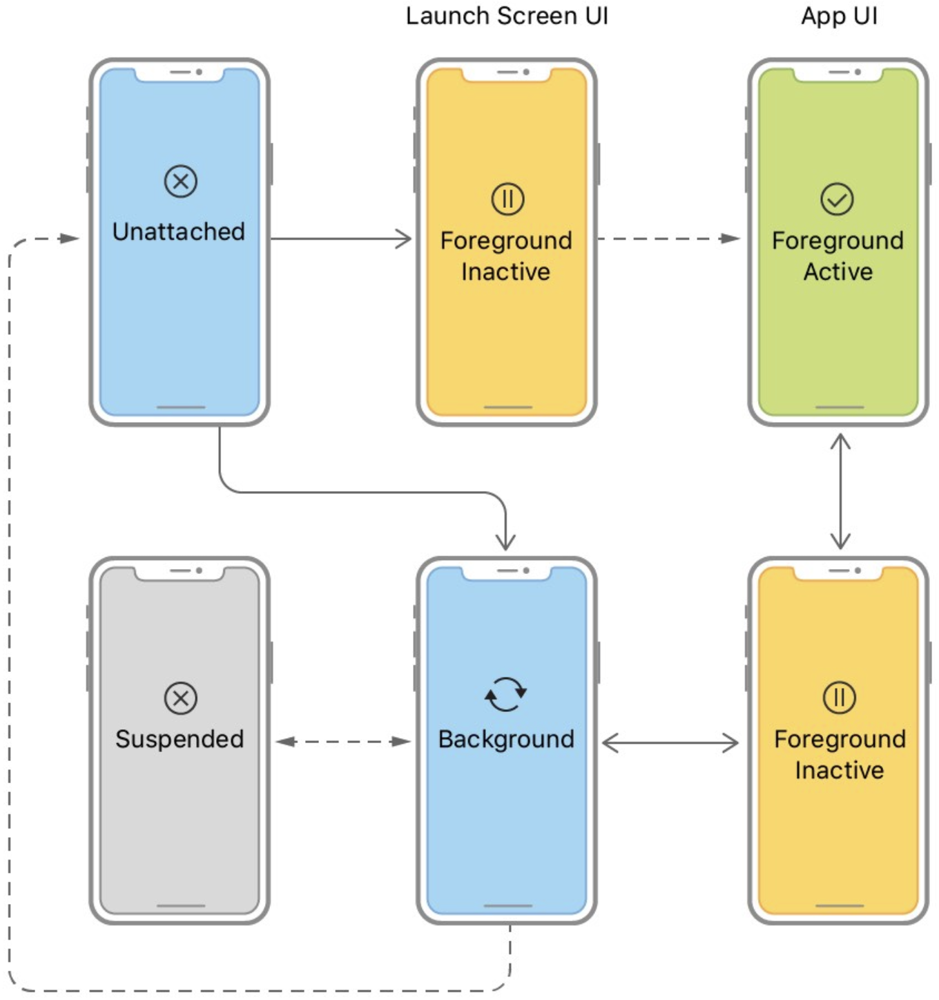

- Read through the provided methods and their comments to learn about what the methods do. As always, you can Option-click a method's signature to see more information.

- **Will Connect To**

  - This method is called with a scene instance that is being connected to your app. This provides you with an opportunity to perform any necessary steps to prepare for the additional scene such as fetching data from your local persistence store or opening network connections.

    - ```swift
        func scene(_ scene: UIScene, willConnectTo session: UISceneSession, options connectionOptions: UIScene.ConnectionOptions) {
            // Use this method to optionally configure and attach the UIWindow `window` to the provided UIWindowScene `scene`.
            // If using a storyboard, the `window` property will automatically be initialized and attached to the scene.
            // This delegate does not imply the connecting scene or session are new (see `application:configurationForConnectingSceneSession` instead).

            guard let _ = (scene as? UIWindowScene) else { return }
        }
      ```

- **Scene Did Disconnect**

  - This method, called when the scene has been removed from your app, is the best place to clean up and release any resources or to save files that were necessary for the scene. UIKit disconnects scenes when a user explicitly closes them in the app switcher and can disconnect scenes in the background state on behalf of the system to free up resources for other active applications. It's not as commonly overridden as sceneDidEnterBackground(_:) below. A scene is not guaranteed to be disconnected when the user switches to another app.

    - ```swift
        func sceneDidDisconnect(_ scene: UIScene) {
            // Called as the scene is being released by the system.
            // This occurs shortly after the scene enters the background, or when its session is discarded.
            // Release any resources associated with this scene that can be re-created the next time the scene connects.
            // The scene may re-connect later, as its session was not necessarily discarded (see `application:didDiscardSceneSessions` instead).
        }
      ```

- **Scene Did Become Active**

  - This method is called to let your scene know that it moved from the foreground inactive state to the foreground active state, which can occur when a user switches to your scene. Scenes can also return to the foreground active state if the user chooses to ignore an interruption, such as an incoming phone call or system alert, that temporarily sent the app into the inactive state.

    - ```swift
        func sceneDidBecomeActive(_ scene: UIScene) {
            // Called when the scene has moved from an inactive state to an active state.
            // Use this method to restart any tasks that were paused (or not yet started) when the scene was inactive.
        }
      ```

- **Scene Will Resign Active**

  - The next method is called when the scene is about to leave the foreground active state. This event can happen when the user has closed the scene or quit the app, but it's also called when the app is interrupted temporarily by a phone call or system alert.

    - ```swift
        func sceneWillResignActive(_ scene: UIScene) {
            // Called when the scene will move from an active state to an inactive state.
            // This may occur due to temporary interruptions (ex. an incoming phone call).
        }
      ```

- **Scene Will Enter Foreground**

  - This method is called as part of the transition from the background state to the foreground active state — immediately before sceneDidBecomeActive(_:). You can use this method to undo many of the changes made to your scene when it entered the background.

    - ```swift
        func sceneWillEnterForeground(_ scene: UIScene) {
            // Called as the scene transitions from the background to the foreground.
            // Use this method to undo the changes made on entering the background.
        }
      ```

- **Scene Did Enter Background**

  - The next method is called immediately after the sceneWillResignActive(_:) method, once the scene has actually entered the background state. This is the right time to spin down demanding processes and save the user's work or progress.

    - ```swift
        func sceneDidEnterBackground(_ scene: UIScene) {
            // Called as the scene transitions from the foreground to the background.
            // Use this method to save data, release shared resources, and store enough scene - specific state information to restore the scene back to its current state.
        }
      ```

#### Try It Out

- Add a print statement to each of the delegate methods in both AppDelegate and SceneDelegate that describes what happens to trigger the method. For example, print("Application did finish launching.") in the application`(_:didFinishLaunchingWithOptions:)` method, and print("Scene will resign active.") in `sceneWillResignActive(_:)`.
- Run the app in Simulator. When you open the app, you'll see four messages print to the console:
  - Application did finish launching.
  - Scene will connect to session.
  - Scene will enter foreground.
  - Scene did become active.
- Dismiss the app and return to the Home screen. You'll see two more messages print to the console:
  - Scene will resign active.
  - Scene did enter background.
- Open the app switcher and reopen the app. You'll see another two messages print to the console:
  - Scene will enter foreground.
  - Scene did become active.
- Open the app switcher again, then return to the app. You'll see two more messages print to the console:
  - Scene will resign active.
  - Scene did become active.
- Take note of the various delegate methods and how you might use them when building your apps. As you can see from this exercise, they provide useful hooks to execute code at each app transition—even though you may not need to use all of them in every app you build.

#### Which Method Should I Use?

- You've learned about the many options for responding to different transitions in your app. For now, focus on three methods that will run when launching, reopening, or closing your app:
  - `application(_:didFinishLaunchingWithOptions:)`
  - `sceneDidBecomeActive(_:)`
  - `sceneWillResignActive(_:)`
- As you become more experienced and build more complex apps, you'll encounter situations where you'll want to take advantage of the other delegate methods.

#### Lab - App Event Count

- **Objective**

  - The objective of this lab is to create an app that provides a visual representation of the app life cycle. Your app will update labels on the view when different delegate methods are called.
  - Create a new project called "AppEventCount" using the iOS App template. When creating the project, make sure the interface option is set to "Storyboard."

- **Step 1 Add Event Counters to AppDelegate**

  - Open AppDelegate and create two variables at the top to count the number of times the app has launched and the number of times it has created a configuration for connecting to a scene.

    - ```swift
        var launchCount = 0
        var configurationForConnectingCount = 0​
      ```

  - Increment both of these counts by 1 within the corresponding methods.

- **Step 2 Set Up Your View and View Controller**

  - As with all apps created using the iOS App template, your app starts out with one view controller. Drag seven labels to it, one for each of the following seven AppDelegate and SceneDelegate life cycle methods. Set up constraints as necessary. Hint: Consider using a stack view.
    - application(_:didFinishLaunchingWithOptions:)
    - application(_:configurationForConnecting:options:)
    - scene(_:willConnectTo:options:)
    - sceneDidBecomeActive(_:)
    - sceneWillResignActive(_:)
    - sceneWillEnterForeground(_:)
    - sceneDidEnterBackground(_:)
  - You'll use the labels to display the number of times that each event has occurred. Create an outlet for each label, using descriptive names like `didFinishLaunchingLabel` and `didBecomeActiveLabel`.
  - Also, for each label corresponding to the scene events (not AppDelegate events), create a variable to store a count of how many times its delegate method has been called. Set the initial value of each variable to 0, as in the following example:
`var willConnectCount = 0`

- **Step 3 Access Count vars From AppDelegate**

  - To update your UI for the application(_:didFinishLaunchingWithOptions:) and application(_:configurationForConnecting:options:) calls, you'll need access to the two variables you created in AppDelegate. In ViewController, add the following variable: `var appDelegate = (UIApplication.shared.delegate as! AppDelegate)`
  - This will allow you to access AppDelegate and your count variables within ViewController. Your AppDelegate instance is known as a singleton and can be accessed in this manner. Since you know what the type is, you can safely downcast it using `as! AppDelegate`.
  - ​​While it may be convenient to access AppDelegate anywhere, making it tempting to fill it with information, it's a best practice to keep it focused on its responsibilities. In this case, you're accessing it for information that it is responsible for.
  - Create an updateView() method that updates each label with its count. For the AppDelegate events, you'll access your variables via your new appDelegate variable, and for scene events, you'll use the instance variables that you created within ViewController. Update the labels in updateView(), as in the following example: `launchLabel.text = "The App has launched \(appDelegate.launchCount) time(s)"`

- **Step 4 Give SceneDelegate Access To ViewController**

  - In the SceneDelegate class, just below the line var window: UIWindow?, create a variable property called `viewController` that is of type `ViewController?`. Be sure to make it optional.
  - At the top of the scene(_:willConnectTo:options:) method, set the property `viewController` equal to the `rootViewController`. This will give the SceneDelegate access to the instance of ViewController, enabling you to write code that increments the corresponding count properties on ViewController each time an app life cycle method has been called, as in the following example: `viewController = window?.rootViewController as? ViewController`
 
- **Step 5 Increment the Count Properties**

  - In scene(_:willConnectTo:options:), increment the count of the ViewController property corresponding to the scene connecting: `viewController?.willConnectCount += 1`
  - Repeat this step for the other SceneDelegate methods:
    - sceneDidBecomeActive(_:)
    - sceneWillResignActive(_:)
    - sceneWillEnterForeground(_:)
    - sceneDidEnterBackground(_:)

- **Step 6 Regularly Update the View**

  - Your view will need to update regularly to display the new counts for each app event. You might think to call updateView() in the viewDidLoad() method of your ViewController, but there's a problem: viewDidLoad() won't be called at all the app events. 
  - There's a better place to update the view. One of the scene event methods, `sceneDidBecomeActive(_:)`, will be called after each of the other life cycle methods is called and just before the user can interact with the scene again. The `sceneDidBecomeActive(_:)` method is the perfect place to call the view controller's updateView(), ensuring that the labels display the proper count.

- **Step 7 Test**

  - Run the app in Simulator.
  - The labels for both the app did finish launching and the scene did become active events should show 1 for their counts.
  - Go to the Home screen on Simulator.
  - Return to the app and observe which other labels have changed.
  - Bring up the app switcher, but instead of changing apps, return to the same app. Which labels have changed?
  - When the user quits your app or dismisses a scene, `sceneDidDisconnect(_:)` will be called—but adding a label and counter the same way for this method would be ineffective, as the data would be lost between terminations.
  - Great job! You've made an app that helps you visualize the app life cycle. Be sure to save it to your project folder.

### Lesson 1.3 Model-View-Controller

#### Overview

- At this stage of the course, you're probably beginning to feel more comfortable with how apps work and how to build basic app features. You've seen how even relatively simple apps rely on many files, structures, and classes. Imagine how the code for a medium-sized app might span across hundreds of files in your project.
In this lesson, you'll learn how to organize files, structures, and classes into a design pattern called Model-View-Controller, or MVC. MVC will help you architect the files in your app as well as the interactions and relationships between different types and instances.
- MVC is not a trivial topic. This lesson will help you get started, but you'll continue learning about and reinforcing your understanding of MVC concepts for a long time. You'll learn the intricacies of implementing proper MVC patterns in your app from sample code, from building your own apps, and from mentors and teachers.
- Keep in mind that there's never one right answer to any architecture decision. There are best practices, but style and personal preference will play a role in how you choose to organize your app's projects and relationship models.
- Now that you've started to build more complex projects, you know quite a bit about how different classes and structures work together. And you've probably noticed some patterns emerge.
- For example, you know you can use AppDelegate and SceneDelegate methods to handle different events in the app life cycle. You know you can edit the Main storyboard file in Interface Builder to define views and create user interfaces. You've worked with view controller files that define how a scene should respond when the user taps a button or navigates between screens. And you've seen specific classes that represent data for your app to display.
- So far in this course, you've followed specific instructions that told you what classes or structures to create and which properties or functions to add to them. But before that, someone had to decide how all the pieces were going to work together. How would you decide which new classes or structures to create? How do you know what properties to have? Or which objects should call functions on other objects?
- These are all great questions. And by asking them, you're graduating from someone who's simply following instructions to a programmer who's making decisions.
- For decades, software developers have studied and practiced different ways of answering these questions. As software development has matured, a few common design patterns have emerged. One of the most prevalent patterns is Model-View-Controller, or MVC. MVC assigns objects to one of three roles — model, view, or controller — and helps define the way objects communicate with each other.
- The diagram below provides an overview of how the three types of objects work in relation to one another. Each layer, or type, has specific roles and guidelines for communicating with the other layers.

  - 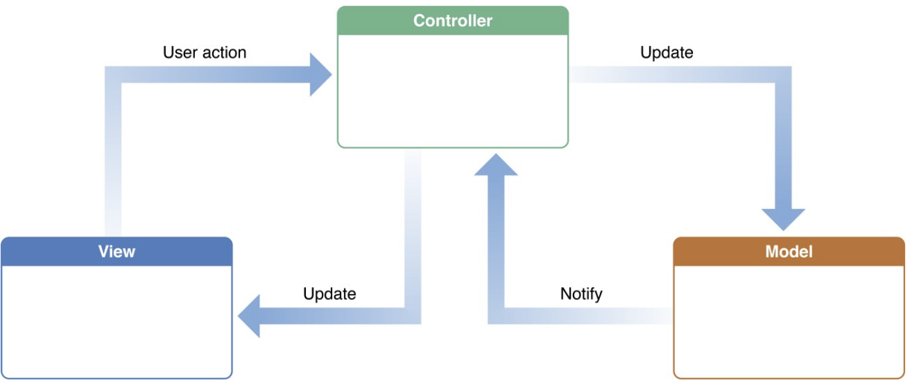

- Before trying to understand how the interactions work, you should understand what each type of object is responsible for. As you read the descriptions below, revisit the diagram and review the interactions between the types of objects.

#### Object - Model

- A model object groups the data you need to represent items or concepts. These items or concepts might be unique to your app, such as a character in a game or a task in a to-do list, or they might represent things in the real world, such as a person and their contact information in an address book, or an item to be purchased from a store.
- Model objects can be related to other model objects. A model object for a car might have a driver property, or that game character might have an array of inventory items.
- In most cases, you'll create model objects by defining structures or classes in your project. And you'll typically define the structures or classes in new Swift files. 
- Model objects are made up of properties that represent attributes of the type, and they sometimes have methods for updating and modifying their own properties.
- **Communication**
  - Model objects are usually created in response to some user interaction with a view or a control. The message to create the model object is transmitted from the view through a controller object, which is most often a subclass of a view controller. That said, model objects

#### Object - View

- You've already learned that views are the visual aspects of the user interface. A view object knows how to draw itself on the screen and can respond to user input. A major purpose of view objects is to display data about an app's model objects and to allow the user to edit that data. 
- Views can be reused or reconfigured to show different instances of model data. For example, a view object in the Contacts app can be used to display information about any contact, and a view in Mail can be used to show any message.
- Views often have an update or configure function that accepts a model object as a parameter; the view uses the model object to update itself to match the data it's meant to display. For example, imagine a table view cell displaying a photo of a player along with the player's current score. The view might have an update(_:) method that assigns the player's image to an image view and the player's score to a label.
- When building an iOS app, you'll typically define the view layer in Interface Builder. Views can then be referenced or used in a view controller class as outlets or actions.
- **Communication**
  - Even though views are commonly used to display data about an app's model objects, views should never own a model object as a property or modify a model object directly. Instead, the view can send a message — for example, that the user has performed an action — to a view controller, and the controller will update the model object.

#### Object - Controller

- A controller object acts as the messenger between views and model objects. For example, when the user interacts with a view, the view sends a message to a view controller, and the view controller can then update the model object. Alternatively, when a model object is created or updated, a view controller can tell its view to redraw or update itself with the new data.
- In fact, the view controller is the most common type of controller for new iOS developers. As you've learned, a view controller controls a view along with its accompanying subviews and usually displays information about one or more model objects. The model object, or collection of model objects, is usually defined as a property on the view controller. When the user interacts with a view or control, an action or block of code is triggered on the view controller, which can then update the model object.
- There are two other types of controllers: model controllers and helper controllers.
- **Model Controllers**
  - Similar to how a view controller controls a view, a model controller helps control a model object or a collection of model objects. There are three common reasons you might want to create a model controller:
    - Multiple objects or scenes need access to the model data.
    - The logic for adding, modifying, or deleting model data is complex.
    - You want to keep the code in your view controllers focused on managing the views.
  - For example, imagine you're working on a simple Notes app that syncs the user's notes to a server. The app has two scenes: a list view, which displays all the notes in a table view, and a detail view, which allows the user to create a new note or read and edit a preexisting note.
  - If you used only view controllers, the list view controller would take on the majority of the work in the app — not only managing the list view but also managing all the model data, including fetching the note data from the server, adding new notes, replacing modified notes, deleting notes, and saving all changes to the server.
  - Instead, you might decide to abstract, or move, all the code that manages notes to a separate model controller called NoteController. This approach allows the view controller to focus only on displaying the notes and leaves the networking and model management to the model controller. 
  - Using model controllers isn't required; in fact, it's not a common practice in small projects. But abstraction is crucial when working on larger projects or working with other developers, because it makes your code simpler, more readable, and easier to maintain.
- **Helper Controllers**
  - Helper controllers are useful anytime you want to consolidate related data or functionality so that it can be accessed by other objects in your app. One common example of a helper controller is a NetworkController, which manages all the network requests in a given app.
  - Controllers should perform a very specific function without depending on other controllers to perform their work. For example, a NoteListViewController might display a list of notes, and a NoteDetailViewController might display the details about an individual note instance and respond to user input to modify or create a note.
- **Communication**
  - Besides mediating the communication between models and views, controller objects can communicate or work directly with other controller objects. Consider the examples above. The initial view controller of a Notes app (NoteListViewController) might be responsible for displaying a list of notes, so it accesses the notes property on a note model controller (NoteController). The note model controller needs to check whether there are any new notes, so it tells the network controller (NetworkController) to check the web service for new data. If the NetworkController finds new notes, it downloads the data and sends it back to the NoteController, which would then update its notes property and send a callback to the NoteListViewController that it has new data, enabling the NoteListViewController to update its view of notes.

#### Example

- Imagine you're tasked with building an app to track photos of meals that the user has eaten, along with notes and an optional rating of each meal. What model objects will you need? What views? What controllers?
- Before moving on, take a moment to consider how you might plan, or architect, this simple app using model, view, and controller objects.
- **Model**
  - If the app is going to track meals, it makes sense to have a model object called Meal that holds the data about each meal. Each meal should have a name, and — according to your feature description — it also needs to have a photo, notes, and a rating.
  - Next, you'll need to consider how your model objects will be displayed in the app — and your decisions will impact the properties to keep on your model objects. For example, if you want to make sure that a list of meals is displayed in the order that the meals were added, you may need to include a timestamp on each meal object.
  - So your model object might be declared as a structure or a class with five properties:

    - ```swift
        struct Meal {
            var name: String
            var photo: UIImage
            var notes: String
            var rating: Int
            let timestamp: Date
        }
      ```

- **View**
  - You can imagine that the app will need at least two views, or scenes. Just like in the Notes example, one scene will display a list of all the meals that the app has tracked, and another scene will display the details of a meal.
  - The meal list scene could display the list in a table view, with the name and photo of each meal in an individual cell. The meal detail scene could then display the name of the meal in the navigation bar, a photo in an image view, notes about the meal in a text view, and the current rating in a segmented control.
  - Each of these two views will need a view controller class that can manage the model data it's displaying and can respond to user interactions.
  - In most cases, you'll use a storyboard to define your views in Interface Builder. You'll assign each view a view controller class, where you can add actions or outlets to respond programmatically to user interaction and to update the view.
  - Occasionally, you may build a view that requires its own class definition. For example, you may have a custom table view cell with a button, which would require you to create a subclass of the cell type and add functionality in the class definition. You'll learn more about custom views with subclasses later.
- **Controller**
  - At a minimum, you'll need a controller for the meal list and meal detail views. For the meal list, you should use a UITableViewController, which displays data in a table, and for the detail view controller you should use a UIViewController. Some of the table view setup that follows will be unfamiliar to you, but don't worry — you'll learn more about UITableViewController and setting up table views in a future lesson.
- **Meal List Table View Controller**
  - `class MealListTableViewController: UITableViewController {...}`
  - The MealListTableViewController should have a property that holds a collection of meals to display.
  - The properties you add to a table view controller subclass — in this case, MealListTableViewController — should reflect anything that makes it different from a plain UITableViewController.
    - `class MealListTableViewController: UITableViewController { var meals: [Meal] = [] }`
  - Because the collection of meals lives on MealListTableViewController, the controller should handle adding and deleting meals from the collection. One approach would be to modify the array directly, but you might choose instead to define functions that add or remove meals from the array.
  - When the user quits the app, they'll expect it to save any meal data they just entered or modified. In this example, MealListTableViewController is the intermediary between the view and the meal model data, so it should take responsibility for saving data to disk, as well as for loading data when the app launches and before the view is displayed.

    - ```swift
        class MealListTableViewController: UITableViewController {
            var meals: [Meal] = []
            func saveMeals() {...} 
            func loadMeals() {...}
        }
      ```

  - The view controller should also respond to any user events. What events might the list view handle?
  - List views usually let the user select an item to display more details about the item. You'd enable that functionality by adding a segue from the list view scene to the detail view scene in the storyboard. You'll also need to add and implement the `prepare` function that passes the selected meal to the detail scene.
  - When all is said and done, you'll likely end up with a view controller that looks similar to this:

    - ```swift
        class MealListTableViewController: UITableViewController {
            var meals: [Meal] = []
            override func viewDidLoad() {
                super.viewDidLoad()
                // Load the meals and set up the table view
            }
            // Required table view methods

            override func tableView(_ tableView: UITableView, numberOfRowsInSection section: Int) -> Int {...}

            override func tableView(_ tableView: UITableView, cellForRowAt indexPath: IndexPath) -> UITableViewCell {...}

            // Navigation methods

            @IBSegueAction func showMealDetails(_ coder: NSCoder) -> MealDetailViewController? {
                // Initialize MealDetailViewController with selected Meal and return
            }

            @IBAction func unwindToMealList(sender: UIStoryboardSegue) {
                // Capture the new or updated meal from the MealDetailViewController and save it to the meals property
            }

            // Persistence methods

            func saveMeals() {
                // Save the meals model data to the disk
            }

            func loadMeals() {
                // Load meals data from the disk and assign it to the meals property
            }
        }
      ```

  - Once you've planned the required features of the list view controller, consider the detail view controller. How will the two controllers interact with each other?
- **Meal Detail View Controller**
  - `class MealDetailViewController: UIViewController {...}`
  - The MealDetailViewController will display the details about an individual meal. You can use Interface Builder to set up views for displaying the name, the image, the notes, and the rating, then create outlets to MealDetailViewController. Your view controller should also have a property for the meal that will be displayed.
  - Providing a custom initializer and using@IBSegueAction to display the detail controller from MealListTableViewController allows you to guarantee that a model is provided, so that you do not need to worry about handling optional values.

    - ```swift
        class MealDetailViewController: UIViewController {
            var meal: Meal

            @IBOutlet var nameTextField: UITextField!
            @IBOutlet var photoImageView: UIImageView!
            @IBOutlet var ratingControl: RatingControl!
            @IBOutlet var saveButton: UIBarButtonItem!

            init?(coder: NSCoder, meal: Meal) {
                self.meal = meal
                super.init(coder: coder)
            }

            override func viewDidLoad() {
                super.viewDidLoad()
                // Update view components using the Meal model
            }
        }
      ```

  - The MealDetailViewController should handle updating the view it controls with the information about the model object (the meal) it's meant to display. Many times you can do this right in viewDidLoad(), but you may want to break the process out into its own method — especially if the model can change.
  - The detail view controller might have additional methods to allow the user to add a photo or to modify other properties of the meal. In those scenarios, it will need some way to know whether it's displaying an existing meal or creating a new meal.
  - After accounting for all the tasks the detail view controller is handling, the result might look something like this:

    - ```swift
        class MealDetailViewController: UIViewController, UIImagePickerControllerDelegate {

            @IBOutlet var nameTextField: UITextField!
            @IBOutlet var photoImageView: UIImageView!
            @IBOutlet var ratingControl: RatingControl!
            @IBOutlet var saveButton: UIBarButtonItem!

            var meal: Meal

            init?(coder: NSCoder, meal: Meal) {
                self.meal = meal
                super.init(coder: coder)
            }

            override func viewDidLoad() {
                super.viewDidLoad()
                // Update view components using the Meal model
            }

            // Navigation methods

            override func prepare(for segue: UIStoryboardSegue, sender: Any?) {
                // Update the meal property that will be accessed by the MealListTableViewController to update the list of meals
            }

            @IBAction func cancel(_ sender: UIBarButtonItem) {
                // Dismiss the view without saving the meal
            }
        }
      ```

- **A Reminder**
  - MVC is a tool to help you write clean, maintainable, and organized code. But there's more than one way to implement it. If you were to plan out the same classes for the same app, you might end up with different variable names, different function names, different model objects, and different interfaces for your view hierarchies.
  - When thinking through MVC, developers have their own distinct styles and patterns. Since you're going through this course, you'll tend to follow the patterns used here. But as you grow and gain more experience, you'll come up with your own preferences for how to architect the objects in your apps.
  - You'll also develop your own perspective on the advantages and guidelines behind the MVC design pattern. Look at sample code and previous projects for further guidance. And don't be afraid to ask someone with more experience to mentor you in the best approach to app architecture.

#### Project Organization

- Xcode projects get crowded quickly. Even small apps can have dozens or hundreds of files that define different views, storyboards, structures, classes, protocols, and controllers. Writing navigable code is an important part of building any program. If you aren't careful, your project can quickly become disorganized, which will make it hard to continue working productively.
- The first step in organizing your project is to create clear, descriptive filenames. For example, ProductListTableViewController.swift is much more descriptive than MainVC.swift. Descriptive names for classes, structures, protocols, properties, and functions will also help you stay productive. Some developers worry that they'll have to write long names over and over again, but the autocompletion feature in Xcode makes it easy, so there's no advantage to a short name.
- Another good practice is to create separate files for each of your type definitions, such as classes, structures, protocols, and enumerations. For example, create separate Car.swift, Driver.swift, RaceTrack.swift, and Garage.swift files, rather than one combined Model.swift file.
- One more thing: Write your code as if complete strangers are going to read it. You might think this only matters when you're working with other people, but it also applies to code only you will see. When you need to revise your code six months down the road, you'll appreciate descriptive names, clear function signatures, and details comments.
- Xcode also provides a grouping feature to help you organize code. It's basically a way to group your files into folders within your project, so that you don't end up with one never-ending list of files in the Project navigator.
- Many developers make groups for the following:
  - View controllers
  - Views
  - Models
  - Model controllers
  - Other controllers
  - Protocols
  - Extensions
  - Resources
    - Storyboards
    - Frameworks
- For now, you might want to keep your AppDelegate, SceneDelegate, and Main files on the top level and use a shorter list of groups:
  - Models
  - Other controllers
  - Storyboards
  - View controllers
  - Views

    - 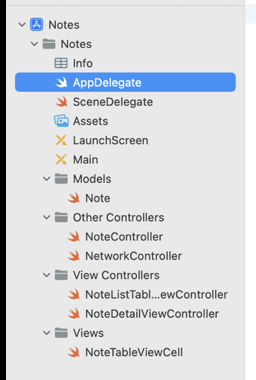

- It's worth noting that the way you organize your project in Xcode may not always change the way your files are saved in the project directories; depending on how groups are created, it might only affect how files are displayed within Xcode itself. In Xcode, this is signified by two different folder icons. A group that is used to organize information logically in your project but that does not represent a folder that you would see in Finder is denoted by a shaded lower-left corner in the folder icon.

  - 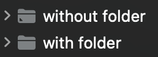

- When creating groups in Xcode's navigator, you will see two options: New Group and New Group without Folder. The latter does not create a folder on disk — it's simply visual organization within Xcode.
- The specifics of how to organize your projects will depend on what you're building. For now, think simple. Allow yourself time to keep things organized so that your projects are easy to navigate. You'll appreciate it later.

#### Lab - Favorite Athletes

- **Object**
  - In this lab, you'll plan out and create an app that uses proper MVC design. Your app will have two screens for displaying the user's favorite athletes. It will allow the user to add new athletes to the list and to edit existing entries.
  - In your student resources folder, open the starter project called "FavoriteAthlete." The app is already set up with a table view for displaying a list of athletes and a form for collecting information about an individual athlete.
- **Step 1 Make a Plan**
  - Based on the app description, think through the following questions and write down your answers in a brief outline:
    - What model object(s) will you need for this app?
    - What properties will the model object(s) need?
    - In addition to the view controller provided in the starter project, what other controllers will you need?
    - What properties and functions will the controllers need?
  - Did you come up with a plan for moving forward? Your design may differ slightly from the steps in this lab, and that's OK. In app design, there's no one right way to do things. But for the purposes of this project, you'll use the following model and controllers:
    - The Athlete model will store information, through properties, for the athlete's name, age, league, and team.
    - The AthleteTableViewController will handle the view associated with displaying the user's list of favorite athletes.
    - The AthleteFormViewController will handle the views and user input associated with entering and editing athlete information.
- **Step 2 Examine the Starter Project**
  - Take a look at the view controllers in the storyboard. You'll see a table view controller that has two segues to a form. One segue has an identifier of AddAthlete and originates from an Add button. The other segue has an identifier of EditAthlete and originates from a table view cell.
  - The form has a Save button that you'll use to trigger an unwind segue to bring the user back to the table view.
  - The table view controller's subclass has already been created and set as AthleteTableViewController. At the moment, you'll see an error in this file. That's because it references a type, Athlete, that hasn't been created yet.
- **Step 3 Create the Model**
  - Create a new Swift file named "Athlete."
  - In the file, create an Athlete struct that has the following properties: name, age, league, and team.
  - Add a computed property description of type String that uses the four properties to return a phrase describing the athlete, as in the following:

    - ```swift
        var description: String {
            return "\(name) is \(age) years old and plays for the \(team) in the \(league)."
        }
      ```

- **Step 4 Create and Implement a View Controller Subclass**
  - Create a new Cocoa Touch Class file that subclasses UIViewController and is named “AthleteFormViewController.” In the Main storyboard, use the Identity inspector to set the class of the form scene to your new subclass.
  - Add a variable property athlete of type Athlete? to your AthleteFormViewController class. Why is this variable optional? It will be nil when the user comes to the screen to create a new athlete, and it will have a value when the user comes to the screen to edit an athlete.
  - Create a custom initializer with the signature init?(coder: NSCoder, athlete: Athlete?). Assign self.athlete to your instance variable and call the super implementation. Satisfy the compilation error that this creates by using Xcode's fix-it suggestion.

    - ```swift
        class AthleteFormViewController: UIViewController {
            var athlete: Athlete?
            
            init?(coder: NSCoder, athlete: Athlete?) {
                self.athlete = athlete
                super.init(coder: coder)
            }
            
            required init?(coder: NSCoder) {
                // fatalError("init(coder:) has not been implemented")
                super.init(coder: coder)
            }
            ...
      ```

  - Create an updateView() method and call it in the viewDidLoad() method.
  - Add outlets from the storyboard to all the text fields in AthleteFormViewController. In the same file, add an action for the Save button.
  - In updateView(), unwrap the athlete property and check whether it contains an Athlete object. If so, use the object to update the text fields with the athlete's information.

    - ```swift
        func updateView() {
            guard let theAthlete = athlete else { return }
            nameTextField.text = theAthlete.name
            ageTextField.text = "\(theAthlete.age)"
            leagueTextField.text = theAthlete.league
            teamTextField.text = theAthlete.team
        }
      ```

  - Inside the the action for the Save button, create an Athlete object by unwrapping the text from the text fields and passing it to the Athlete initializer, as follows:​

    - ```swift
        guard let name = nameTextField.text,
            let ageString = ageTextField.text,
            let age = Int(ageString),
            let league = leagueTextField.text,
            let team = teamTextField.text else {return}
         
        athlete = Athlete(name: name, age: age, league: league, team: team)
      ```

- **Step 5 Finish Implementing AthleteTableViewController**
  - In the starter project for this lab, most of the AthleteTableViewController class has already been implemented. You'll learn how to set up a table view on your own in a later lesson. For now, you simply need to create the functionality for informing the next view controller which athlete was tapped and for receiving information about an added or edited athlete.
  - Create an @IBSegueAction from the AddAthlete segue by Control-dragging from the segue arrow between the two controllers into AthleteTableViewController. Name it `addAthlete` with no arguments. Do the same for the EditAthlete segue, naming the action `editAthlete` and setting Arguments to `Sender`.
  - In the addAthlete method, instantiate and return a new instance of AthleteFormViewController.
  - When the editAthlete method is called, the sender parameter will be the cell that was touched. Since you haven't yet learned about table views, this next part might be tricky, but see if you can follow along. Your Athlete objects are stored in an array called athletes in the table view controller. The index of each athlete in the array corresponds to the index of the table cell displaying that athlete. UITableView provides a method to look up a cell's IndexPath, which you can use to look up the corresponding Athlete in your athletes array.
  - In the editAthlete method, unwrap the `sender` and cast it to a `UITableViewCell`, then use UITableView's `indexPath(for:)` method to get the IndexPath for the cell. The index path method returns an optional, so you can include that call in your unwrapping logic. Once you have the index path, you can access its row property, which translates to the index of the athlete in your athletes array. Your implementation might look like the following:​

    - ```swift
        let athleteToEdit: Athlete?
        if let cell = sender as? UITableViewCell,
          let indexPath = tableView.indexPath(for: cell) {
            athleteToEdit = athletes[indexPath.row]
        } else {
            athleteToEdit = nil
        }
         
        return AthleteFormViewController(coder: coder, athlete: athleteToEdit)
      ```

  - Next, you'll enable the table view controller to receive an Athlete object back from the AthleteFormViewController in the event that a new athlete has been added or an existing athlete has been edited. You will do this with an unwind segue. In AthleteTableViewController, add an @IBAction method that takes a parameter of type UIStoryboardSegue. Inside the body of this method, you'll first need to cast the segue's source view controller as an AthleteFormViewController and unwrap its athlete property with a guard statement.
  - Which index path, if any, was selected before going to AthleteFormViewController? You can use the table view's indexPathForSelectedRow property in combination with conditional binding to discover the path. If the returned index path is successfully unwrapped, the Athlete object coming back is an edited athlete, not a new athlete. You'll need to use the index path to replace the existing athlete in the athletes array. If the returned index path is unsuccessfully unwrapped, the Athlete object coming back is a new athlete—in which case you can simply append the new athlete to the end of the athletes array. Here's how all this works:​

    - ```swift
        @IBAction func unwindToAthleteList(segue: UIStoryboardSegue) {
            guard let athleteFormViewController = segue.source as? AthleteFormViewController,
                  let athlete = athleteFormViewController.athlete else { return }
            if let selectedIndexPath = tableView.indexPathForSelectedRow {
                athletes[selectedIndexPath.row] = athlete
            } else {
                athletes.append(athlete)
            }
        }
      ```

- **Step 6 Perform the Unwind Segue in Storyboard**
  - Finally, you need to create the unwind segue. In the storyboard, Control-drag from the Athlete Form View Controller to the view controller's Exit, then choose your unwind segue: `unwindToAthleteListWithSegue`. Give this segue a name, `segueForm`, by selecting it in the Document Outline and adding the identifier in the Attributes inspector.
  - Now you need to instruct the segue when to execute in the AthleteFormViewController. Do this by calling `performSegue(withIdentifier:sender:)` at the end of your Save button's @IBAction method, passing in the identifier of the unwind segue and self as the sender: `performSegue(withIdentifier: "segueForm", sender: self)`
  - Now run the app and see if you can add and edit your favorite athletes.
  - Congratulations! You've planned and created a simple app using MVC principles. Be sure to save your work to your project folder.

### Lesson 1.4 Scroll Views

- Whenever your app needs to display content or allow manipulation of content that doesn't fit entirely on the screen, it's time for a scroll view. You can see an excellent example in the Photos app. Open Photos on an iOS device and select a photo. At first tap, the picture will fill as much of the screen as possible while maintaining the same aspect ratio. Now imagine you want to inspect a particular detail of the image. Zoom into your picture by double-tapping. Even though the photo is now bigger than the screen — especially if you're using a smaller device — you'll be able to scroll anywhere you like on the image.
- A UIScrollView needs to know two sets of information to function: the position and size of the scroll view, and the size of the content being displayed. Programmatically, these values are stored in the scroll view's frame property and contentSize property, respectively. Both properties can be managed using Auto Layout and Interface Builder.
- For scrolling to happen, the width or height (or both) of the content size must be greater than the frame's width or height. In the layout below, the frame size is represented by the red box. Notice that the content height is greater than the frame height and the content width is the same as the frame width - so this view will only scroll vertically.

  - 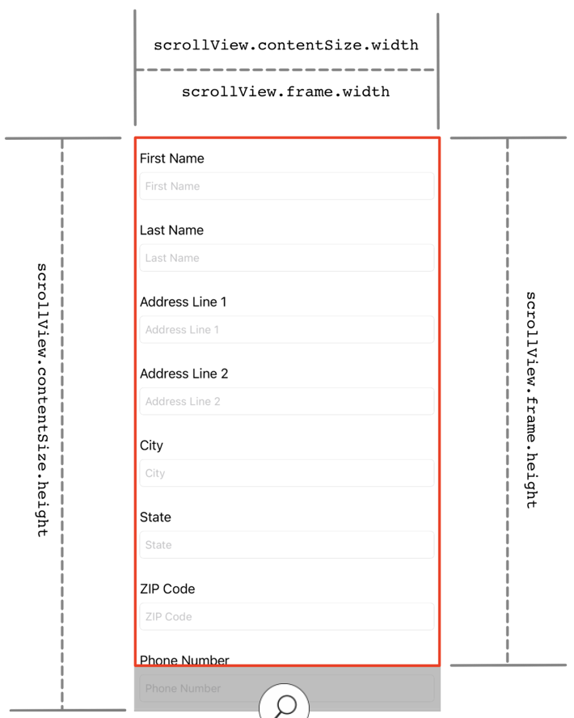

- By adjusting the sizes, you can create scroll views that scroll horizontally, vertically, or both. In addition to the content size requirement, all views you wish to scroll must be subviews of the scroll view.

#### Scroll Views in Interface Builder

- In this lesson, you'll learn how to implement scroll views with the Auto Layout feature of Interface Builder. Imagine you're designing a UI that will allow users to enter their shipping information, perhaps as part of a checkout flow for an online purchase. It will look much like the layout above.
- Start by creating a new Xcode project using the iOS App template. Name the project "ScrollingForm." When creating the project, make sure the interface option is set to "Storyboard" and save it to your project folder.
- **Define Scroll View Frame**
  - In the Main storyboard, find a scroll view in the Objects library and drag it onto the view controller scene. Adjust the size of the scroll view to match the size of the scene's Safe Area.
  - Add constraints to pin all four edges of the scroll view to the edges of the view controller's Safe Area. These Auto Layout constraints apply to the scroll view's Frame Layout Guide and ensure the scroll view size is the same as the view controller's view — whether on an iPhone SE, an iPad Pro, or any device in between. The constraints also tell the scroll view its size and position.
- **Programmatic Constraints to Content Layout Guide**
  - If needed, you can also apply constraints programmatically to a scroll view's Content Layout Guide. In other words, you can not only constrain a scroll view's size and position but also place constraints to control the behavior of a scroll view's content. For example, if you have an image view inside of a scroll view that you want to stay centered when zooming in and out, you can anchor the center of of the image view to the center of the scroll view's Content Layout Guide, as follows:

    - ```swift
        imageView.centerXAnchor.constraints(equalTo: scrollView.contentLayoutGuide.centerXAnchor)
        imageView.centerYAnchor.constraints(equalTo: scrollView.contentLayoutGuide.centerYAnchor)
      ```

  - This is just one example, and while you won't use constraints on a scroll view's Content Layout Guide in this lesson's scrolling form, they can be useful in many scenarios.
- **Define Content View Using Stack View**
  - Next, you'll tell the scroll view the size of the content. For most common layout tasks, the logic to implement a scroll view with Auto Layout will be much easier if you use a dummy view to contain the scroll view’s content. The dummy view's job is to contain the content and, generally, it is not seen by the user. This is sometimes referred to as a content view.
  - To continue your form, you'll use a stack view to contain all your content.
    - Select a vertical stack view from the Object library and add it as a subview of the scroll view.
    - Adjust the size to be the same as the scroll view
    - Pin the edges of the stack view to the Content Layout Guide by Control-dragging from the Stack View in the outline to the Content Layout Guide on the Document Outline. By holding Command while clicking each constraint, you can add them all without the menu closing.

    - 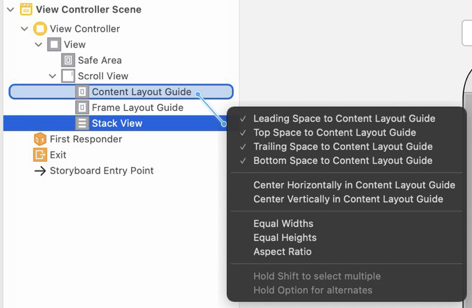

    - In the Document Outline, click the arrow next to Constraints, below Stack View, and expand the outline view's area so you can see the full set of constraints that were just added. Verify that each one's Constant value is set to 0.  The stack view now defines the scroll view's content area.
  - This form should only scroll vertically — not horizontally.
    - Create an Equal Widths constraint between the Stack View and the Frame Layout Guide by Control-dragging from one to the other in the outline.
    - Locate the new constraint in the outline and verify its Constant is 0 and Multiplier is 1. Now the width of the stack view will always be equal to the scroll view's frame, which means it can't scroll horizontally.

#### Creating the Form

- **Start Creating the Form**
  - Think back to the lesson on Auto Layout and stack views. You learned that when a stack view doesn't have a defined width or height, its size is based on its subviews. As you add content to the stack view, it expands to fit all your content. Thus, the content inside the stack view defines the stack view's size. It's only as big as it needs to be.
  - Because stack views grow to fit their content, they are a perfect candidate for holding the content of a scroll view. As the content grows, the scroll view will scroll to meet the needs of the content size.
  - In your ScrollingForm project, you'll add your scrolling content to the stack view. To simplify the process, you'll create a group of views that will allow you to add as many fields as you need. Each group will consist of three views: a UIView (to serve as a background and container), a label, and a text field. The label will tell the user what type of data to enter into the text field. Both will be subviews of the background view.
  - Drag a view from the Object library into the stack view. (Hint: Typing "UIView" in the library's filter is a quick way to find the view object.) Interface Builder is showing that you have layout issues, indicated by a white arrow inside a red circle in the Document Outline, as well as by the red layout indicators in the scene.
  - What's going on? You haven't defined enough size information for the scroll view's content size. For starters, the UIView you added doesn't have an intrinsic, or natural, size. Therefore, the stack view can't determine its size, which means the scroll view can't determine its content size. In the next section, after you've added the rest of your views, you'll make sure that you have enough constraints for the required size definitions.
  - Add a label to the view you just added. Use the alignment guides to place the label in the upper-left of the view.
  - Next, add a text field below the label - again, taking care to use the alignment guides.
  - Adjust the height of the view so that its bottom margin is aligned with the bottom of the text field.
  - Next, adjust the trailing edges of the label and text field so they're aligned with the margin of the view's trailing edge.
- **Add Constraints**
  - Now that your view is nicely aligned, adding constraints should be a breeze. Adding these constraints will resolve the layout issues discussed above by defining the content size of the scroll view. (If you need a quick review, check out the lesson on Auto Layout in Unit 2 of Develop in Swift Fundamentals.)
    - Select the label and click the Add New Constraints tool button. Add a constraint for each edge, '8'.
    - Select the text field and click the Add New Constraints tool button. Since you added a constraint between the text field and the label in the previous step, you only need to add constraints for the three remaining edges: leading: 8, trailing: 8, and bottom: 20
- **Add More Fields to Your Form**
  - If you ran your project now, would you be able to scroll? Why or why not? You'd be correct if you said "no." The content isn't bigger than the scroll view, so scrolling isn't necessary.
  - In the Document Outline, select the view in the stack view and copy it (Command-C). Paste it (Command-V) several times into the stack view, once for every field you want to include in your form. Since your form will collect users' shipping information, you'll probably need the following fields: first name, last name, address line 1, address line 2, city, state, ZIP code, and phone number. Don't forget to modify the labels with descriptions of the field content. 
  - Build and run your app on different devices. On larger devices, you may find there's enough room to display all the views — so the scroll view won't scroll. On smaller devices, such as an iPhone XS, you won't be able to see all the views, but you should be able to scroll to see the rest. If you don't have a physical device small enough, run the app on a small device in Simulator.

#### Keyboard Issues

- When you ran your app on smaller devices, you might have noticed that the keyboard covers some of the text fields while they are being edited.
- Obviously, it's not a good experience if the user can't see the text they're entering. This lesson doesn't provide details about keyboard management with scroll views, but here's a brief explanation that will help you handle the problem.
- iOS sends a notification every time the keyboard is shown. You can add code to listen for the notification and execute a function when the notification is posted. And, because the notification includes the keyboard size, your function can adjust the scroll view so that its contents aren't overlapped by the keyboard. You can also add a listener for another notification that is posted when the keyboard will be hidden, allowing you to reverse the adjustments.
- If you're interested in learning more about notifications, check out the API Reference documentation for [Notification Center](https://developer.apple.com/documentation/foundation/notificationcenter).
- To adjust the size of the content view, you need to create an outlet from the scroll view to its view controller. Then you can add the following code to the ViewController class to fix the keyboard issues:

  - ```swift
      func registerForKeyboardNotifications() {
          NotificationCenter.default.addObserver(self, selector: #selector(keyboardWasShown(_:)), name: UIResponder.keyboardDidShowNotification,
          object: nil)
          NotificationCenter.default.addObserver(self, selector: #selector(keyboardWillBeHidden(_:)), name: UIResponder.keyboardWillHideNotification,
          object: nil)
      }

      @objc func keyboardWasShown(_ notification: NSNotification) {
          guard let info = notification.userInfo,
              let keyboardFrameValue = info[UIResponder.keyboardFrameBeginUserInfoKey]
              as? NSValue else { return }

          let keyboardFrame = keyboardFrameValue.cgRectValue
          let keyboardSize = keyboardFrame.size

          let contentInsets = UIEdgeInsets(top: 0.0, left: 0.0, bottom: keyboardSize.height, right: 0.0)
          scrollView.contentInset = contentInsets
          scrollView.scrollIndicatorInsets = contentInsets
      }

      @objc func keyboardWillBeHidden(_ notification: NSNotification) {
          let contentInsets = UIEdgeInsets.zero
          scrollView.contentInset = contentInsets
          scrollView.scrollIndicatorInsets = contentInsets
      }
    ```

- Now add the following line to viewDidLoad(): `registerForKeyboardNotifications()`
- Build and run your app. You should now be able to see what you're typing in any text field.

#### Content Insets and Scroll Indicator Insets

- To ensure that the keyboard does not overlap your content, you used a content inset to change the size of the content area of the scroll view, making room for the keyboard. You'll use this solution often when you want to add padding to the scroll view content so that controllers, toolbars, and keyboards don’t interfere with the user's experience of the content.
- To add padding, use the contentInset property to specify a buffer area around the content of the scroll view. By adding padding, you're making the scroll view's window into its content smaller without changing the size of the scroll view itself or the size of its content.
- The contentInset property is a UIEdgeInsets struct with fields for top, bottom, left, and right.

  - 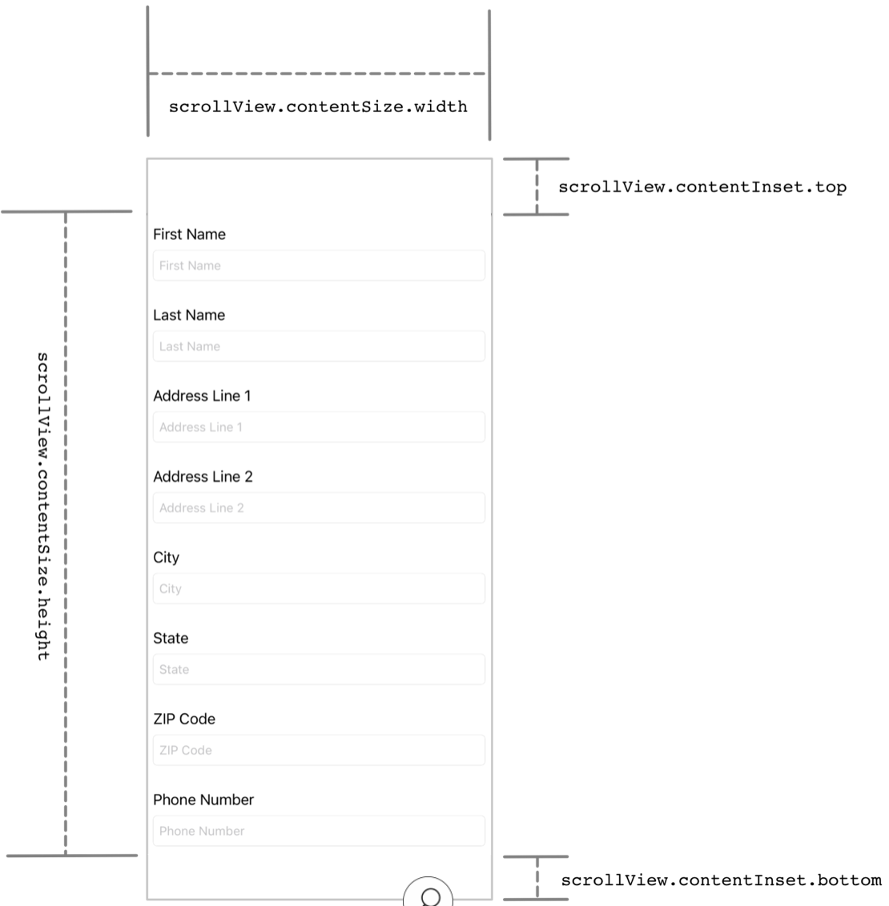

- But there's a problem. Changing the contentInset value has an unexpected side effect when your scroll view displays scroll indicators. For example, the scroll indicators may be drawn behind the keyboard — an unwanted result. To fix this, you'll need to modify the `scrollIndicatorInsets`. Like the contentInset property, the scrollIndicatorInsets property is defined as a UIEdgeInsets struct. You can remedy the situation by setting the scrollIndicatorInsets values to match the contentInset value.

  - ```swift
      let contentInsets = UIEdgeInsets(top: 0.0, left: 0.0, bottom: keyboardSize.height, right: 0.0)
      scrollView.contentInset = contentInsets
      scrollView.scrollIndicatorInsets = contentInsets
    ```

#### The Scroll View Family

- UIScrollView is the parent class of several other classes in UIKit, including UITableView and UICollectionView. These two prominent classes both inherit all the functionality of UIScrollView classes. As you advance to these new topics, you'll want to keep this relationship in mind, since you'll be able to use all the tools you learned in this lesson when you use table views or collection views.

#### Challenge

- Create a horizontal scroll view that displays three of your favorite images.

#### Lab - I Spy

##### Objective

- The objective of this lab is to implement a scroll view on an image view that will enable users to zoom in and pan an image. Your app will have a single view with a single picture.
- Create a new project called "ISpy" using the iOS App template.

##### Step 1 Set Up the Storyboard

- Add a scroll view to the view controller and resize it to fit in the Safe Area. Add constraints to pin the scroll view edges to the Safe Area of the view controller.
- Add an image view as a subview of the scroll view and resize it to fit the scroll view's bounds. Add constraints to pin the edges of the image view to the Content Layout Guide of the scroll view.

  - 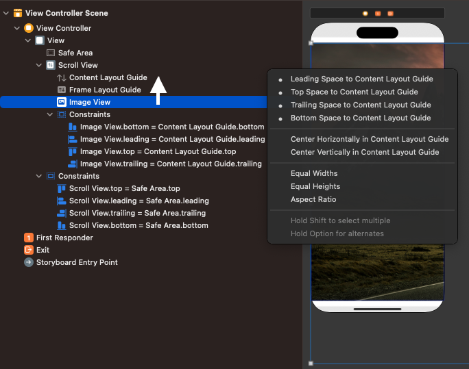

- Add an image of your choosing to the Assets folder. Set it as the image of the image view.
- Create outlets from the scroll view and image view to the ViewController file.

##### Step 2 Implement the UIScrollViewDelegate

- To use a scroll view for zooming, your view controller needs to conform to UIScrollViewDelegate. You can read more about UIScrollViewDelegate in the [documentation](https://developer.apple.com/documentation/uikit/uiscrollviewdelegate). But for now, go ahead and add the following line of code to the class declaration: `class ViewController: UIViewController, UIScrollViewDelegate {...}`
- In the viewDidLoad() method, set the scroll view's delegate to be the ViewController instance.
- Implement the `viewForZooming()` delegate method, and return the image view in the body of the method.
- Create a new method `updateZoomFor(size: CGSize)` that will update the zoom of the image. Override `viewDidAppear(_:)` and in the body call `updateZoomFor(size:)`, passing in `view.bounds.size`.
- Inside the `updateZoomFor(size:)` method, use the imageView and the size parameter to calculate the scale. Then set the `minimumZoomScale` property of the scrollView to be that scale, as in the following:

  - ```swift
      let widthScale = size.width / imageView.bounds.width 
      let heightScale = size.height / imageView.bounds.height 
      let scale = min(widthScale, heightScale)
      scrollView.minimumZoomScale = scale
      scrollView.zoomScale = scale
    ```

- The code above starts by calculating the scale necessary to show the entire width and height of the image. It then sets the minimum scale to be the smaller of the two (width or height), so that you won't be able to zoom out beyond that. Finally, it sets the initial zoom scale so that the image fits inside the screen.
- Run the app. You should be able to zoom and scroll in all directions. (Use **Option-drag** to zoom in Simulator.)
- Great work! You've made an app that can scroll and zoom in on an image. Can you think of something you want to build where this functionality might be useful? Be sure to save your app to your project folder for future reference.

  - ```swift
      import UIKit

      class ViewController: UIViewController, UIScrollViewDelegate {
          @IBOutlet var scrollView: UIScrollView!
          @IBOutlet var imageView: UIImageView!

          override func viewDidLoad() {
              super.viewDidLoad()
              scrollView.delegate = self
          }

          func viewForZooming(in scrollView: UIScrollView) -> UIView? {
              return imageView
          }
          
          func updateZoomFor(size: CGSize) {
              let widthScale = size.width / imageView.bounds.width
              let heightScale = size.height / imageView.bounds.height
              let scale = min(widthScale, heightScale)
              scrollView.minimumZoomScale = scale
              scrollView.zoomScale = scale
          }
          
          override func viewDidAppear(_ animated: Bool) {
              super.viewDidAppear(animated)
              updateZoomFor(size: view.bounds.size)
          }
      }
    ```

- Tip: When to use super when overriding iOS method
  - It depends on recommendations from the documentation for the superclass's implementation of that method.
  - `viewDidAppear(_:)` - If you override this method, you must call super at some point in your implementation.

### Lesson 1.5 Table Views

- Enter UITableView, one of the most widely used views in iOS. Table views are perfect for efficiently displaying large or small amounts of information and for managing dynamic or static lists of data.
- In this lesson, you'll learn why table views are so popular among iOS developers. This lesson will focus on dynamic table views; the next table view lesson will cover static table views.
- If you've ever used an iOS device, odds are you've encountered a table view, or UITableView. Because of their utility, table views are one of the most ubiquitous views in all of iOS. In the Music app, table views allow you to navigate through your music hierarchy. In Contacts, table views present your contacts in an indexed list. In Settings, table views organize controls into visually distinct groupings. 
- As you work through this lesson, you'll learn how to work with table views by building an emoji dictionary app.
- Before we jump into table views, you'll need to complete a few setup steps — all things you've learned about in previous lessons. To get started, open Xcode and create a new iOS app project called "EmojiDictionary." When creating the project, make sure the interface option is set to "Storyboard." Delete the ViewController file and the view controller scene in the Main storyboard. Now you have a truly blank app canvas to work with.
- The next step is to create your model. Remember that model objects should represent the real-world object you want to display to the user. In this project, you're going to display information about different emoji, so you'll need to create an Emoji model object. Your emoji structure will have the following properties:
  - symbol, a String that holds the emoji symbol
  - name, a String representing the emoji name
  - description, a String describing the emoji
  - usage, a String describing how the emoji is used or its meaning
- For example, an emoji instance might look like the following:

  - ```swift
      {
          symbol: "🐘",
          name: "Elephant",
          description: "A gray elephant.",
          usage: "good memory"
      }
    ```

- Before looking at the code segment below, create a new Swift file called Emoji.swift and try to create a struct to represent an emoji on your own.

  - ```swift
      struct Emoji {   
          var symbol: String
          var name: String
          var description: String
          var usage: String
      }
    ```

- Now that your model is set up, you can dive into table views.

#### Anatomy of a Table View

- A table view is an instance of the UITableView class. It may be responsible for displaying one data object or tens of thousands of data objects. To accommodate many rows of data, table views present data in a scrolling, single-column list, with the option to divide the rows into sections or groups. Each section can have a header above the first item and a footer below the last item. The table view itself can also have its own header and footer.

##### Table View Controllers

- There are two ways to add a table view to your projects, depending on how you will use the table view.
- One approach is to add a table view instance directly to a view controller's view. In this scenario, the view controller may manage other views in addition to the table view. This means you're responsible for managing the position and size of the table view. You're also responsible for setting the data source and delegate object(s). (You'll learn about the data source object and the delegate object later in this lesson.)
- The second approach is to use a table view controller. UITableViewController is a view controller subclass that manages a single table view instance. In this approach, the table view takes up the entire view, and you can't adjust the table view's size. The table view controller also acts as the data source and delegate of the table view.
- While you may find uses for both approaches, table view controllers provide some additional functionality. If you were to use the first approach and also wanted one of these features, you'd have to write additional code. For example, when using a table view controller, the table view's scroll view will always adjust to accommodate the keyboard when necessary. If you were to use a table view added to a regular view controller, you would have to write code to monitor when the keyboard is presented and adjust the table view's content insets accordingly. 
- Except in special cases, you'll likely find that it's best to use a table view controller.
- Back in your EmojiDictionary project, open the Main storyboard and drag a navigation controller from the Object library onto the scene. You'll notice that a second view controller, a table view controller, automatically came along for the ride.
- Next, set the navigation controller to be the initial view controller by selecting the navigation controller and checking "Is Initial View Controller" in the Attributes inspector. Then, update the title in the navigation bar from "Root View Controller" to "Emoji Dictionary."
- Create a new Cocoa Touch Class called `EmojiTableViewController` as a subclass of `UITableViewController`. Back in your storyboard, select the table view controller and assign `EmojiTableViewController` as its custom class in the Identity inspector(1).
- Build and run you app. At this point, you should see an empty table view inside a navigation controller.

  - 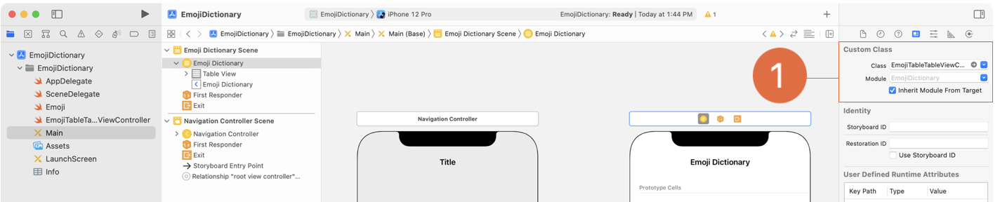

##### Table View Style

- Table views come in three styles: plain, grouped, and inset grouped.
  - The plain style is the default. In a plain table view, rows can be separated into labeled sections with an optional index along the right edge of the table (such as the alphabet index seen in Contacts). Each section immediately follows the previous section with no spacing, creating an unbroken list.
  - In a grouped table view, rows are displayed in visually distinct groups, or sections, with spacing in between - and without an index option.
  - An inset grouped table view is similar to grouped, but each visual group in inset on both sides of the view with rounded corners, providing a very pronounced separation between sections.

##### Table View Cells

- Every row in a table view is represented with a table view cell, a UITableViewCell instance. Cells are reusable views that can display text, images, or any other UIView. In addition to the cell content, each cell has an optional accessory view (more on accessory views later).

  - 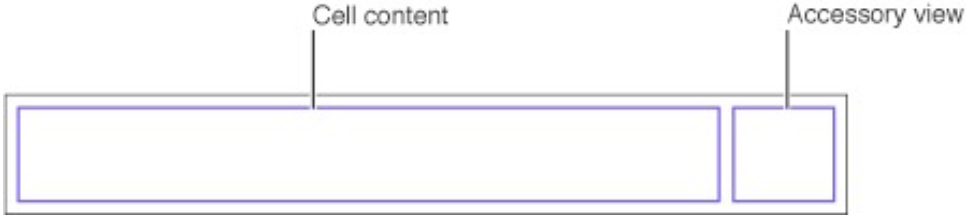

- In addition to the default, non-editing mode, table views can enter an editing mode, which enables users to insert, delete, or reorder cells. In editing mode, the cell content size shrinks and any accessory view disappears to allow room for the editing and reorder controls.

  - 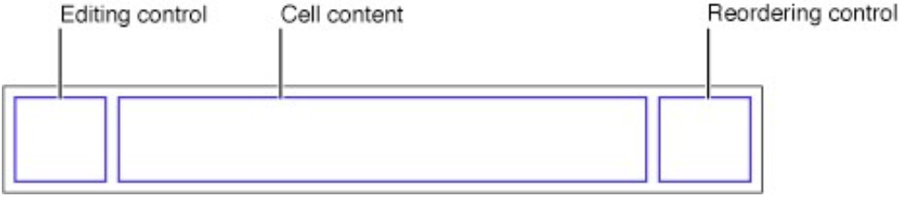

- The UITableViewCell class defines three properties for cell content. 
  - `textLabel` and `detailTextLabel` are UILabels for the title and subtitle (or additional detail). 
  - `imageView` is a UIImageView for an image.
- These three properties have existed since the release of the iOS 2.0 SDK in 2009. UIKit has evolved since then, and table view cell configurations were introduced in iOS 14.0. Cell configurations let you describe what a cell should contain, rather than directly updating the cell's views yourself. The cell is responsible for taking the information in a configuration and updating its own views. This extra abstraction gives the cell more control over how to display its contents and lets you focus on the data you want it to display. (Also, the support for the textLabel, detailTextLabel, and imageView properties will be deprecated in a future version of iOS, so you should use cell configurations when possible.)
- To configure a cell, request its defaultContentConfiguration and set the properties of the returned content configuration. Then update the cell's contentConfiguration property with the updated configuration. The configuration has properties for text, secondaryText, image, and more to adjust the presentation of elements in a cell. You'll see cell content configurations in action shortly.
- The UIKit framework defines four standard cell styles that you can select in Interface Builder or programmatically, using the enum UITableViewCell.CellStyle. Each style supports its own combination of properties and has its own layout.
- | Storyboard Name | Programmatic Enum Name | Displays | Description |
  |---|---|---|---|
  | Basic | .default | textLabel, imageView | A label on the left side of the cell with black, left-aligned text; options leading image view. |
  | Subtitle | .subtitle | textLabel, detailTextLabel, imageView | A label across the top with black, left-aligned text; a second label below in smaller, gray, left-aligned text; optional leading image view.  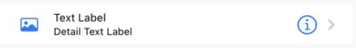|
  | Right Detail | .value1 | textLabel, detailTextLabel, imageView | A label on the left side of the cell with black, left-aligned text; a label on the right side with black(storyboard) or gray (programmatic), right-align text; optional leading image view. |
  | Left Detail | .value2 | textLabel, detailTextLabel | A label on the left side of the cell with small, black, right aligned text, followed by a detail label with small, black (storyboard) or blue (programmatic), left-align text. 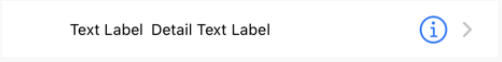|
-  When the table is in default (view-only) mode, cells can display an accessory view, which you can also select in Interface Builder or programmatically, using the enum `UITableViewCell.AccessoryType`. The iOS SDK defines five standard types of accessory views, some of which can respond to user touches, like a button. With a delegate method, you can respond and execute code when the user taps the accessory view. You'll learn about the delegate later in this lesson.
No matter which accessory view is displayed, your code is responsible for responding to the user's tap on a cell or its accessory view. Accessory views are just indicators to the user about the nature of the cell.
  - | Storyboard Name | Programmatic Enum Name | Description | Image |
    |---|---|---|---|
    | None | .none |  No accessory view is displayed; content view takes up the entire cell. | 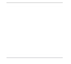 |
    | Disclosure Indicator | .disclosureIndicator | A chevron. Tapping the cell typically triggers a show segue. The accessory view does not track touches. |  |
    | Detail | .detailButton | An info button. The accessory view tracks touches; tapping it typically displays additional information about the cell's contents. |  |
    | Detail Disclosure | .detailDisclosureButton | An info button and a chevron. Tapping the cell typically triggers a show segue. The accessory view tracks touches and typically displays additional information about the cell's contents. |  |
    | Checkmark | .checkmark | A checkmark. The accessory view does not track touches. | 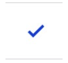 |
- Return to your EmojiDictionary project. In the table view controller scene, notice there is one cell under the Prototype Cells header. If you select the cell and open the Attributes inspector, you'll see many adjustable options, including Style. Feel free to select the different styles to see the options. When you're done, select the Subtitle style. You will use the labels to display the emoji symbol and name on the title line and the description as the subtitle. This style gives you the most room for both of your labels.

##### Table View Readability Margins

- By default, table view cells take up the entire width of the table view. This may cause readability issues on large screens: It's hard to read a very long line of text, and short lines can be awkward when the label is far from its accessory view. But there's a fix. With the table view selected in your storyboard, navigate to the `Size inspector` and find and check the `Follow Readable Width` option. Now, the width of your table view cells will stay within readable margins.
- You can also set this option programmatically by setting the `cellLayoutMarginsFollowReadableWidth` property to true. You can do this in the viewDidLoad() method of EmojiTableViewController.

#### Index Paths

- Many of the API methods for table views either accept an index path as a parameter or return an index path. As you might guess, an index path points to a specific row in a specific section of a table view. You can access these values through the index path's row and section properties. Just like array indices, these values are zero-indexed.

  - 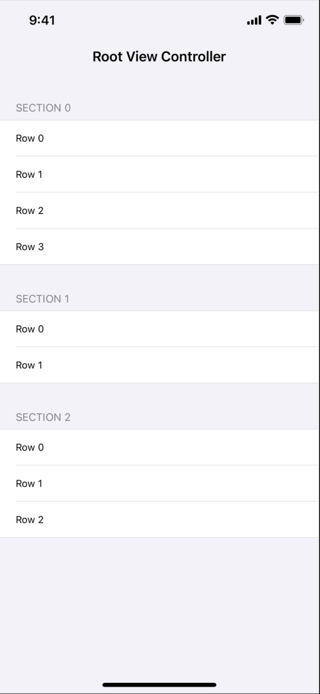

#### Arrays and Table Views

- Table views are ideal for displaying a collection of similar data and are typically backed by a collection of model objects. This collection is usually an array — though it's possible to use another collection, such as a dictionary. Why is an array the best match with a table view? First, ordering of an array is guaranteed and stable. Also, arrays have a property (count) to query how many objects they contain, which can then inform the table view how many rows to display. In addition, arrays and index path values are both zero-based, which simplifies accurate addressing.
- To display a list of emoji in EmojiDictionary, you'll need to create an array of Emoji and add it as a property to your EmojiTableViewController. Feel free to create your own list or use the array provided below. (While it could be argued that the plural of “emoji” is “emoji,” for the sake of clarity — always a programmer's goal—“emojis” is the best name for your array.)

  - ```swift
      var emojis: [Emoji] = [
          Emoji(symbol: "😀", name: "Grinning Face", description: "A typical smiley face.", usage: "happiness"),
          Emoji(symbol: "😕", name: "Confused Face", description: "A confused, puzzled face.", usage: "unsure what to think; displeasure"),
          Emoji(symbol: "😍", name: "Heart Eyes", description: "A smiley face with hearts for eyes.", usage: "love of something; attractive"),
          Emoji(symbol: "🧑‍💻", name: "Developer", description: "A person working on a MacBook (probably using Xcode to write iOS apps in Swift).", usage: "apps, software, programming"),
          Emoji(symbol: "🐢", name: "Turtle", description: "A cute turtle.", usage: "something slow"),
          Emoji(symbol: "🐘", name: "Elephant", description: "A gray elephant.", usage: "good memory"),
          Emoji(symbol: "🍝", name: "Spaghetti", description: "A plate of spaghetti.", usage: "spaghetti"),
          Emoji(symbol: "🎲", name: "Die", description: "A single die.", usage: "taking a risk, chance; game"),
          Emoji(symbol: "⛺️", name: "Tent", description: "A small tent.", usage: "camping"),
          Emoji(symbol: "📚", name: "Stack of Books", description: "Three colored books stacked on each other.", usage: "homework, studying"),
          Emoji(symbol: "💔", name: "Broken Heart", description: "A red, broken heart.", usage: "extreme sadness"), 
          Emoji(symbol: "💤", name: "Snore", description: "Three blue \'z\'s.", usage: "tired, sleepiness"),
          Emoji(symbol: "🏁", name: "Checkered Flag", description: "A black-and-white checkered flag.", usage: "completion")
      ]
    ```

##### Cell Dequeueing

- Before diving into displaying this data, you first need to learn about cell dequeueing. It's possible to create a table view that's responsible for displaying hundreds of thousands of model objects. Each of these objects will be displayed by a cell, and each could have multiple views. Every view displayed onscreen must exist in a device's finite memory. If the table view were to try to initialize a cell for each object, a large list would quickly cause the device to run out of memory, resulting in a crash.
- To address this issue, table views only load the visible cells — plus a few more to make sure scrolling stays smooth. As the user scrolls through a table view, cells leave the visual field, and others are displayed at the opposite end of the device. Typically, the cells entering the visual field share the same layout as the ones that left the visual field moments ago. Could you take the cell that just left and reuse it as the cell that's about to enter?
- In fact, this process — called dequeueing — is precisely how table views manage their cells. You can register each cell type in your table view with a `reuseIdentifier` string. The table view can then manage a stockpile of cells for each reuse identifier. When you want a cell, you use the table view instance method `dequeueReusableCell(withIdentifier:for:)`, passing in the reuse identifier for the desired cell type. This method asks the table view instance to provide a matching cell that's available for reuse: `let cell: UITableViewCell = tableView.dequeueResuableCell(withIdentifier: "Cell", for: indexPath)`
- You can register your cells in Interface Builder by selecting the prototype cell and adding a value to the reuse identifier field in the Attributes inspector. In EmojiDictionary, select your table view cell. Then, navigate to the Attributes inspector and add `EmojiCell` as the Identifier. Your cell is now registered.
- Through the process of dequeueing, the table view only creates and loads as many cells as absolutely necessary, rather than one cell for every piece of information displayed. Dequeueing saves memory and allows for a smooth flow when scrolling through table views — providing the best possible user experience.

#### Table View Protocols

- A dynamic table view object must have a data source object and may or may not have a delegate object. Following the MVC design model you learned about in an earlier lesson, the data source acts as an intermediary between the table view and your app's data model. The optional delegate manages the appearance (minus the actual cells) and the behavior of the table view.
- Since the UITableView class itself doesn't have the methods, properties, or data required to configure its own contents, it delegates that responsibility to other objects. The data source and delegate are often, but not always, the same object. Typically this object is your custom subclass of UITableViewController. The responsibilities of the data source and delegate are defined in the UITableViewDataSource and UITableViewDelegate protocols.
- As a reminder, protocols define methods and properties for the objects conforming to the protocol to implement. Now that you understand the general difference between the two table view protocols, you'll explore the specific methods defined by them.

#### Table View Data Source

- The data source, which adopts the `UITableViewDataSource` protocol, is responsible for providing the necessary data to the table view object.
- Take a moment to think about the minimum information a table view would need to display its contents. It needs to know how many things to display (i.e. how many rows are in the table) and what goes in each row (i.e. the contents of each cell).
- To provide this information, you implement the methods outlined in UITableViewDataSource.
- For now, you'll focus on three data source methods that provide the number of sections in the table view, the number of rows in each section, and the cell to display for each index path.

  - ```swift
      optional func numberOfSections(in tableView: UITableView) -> Int
      func tableView(_ tableView: UITableView, numberOfRowsInSection section: Int) -> Int
      func tableView(_ tableView: UITableView, cellForRowAt indexPath: IndexPath) -> UITableViewCell
    ```

- When the table view loads or reloads its data, it queries the data source by calling each of these methods (sometimes multiple times) to request information for the visible rows. As the user scrolls through the table view and different rows become visible, the table view continues to query the data source for information to fill the new rows about to be displayed. The data source is responsible for returning the requested information based on the values of the parameters passed into the methods.
- In the next three sections, you'll explore the parameters of each function and your job, as the programmer, when implementing these functions.
- **Number of Sections**
  - In `numberOfSections(in:)`, you return as an Int the number of sections you want the table view to display. You probably noticed in the code above that this function has the optional modifier. If you choose not to write this function, the table view will display one section.
- **Number of Rows in a Section**
  - Once the table view knows how many sections to display, it needs to know how many rows there will be in each section. The `tableView(_:numberOfRowsInSection:)` method has two parameters: the table view requesting the information and the section in question. Based on these parameters, your job is to return an Int representing the number of rows for the given section. This required method will be called for every section in your table view.
- **Cell for Row at Index Path**
  - The table view now knows how many sections to display and how many rows there should be in each section. `tableView(_:cellForRowAt:)` provides you with an index path, and in the body of the method you dequeue, configure, and return a cell for the table view to display.
  - While different situations will call for different implementations of this method, most will adhere to the following steps:
    1. Fetch the correct cell type by dequeueing a cell.
    2. Fetch the model object to be displayed.
    3. Configure the cell's properties with the model object's properties — in other words, set views (labels, image views, etc.) based on the model object.
    4. Return the fully configured cell.

#### Implement the Data Source

- It's time to implement your table view's data source. Since you're using a UITableViewController subclass, your table view already has its data source assigned as the EmojiTableViewController instance. Open the Swift file for your emoji table view controller. Notice that the three data source methods are already defined for you, but with comments warning you that the implementations are incomplete.
  - The first method that will be called is `numberOfSections(in:)`. EmojiDictionary will have one section, so delete the comment inside the body of the method and return 1. (You could also remove the implementation of numberOfSections(in:) completely, and the table view would assume that it has one section. However, it's a good habit to clearly define your table views rather than relying on default values.)
  - Next, the table view will call `tableView(_:numberOfRowsInSection:)` to determine how many rows to place inside the section. You'll know which section is being requested via the parameter section. In EmojiDictionary, you only have one section. Delete the comment in tableView(_:numberOfRowsInSection:) and add the following to its body: `return emojis.count`
    - The code above returns the count of your emojis array. This means that if you were to allow user input to add to the array of emoji, your table view could be updated at runtime to match.
      - For example, if you added an emoji to the emojis array, the count of the array would increase by one, and your table view would display an additional row.
    - Since the EmojiDictionary table view has only one section, there's no need to use the section parameter of the method. If you were to add more sections in the future, you'd need to add conditional logic to return the correct number of cells in each section.
- Now that the table view knows how many rows to display, the table view will call `tableView(_:cellForRowAt:)` to get a cell for each row. To expose the method, you'll need to uncomment it. Delete the /* before the method and the */ after it. Next, you'll implement the method to follow the dequeueing steps detailed above.
  - First, you'll ask the table view to dequeue a cell. The following line (provided in the template with a placeholder for the reuse identifier) returns a UITableViewCell instance of the same style you registered in Interface Builder with the EmojiCell identifier: `let cell = tableView.dequeueReusableCell(withIdentifier: "EmojiCell", for: indexPath)`
  - The second step is to get the appropriate model object to display in the cell — in this example, that's the Emoji instance associated with that row. Using the indexPath parameter, you can get the array index required to retrieve the correct Emoji. Recall that the index path has two properties to access the cell address: `section` and `row`. Since your table view only has one section, you can ignore the section property, as it will be the same (in this case) every time the method is called.
    - You'll use the `row` property instead. Add the following line: `let emoji = emojis[indexPath.row]`
  - Your third step is to configure the cell with information about the emoji. Using the example cell above, you'll modify the cell's view to display the emoji info. Add the following lines:

    - ```swift
        var content = cell.defaultContentConfiguration()
        content.text = "\(emoji.symbol) - \(emoji.name)"
        content.secondaryText = emoji.description
        cell.contentConfiguration = content
      ```

    - These lines update the cell's content configuration so that a string consisting of the `symbol` and `name` will be rendered in the primary text position and the `description` will be rendered in the secondary text position. (Your usage property will be put to use in the next lesson.)
  - At last, your cell is looking the way you want. The final line from the template returns the configured cell: `return cell`
- You've completed the basic implementation of a table view data source, which means your table view now has enough information to display content.
- Build and run your app. At this point, you should see a filled table view with one row for each emoji in your array.
- Take some time to add more emoji to the emojis array. Build and run your app. Notice that without changing any code your table view was able to handle the additional data and display more cells, demonstrating the power that comes from combining an array with a table view.

#### Table View Delegate

- The second protocol in the table view API is the delegate. The delegate object, which conforms to the UITableViewDelegate protocol, implements methods to modify visible aspects of the table view, manage selections, support an accessory view, and support editing of individual rows. Unlike the data source protocol, the delegate protocol has no required methods.
- Although several of the delegate methods are beyond the scope of this lesson, there are two that are important to learn right now:
  - `tableView(_:accessoryButtonTappedForRowWith:)` — This method is used to respond to user interaction with the accessory view.
  - `tableView(_:didSelectRowAt:)` — This method is used to respond to user interaction with the cell's content area.
- **Accessory Button Tapped for Row**
  - As you learned earlier in the lesson, two of the accessory types track user interaction. Accessory button tapped for row is called if the cell has a detail or a detail disclosure accessory type and the user taps the detail indicator. This gives you the opportunity to respond to the user interaction, and you'll be given the index path of the row that contains the tapped accessory button so you can get the corresponding model object.
- **Did Select Row**
  - In a table view, you can respond to user interaction by implementing the `tableView(_:didSelectRowAt:)` method of the table view delegate. Any time the user taps a cell, the table view will select that row, provided the cell's selection style isn't set to `.none`. By default, the table view changes the background of a selected cell from white to gray and deselects any previously selected cell. The currently selected index path is accessible through the table view property `indexPathForSelectedRow`. Once the selection is completed, `tableView(_:didSelectRowAt:)` is called, and you're provided with the index path of the selected cell.
- **Implement the Delegate**
  - In your EmojiDictionary app, you're using a UITableViewController subclass to manage the table view. That table view controller, as you have seen, was automatically assigned as the table view data source, and it is also assigned as the table view delegate.
  - Add the delegate method `tableView(_:didSelectRowAt:)` to your EmojiTableViewController. In this method, print the emoji symbol and the index path of the row tapped.

    - ```swift
        override func tableView(_ tableView: UITableView, didSelectRowAt
          indexPath: IndexPath) {
            let emoji = emojis[indexPath.row]
            print("\(emoji.symbol) \(indexPath)")
        }
      ```
 
- Build and run your app. As you select rows, you should see the background color change and your message printed in the console.

#### Edit the Table View

- In addition to the data source methods you've already seen, there are others that allow for modifying the data in the table view. For example, `tableView(_:moveRowAt:to:)` reorders the cells displayed by a table view. Cells display the reorder control based on three factors:
  - The `UITableViewCell` class property `showsReorderControl`, a `Bool`, must be set to `true`. 
  - The data source method `tableView(_:moveRowAt:to:)` must be implemented. 
  - The table must be in editing mode.
- When it is displayed, the reorder control appears to the right of the cell's content and allows the user to drag cells to reorder them. The same factors will cause the delete button to display to the left of the content.
- Back in your project, add the following line to the method `tableView(_:cellForRowAt:)` method just before the return statement: `cell.showsReorderControl = true`
- Typically, but not necessarily, a table view will enter editing mode when the user taps an Edit button in the navigation bar. That seems like a good idea for your app. 
  - To enable this functionality, add a bar button item to the left slot of the table view controller's navigation bar. 
  - Choose Edit for the System Item property of the bar button, then add an @IBAction from the Edit button to the table view controller. 
  - Put the table view into editing mode using the setEditing(_:animated:) function; this will toggle the editing mode of the table view on and off:

    - ```swift
        @IBAction func editButtonTapped(_ sender: UIBarButtonItem) {
            let tableViewEditingMode = tableView.isEditing
         
            tableView.setEditing(!tableViewEditingMode, animated: true)
        }
      ```

- Alternatively, you can add an Edit button programmatically that will give you the same functionality without requiring any additional actions.
  - In viewDidLoad(), set the `leftBarButtonItem` to `editButtonItem`, a predefined button that switches the table view's editing mode on and off.

    - ```swift
        override func viewDidLoad() {
            super.viewDidLoad()
            navigationItem.leftBarButtonItem = editButtonItem
        }
      ```

- Next, implement the `tableView(_:moveRowAt:to:)` method. When called, it should remove the data within emojis at `fromIndexPath.row` and add it back at `to.row`:

  - ```swift
      override func tableView(_ tableView: UITableView, moveRowAt fromIndexPath: IndexPath, to: IndexPath) {
          let movedEmoji = emojis.remove(at: fromIndexPath.row)
          emojis.insert(movedEmoji, at: to.row)
      }
    ```

- Build and run your app. Enter editing mode. You should now see the reorder controls. Go ahead and use one to rearrange the cells.
- Maybe you only want users to be able to reorder items, not delete them. To remove the delete indicator, you could add the following method to the table view controller:

  - ```swift
      override func tableView(_ tableView: UITableView, editingStyleForRowAt indexPath: IndexPath) -> UITableViewCell.EditingStyle {
          return .none
      }
    ```

#### Reload Data

- The time will come when you need to reload your table view's data. Imagine, for example, that a user adds a new model object in a separate view controller and then returns to an already loaded table view. The table view won't reflect the addition.
- Table views have a built-in instance method, called `reloadData()`, that forces a refresh. If you want to refresh the table view with new data when a user returns to the view, you could add the call to `reloadData()` in the view will appear method.

  - ```swift
      override func viewWillAppear(_ animated: Bool) {
          super.viewWillAppear(animated)
          tableView.reloadData()
      }
    ```

- With your new skills, you'll be able to confidently and efficiently build a custom display to present whatever model objects your app uses and respond to user interactions with your table view. Make sure to save your EmojiDictionary project as you will continue to build on it in the next table view lesson.

  - ```swift
      import UIKit
      class EmojiTableViewController: UITableViewController {
          var emojis: [Emoji] = [
              Emoji(symbol: "😀", name: "Grinning Face", description: "A typical smiley face.", usage: "happiness"),
              Emoji(symbol: "😕", name: "Confused Face", description: "A confused, puzzled face.", usage: "unsure what to think; displeasure"),
              Emoji(symbol: "😍", name: "Heart Eyes", description: "A smiley face with hearts for eyes.", usage: "love of something; attractive"),
              Emoji(symbol: "🧑‍💻", name: "Developer", description: "A person working on a MacBook (probably using Xcode to write iOS apps in Swift).", usage: "apps, software, programming"),
              Emoji(symbol: "🐢", name: "Turtle", description: "A cute turtle.", usage: "something slow"),
              Emoji(symbol: "🐘", name: "Elephant", description: "A gray elephant.", usage: "good memory"),
              Emoji(symbol: "🍝", name: "Spaghetti", description: "A plate of spaghetti.", usage: "spaghetti"),
              Emoji(symbol: "🎲", name: "Die", description: "A single die.", usage: "taking a risk, chance; game"),
              Emoji(symbol: "⛺️", name: "Tent", description: "A small tent.", usage: "camping"),
              Emoji(symbol: "📚", name: "Stack of Books", description: "Three colored books stacked on each other.", usage: "homework, studying"),
              Emoji(symbol: "💔", name: "Broken Heart", description: "A red, broken heart.", usage: "extreme sadness"),
              Emoji(symbol: "💤", name: "Snore", description: "Three blue \'z\'s.", usage: "tired, sleepiness"),
              Emoji(symbol: "🏁", name: "Checkered Flag", description: "A black-and-white checkered flag.", usage: "completion")
          ]

          override func viewDidLoad() {
              super.viewDidLoad()
              navigationItem.leftBarButtonItem = editButtonItem
          }

          override func numberOfSections(in tableView: UITableView) -> Int {
              return 1
          }

          override func tableView(_ tableView: UITableView, numberOfRowsInSection section: Int) -> Int {
              return emojis.count
          }

          override func tableView(_ tableView: UITableView, cellForRowAt indexPath: IndexPath) -> UITableViewCell {
              let cell = tableView.dequeueReusableCell(withIdentifier: "EmojiCell", for: indexPath)
              let emoji = emojis[indexPath.row]
              
              var content = cell.defaultContentConfiguration()
              content.text = "\(emoji.symbol) - \(emoji.name)"
              content.secondaryText = emoji.description
              cell.contentConfiguration = content
              
              cell.showsReorderControl = true
              
              return cell
          }

          override func tableView(_ tableView: UITableView, didSelectRowAt indexPath: IndexPath) {
              let emoji = emojis[indexPath.row]
              print("\(emoji.symbol) \(indexPath)")
          }
          override func tableView(_ tableView: UITableView, moveRowAt fromIndexPath: IndexPath, to: IndexPath) {
              let movedEmoji = emojis.remove(at: fromIndexPath.row)
              emojis.insert(movedEmoji, at: to.row)
          }

          override func tableView(_ tableView: UITableView, editingStyleForRowAt indexPath: IndexPath) -> UITableViewCell.EditingStyle {
              return .none
          }
          
          override func viewWillAppear(_ animated: Bool) {
              super.viewWillAppear(animated)
              tableView.reloadData()
          }
      }
    ```

#### Challenge - Table Views

- With your new skills, you'll be able to confidently and efficiently build a custom display to present whatever model objects your app uses and respond to user interactions with your table view. Make sure to save your EmojiDictionary project, as you will build on it in the next table view lesson.

#### Lab - Meal Tracker

- The objective of this lab is to give you a chance to practice implementing a basic table view. You'll create an app that will display a list of foods grouped into three sections, one for each meal of the day.
- Create a new project called "Meal Tracker" using the iOS App template. When creating the project, make sure the interface option is set to "Storyboard."

##### Step 1 - Set Up the Storyboard

- Delete the UIViewController that comes with the storyboard and its associated ViewController file. Add a UITableViewController from the Object library.
- Embed the scene in a navigation controller. Check `Is Initial View Controller` in Attributes inspector of Navigation Controller.
- The table view will default to having one prototype cell. 
  - Change its Style to `Subtitle`.
  - Update the reuse identifier to `Food`.
- Select the table view and change its Style to `Grouped`.
- Add a new Cocoa Touch Class file called `FoodTableViewController` that subclasses UITableViewController. Assign that class to the table view controller in your storyboard.

##### Step 2 - Create Model Objects

- Create two new Swift files. Name one “Meal” and the other “Food.”
- In the Food file, create a Food struct. Give it two properties, `name` and `description`, both of type `String`.
- In the Meal file, create a Meal struct. Give it two properties, `name` and `food`. The name property should be of type `String`, and food should be a type `[Food]`.

##### Step 3 - Implement UITableViewDataSource

- In the FoodTableViewController, remove all the template code except for `numberOfSections(in:)`, `tableView(_:numberOfRowsInSection:)`, and `tableView(_:cellForRowAt:)`.
- Create a computed property, `meals`, of type [Meal].
  - This property will return three Meal objects that each have three Food objects. The meals will represent `breakfast`, `lunch`, and `dinner`.
  - In the body of the property, create three Meal objects. Name them breakfast, lunch, and dinner. Set their food values to [] for now.
  - Return the three Meal objects in an array with the order: breakfast, lunch, dinner.
  - Create three Food objects for the food array on each Meal object. Give each Food item an appropriate name for its corresponding meal.

    - ```swift
        var meals: [Meal] {
            let aBreakfast = Food(name: "Eggs", description: "Scrambled with bacon")
            let bBreakfast = Food(name: "Cooked Rice", description: "Boiled rice by pressed pot with side dishes")
            let cBreakfast = Food(name: "Salad", description: "Cabbage, Cucumber, Almond, and Dressing")
            let breakfast = Meal(name: "Breakfast", food: [aBreakfast, bBreakfast, cBreakfast])
            
            let aLunch = Food(name: "Soup", description: "Mushroom soup")
            let bLunch = Food(name: "Pizza", description: "Pepperoni pizza")
            let cLunch = Food(name: "Pork belly", description: "Grilled port belly")
            let lunch = Meal(name: "Lunch", food: [aLunch, bLunch, cLunch])
            
            let aDinner = Food(name: "Milk", description: "2% Milk")
            let bDinner = Food(name: "Ramen", description: "Shin ramen")
            let cDinner = Food(name: "Seaweed Soup", description: "")
            let dinner = Meal(name: "Breakfast", food: [aDinner, bDinner, cDinner])
            
            return [breakfast, lunch, dinner]
        }
      ```

- In `numberOfSections(in:)`, return the number of meals in your meals array. `return meals.count`
- In `tableView(_:numberOfRowsInSection:)`, access the meal for the given section and return the number of food items in that meal. `return meals[section].food.count`
- In `tableView(_:cellForRowAt:)`, 
  - dequeue a cell with the reuse identifier `Food`.
  - Access the meal for the row using `indexPath.section`.
  - From the returned meal, access the food for the row using `indexPath.row`.
  - Get the cell's default content configuration, update the content configuration's text and secondary text to be the `name` and `description` of the food item, and assign it to the cell's content configuration before returning the cell.

    - ```swift
        override func tableView(_ tableView: UITableView, cellForRowAt indexPath: IndexPath) -> UITableViewCell {
            let cell = tableView.dequeueReusableCell(withIdentifier: "Food", for: indexPath)
            let meal = meals[indexPath.section]
            let food = meal.food[indexPath.row]

            var content = cell.defaultContentConfiguration()
            content.text = "\(food.name)"
            content.secondaryText = "\(food.description)"
            cell.contentConfiguration = content

            return cell
        }
      ```

- In `tableView(_:titleForHeaderInSection:)`, return the `name` of the meal that corresponds to the section.

  - ```swift
      override func tableView(_ tableView: UITableView, titleForHeaderInSection section: Int) -> String? {
          return meals[section].name
      }
    ```

- Congratulations! You've made an app that displays a list of meals and food items in a table view. Be sure to save it to your project folder for future reference.

  - ```swift
      import UIKit
      class FoodTableViewController: UITableViewController {
          var meals: [Meal] {
              let aBreakfast = Food(name: "Eggs", description: "Scrambled with bacon")
              let bBreakfast = Food(name: "Cooked Rice", description: "Boiled rice by pressed pot with side dishes")
              let cBreakfast = Food(name: "Salad", description: "Cabbage, Cucumber, Almond, and Dressing")
              let breakfast = Meal(name: "Breakfast", food: [aBreakfast, bBreakfast, cBreakfast])
              
              let aLunch = Food(name: "Soup", description: "Mushroom soup")
              let bLunch = Food(name: "Pizza", description: "Pepperoni pizza")
              let cLunch = Food(name: "Pork belly", description: "Grilled port belly")
              let lunch = Meal(name: "Lunch", food: [aLunch, bLunch, cLunch])
              
              let aDinner = Food(name: "Milk", description: "2% Milk")
              let bDinner = Food(name: "Ramen", description: "Shin ramen")
              let cDinner = Food(name: "Seaweed Soup", description: "")
              let dinner = Meal(name: "Breakfast", food: [aDinner, bDinner, cDinner])
              
              return [breakfast, lunch, dinner]
          }
          
          override func viewDidLoad() {
              super.viewDidLoad()
          }

          override func numberOfSections(in tableView: UITableView) -> Int {
              return meals.count
          }

          override func tableView(_ tableView: UITableView, numberOfRowsInSection section: Int) -> Int {
              return meals[section].food.count
          }

          override func tableView(_ tableView: UITableView, cellForRowAt indexPath: IndexPath) -> UITableViewCell {
              let cell = tableView.dequeueReusableCell(withIdentifier: "Food", for: indexPath)
              let meal = meals[indexPath.section]
              let food = meal.food[indexPath.row]

              var content = cell.defaultContentConfiguration()
              content.text = "\(food.name)"
              content.secondaryText = "\(food.description)"
              cell.contentConfiguration = content

              return cell
          }

          override func tableView(_ tableView: UITableView, titleForHeaderInSection section: Int) -> String? {
              return meals[section].name
          }
      }
    ```

### Lesson 1.6 Intermediate Table Views

- In the previous lesson, you learned how to build basic table views. While the styles and functionality provided by basic table views will get you far, you'll often find you want more customization. In this lesson, you'll learn how to create custom table view cells and use row actions to add and delete table view rows. You'll also learn how you can use table views to display static data without the overhead of implementing the table view's data source.

#### Custom Table View Cells

- Throughout this section, you'll build on the EmojiDictionary project you set up in the previous table view lesson. In that lesson, you used the table view cell styles provided in the iOS SDK. But what if you wanted further customization? For example, table view cells in the Mail app display preview text so the user can read a piece of each message at a glance. In the App Store, cells display app names and an image of the app as well as a button that allows users to download the app right from the table view.
- In EmojiDictionary, the default cell displaying the emoji works — but emoji are all about the symbol. Wouldn't it be nice if the symbol were displayed more prominently?
- Since emoji are characters, it won't work to use the included image view. Instead, you'll build a custom table view cell that adds a third, larger label aligned to the leading edge of the cell to display the emoji.
- To start creating a custom table view cell in the EmojiDictionary project, open the Main storyboard, select the table view cell, and set its Style in the Attributes inspector to `Custom`. You now have a blank cell to work with.
- You can customize this empty cell using the tools provided in Interface Builder in the same way you would customize a scene's main view.
- Add a horizontal stack view to the cell's content view with Spacing set to 8. Use the Add New Constraints tool to constrain the stack view to the margins of the cell (make sure that the "Constrain to margins" checkbox is checked). 
- In the horizontal stack view, add a label and, to the right of the label, a vertical stack view. The horizontal stack view on the canvas is probably very short, which will make it difficult to drag in the labels. Instead, you can drag the labels to the Stack View item in the Document Outline. The left label will contain the emoji, so replace the label text with a sample emoji. (You can bring up the emoji keyboard on your Mac using Control+Command+Spacebar in a text field.) Set the font size to 24 and the Alignment to centered.
- Add two labels to the vertical stack view. Set the vertical stack view's Distribution property to `Fill Equally` so that the two labels share equal space.
- At this point, you'll probably notice that the Auto Layout engine is giving too much width to the emoji label compared to the vertical stack view and its labels.
- **Content Hugging**
  - How much horizontal space should the emoji label use compared to the labels in the vertical stack view? It would be nice if the emoji symbol used as much space as it needed to fit its contents, and then allowed all remaining horizontal space to be dedicated to the vertical labels.
  - In short, the emoji label's width should hug its contents. To achieve this, select the emoji label and open the Size inspector. Under Content Hugging Priority, change the value in the Horizontal field from `251` to `252`.
    - This number is a relative number indicating how high of a priority the Auto Layout engine should place on making the view hug its content. In this case, the Horizontal Content Hugging Priority of each of the other labels is set to 251, so the Auto Layout engine prioritizes shrinking the emoji label to fit its content over shrinking the other labels to fit their content.
  - The end result is that the emoji label is only as wide as it needs to be to display the entire emoji symbol, while the other labels fill the rest of the horizontal space.
  - Touch up your cell's design by setting the top label's font to the `Title 3` Text Style, provided by the system, and the lower label's font to `Subhead`. You can also set the values for these labels to `Name` Label and `Description` Label in the storyboard to help remind you of their purposes.
- **Create Cell Subclass**
  - Now that your cell is visually set up in the storyboard, you'll need to create a custom table view subclass. This will let you create outlets that you can use to configure the cell. Create a new Cocoa Touch Class file named “EmojiTableViewCell” and set its subclass to UITableViewCell.
  - Back in the storyboard, update the identity of the cell to be an EmojiTableViewCell. 
  - In the EmojiTableViewCell class, add outlets for each of the labels: symbolLabel, nameLabel, and descriptionLabel. Also, add a function called update(with emoji: Emoji). This function will take an Emoji instance and use it to update the cell's labels appropriately. Try adding the implementation of this function on your own before looking at the following code:

    - ```swift
        func update(with emoji: Emoji) {
            symbolLabel.text = emoji.symbol
            nameLabel.text = emoji.name
            descriptionLabel.text = emoji.description
        }
      ```

  - Using an `update(with:)` method on a custom table view cell is a common pattern for abstracting, or moving, setup code from the `tableView(_:cellForRowAt:)` method into the cell itself.
  - At this point, your custom cell class is ready for use. The last step will be to update the `tableView(_:cellForRowAt:)` method to use your new cell. 
    - The first line involves the dequeueing process. When you dequeue a cell, the method returns a UITableViewCell instance. You'll need to force - downcast the dequeued cell to your EmojiTableViewCell class so that you can use the update(with:) method you defined earlier. The new line will look like this: `let cell = tableView.dequeueReusableCell(withIdentifier: "EmojiCell", for: indexPath) as! EmojiTableViewCell`
    - The second thing you'll need to do is update how the cell is configured. Instead of using the default cell's text and detail labels, you'll use your recently created `update(with:)` method. Here's the cell configuration part of `tableView(_:cellForRowAt:)`: `cell.update(with: emoji)`, `cell.showsReorderControl = true`
    - Your final `tableView(_:cellForRowAt:)` implementation will now look like this (possibly without the comments):

      - ```swift
          override func tableView(_ tableView: UITableView, cellForRowAt indexPath: IndexPath) -> UITableViewCell {
              //Step 1: Dequeue cell
              let cell = tableView.dequeueReusableCell(withIdentifier: "EmojiCell", for: indexPath) as! EmojiTableViewCell
           
              //Step 2: Fetch model object to display
              let emoji = emojis[indexPath.row]
           
              //Step 3: Configure cell
              cell.update(with: emoji)
              cell.showsReorderControl = true
           
              //Step 4: Return cell
              return cell
          }
        ```

  - Build and run your app. You should see your emoji displayed with your custom table view cells.

#### Edit Table Views

- Once the table view enters editing mode, it calls its delegate method `tableView(_:editingStyleForRowAt:)` to determine the editing style of each row. In the previous lesson, you might have used this method to set the editing style of all rows to have no edit control displayed:

  - ```swift
      override func tableView(_ tableView: UITableView, editingStyleForRowAt indexPath: IndexPath) -> UITableViewCell.EditingStyle {
          return .none
      }
    ```

- In addition to `.none`, there are two other styles: `.delete` and `.insert`.
- When your table view enters editing mode, several data source and delegate methods are called in sequence. The steps, including user input, include:
  1. `tableView(_:canEditRowAt:)` — This data source method is used to exclude rows from being edited. Note that this method isn't necessary for most apps.
  2. `tableView(_:editingStyleForRowAt:)` — This delegate method designates the row's editing style. If you don't implement this method, the table view will display the deletion control. Following this method, the table view will be fully in editing mode.
  3. The user taps an editing control. If it's a deletion control, the row displays a Delete button for confirmation.
  4. `tableView(_:commit:forRowAt:)` — This data source method updates your data model to reflect the user's action in step 3. Although this protocol method is marked optional, the data source must implement it if it needs to delete or insert rows. It must do two things:
     - Update the corresponding data source by either deleting the referenced item or adding an item.
     - Send `deleteRows(at:with:)` or `insertRows(at:with:)` to the table view to remove or insert the appropriate rows.
- **Delete Items**
  - Like most apps, EmojiDictionary won't exclude specific rows from being edited. Therefore, you can ignore step 1.
  - For step 2, you'll need to tell the table view which controls, if any, should be displayed. In EmojiDictionary, you'll display the delete control. If you didn't implement the `tableView(_:editingStyleForRowAt:)` delegate method in the first table view lesson, add it now — and if you already added it, ensure that it returns .delete:

    - ```swift
        override func tableView(_ tableView: UITableView, editingStyleForRowAt indexPath: IndexPath) -> UITableViewCell.EditingStyle {
            return .delete
        }
      ```

  - In step 3, the user's action leads to the implementation of `tableView(_:commit:forRowAt:)` in step 4. When the user taps a control, the app must update the model data backing the table view and the table view itself. For your convenience, Apple has included this method header in table view controllers. You just have to remove the `/*` and the `*/`.
  - In the implementation, remove the emoji from the emojis array using the given index path. Next, call the table view's `deleteRows(at:with:)` method. This method takes in an array of index paths, specifying the rows to delete, and a `UITableView.RowAnimation` enum. There are several different row animations. To see a full list, take a look at the [documentation](https://developer.apple.com/documentation/uikit/uitableview/rowanimation). For now, implement the method using `.automatic` for the row animation.

    - ```swift
        override func tableView(_ tableView: UITableView, commit editingStyle: UITableViewCell.EditingStyle, forRowAt indexPath: IndexPath) {
            if editingStyle == .delete {
                emojis.remove(at: indexPath.row)
                tableView.deleteRows(at: [indexPath], with: .automatic)
            }
        }
      ```

- Build and run your app. If you tap the Edit button, the table view should enter editing mode and give you the option to delete rows. If you tap the delete control, that row should animate away.
- Implementing the ability to delete rows also automatically enables swipe to delete. Try swiping on a row from right to left to make sure it animates away.

#### Add and Edit Emoji

- What if you want your users to be able to add or edit the emoji in your dictionary app? Right now, the only solution is to modify the emojis array property — but your users don't have access to your code.
- How could you add this capability? For adding an emoji, you could use the `.insert` control on a blank row. Another approach would be to add an Add (+) button to the navigation bar and present a new view controller where users can input the properties of their addition — and you could use that same view controller to permit emoji editing. Two birds with one view controller!
- This is also a perfect case for a static table view.
- **Static Table Views**
  - As you can guess from the name, you'll use a static table view when the data it displays will be static — you know exactly how many rows and what types of cells are needed, regardless of the specific information it will display. Static table views are great for forms, settings, or anything where the number of rows doesn't change. In your EmojiDictionary project, your static table view will contain four cells, each with a text field to allow input and editing.
  - For static table views, you'll always use a table view controller — which should not implement the data source protocol. Instead, you'll use the viewDidLoad() method to populate the table view's data. When you create a new UITableViewController subclass, you'll need to remember to delete or comment out the data source methods that are provided in the file. Otherwise your static table view will attempt to use the empty data source methods, and you'll end up with an empty table view.
  - In your storyboard, add a navigation controller from the Object library to the scene, which will include a table view controller alongside it.
    - This new table view controller will be backed by a subclass of UITableViewController. Start by creating a new file to define a UITableViewController subclass called `AddEditEmojiTableViewController`. Remember to delete or comment out the table view data source methods in the file.
  - In the Main storyboard set the Root View Controller's Custom Class to `AddEditEmojiTableViewController`. In AddEditEmojiTableViewController, add a property called emoji with a type of Emoji?.
  - Next, create a custom initializer, as you'll be using @IBSegueAction to pass an Emoji when editing.

    - ```swift
        var emoji: Emoji?
        init?(coder: NSCoder, emoji: Emoji?) {
            self.emoji = emoji
            super.init(coder: coder)
        }
      ```

  - This will cause a compilation error, use the Xcode provided fix-it to resolve the issue.
  - Next, go back to your storyboard and add a bar button item to the Emoji Dictionary scene. Set the system item to Add. Create a modal presentation segue from the bar button item to the new navigation controller. Create a second modal presentation segue from the emoji cell to the navigation controller.
    - 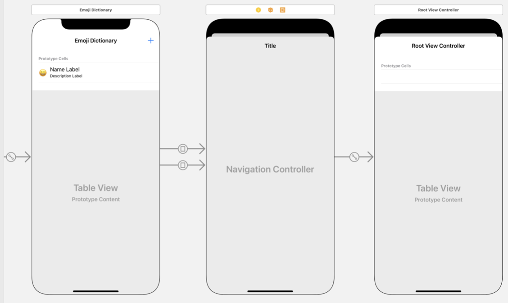
  - According to the Human Interface Guidelines, you should modally present this static table controller when it's being used to create a new Emoji or to edit an existing Emoji. If, however, you're simply displaying data without the ability to edit, it should be pushed.
  - With the segue from the cell to the navigation controller in place, you are no longer interested in knowing when a row is selected — remove the `tableView(_:didSelectRowAt:)` method in EmojiTableViewController.
  - Your new segues both go from the list of emoji to the navigation controller, but for your @IBSegueAction you're interested in initializing the AddEditEmojiTableViewController — the scene after the navigation controller — to pass it an Emoji when editing. You will notice that Xcode has provided a segue between the navigation controller and the AddEditEmojiTableViewController; this is called a relationship segue, and it's what you'll use to create an @IBSegueAction.
  - Control-drag from the segue between the navigation controller and AddEditEmojiTableViewController into EmojiTableViewController and create an action segue with the name `addEditEmoji` and Arguments set to `Sender`.
    - 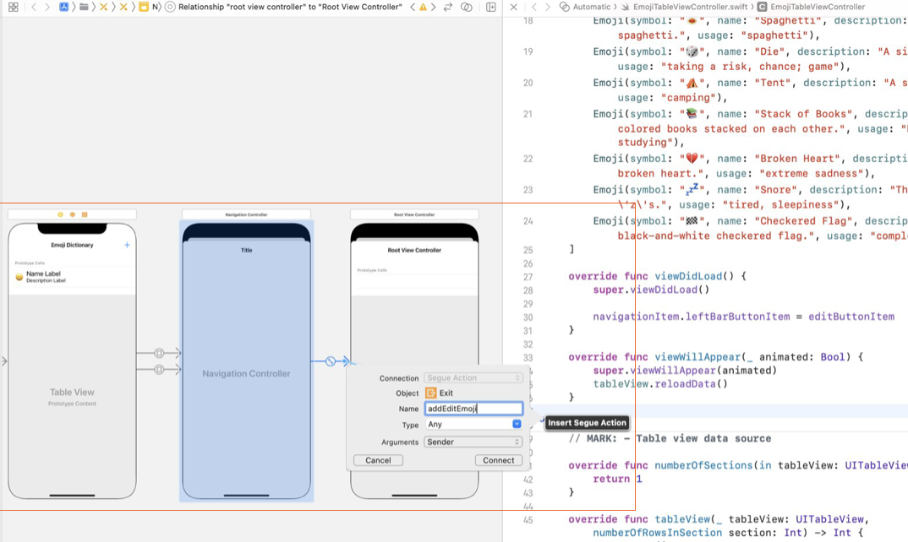
  - The new `addEditEmoji(_:sender:)` method will be called when the user taps the Add button or taps a row to edit an emoji. Add the following implementation.

    - ```swift
        if let cell = sender as? UITableViewCell,
          let indexPath = tableView.indexPath(for: cell) {
            // Editing Emoji

            let emojiToEdit = emojis[indexPath.row]
            return AddEditEmojiTableViewController(coder: coder, emoji: emojiToEdit)
        } else {
            // Adding Emoji

            return AddEditEmojiTableViewController(coder: coder, emoji: nil)
        }
      ```

  - When a cell is tapped, the sender parameter will be the cell, and you can use that to find the IndexPath — which translates back to the position in the emojis array. If the sender is not a cell, you can assume it was the Add button, so you create the `AddEditEmojiTableViewController` with a `nil` value for emoji.
  - Build and run your app. You should be able to tap the Add button or a cell and see your new table view. However, it won't be populated, and it is missing a dismiss button. While you can dismiss by swiping down, the Human Interface Guidelines state that it's best to always provide a button as well.
  - In the new table view controller scene, select the table view and open the Attributes inspector. Change the Content to Static Cells.
  - You can now start to build your static table view. In the Attributes inspector, adjust the number of sections to 4 and the Style of the table view to `Grouped`. Next, edit each section's attributes by selecting the section in the Document Outline and adjusting the settings in Attributes inspector. Set the number of rows in each section to 1 and add the following section headers (from top to bottom): “Symbol,” “Name,” “Description,” and “Usage.” Add a text field in each cell, and don't forget to add constraints.
  - Go ahead and test the app so far. Navigate back to your static table view controller, and enter the first text field. When the keyboard is presented, locate the emoji icon in the bottom left. Selecting it will switch to the Emoji keyboard. You can return to your default keyboard by pressing the ABC icon.
- **Pass Data to Static Table View**
  - Now that your static table view is set up, you need to fill in the text fields when emoji is not nil. Create outlets for each text field: `symbolTextField`, `nameTextField`, `descriptionTextField`, and `usageTextField`. In the AddEditEmojiTableViewController's viewDidLoad() method, check whether emoji has a value. If it does, then you're editing an existing Emoji; update the text of each text field with the corresponding emoji properties as well as the view's title. If the property is nil, then the static table view controller was presented to create a new Emoji:

    - ```swift
        if let emoji = emoji {
            symbolTextField.text = emoji.symbol
            nameTextField.text = emoji.name
            descriptionTextField.text = emoji.description
            usageTextField.text = emoji.usage
            title = "Edit Emoji"
        } else {
            title = "Add Emoji"
        }
      ```

  - If you try running on a smaller device, you'll notice that the keyboard initially covers the usageTextField and possibly the descriptionTextField when it slides up. But the table view controller automatically moves the text fields above the keyboard — unlike with a scroll view, where you needed to add code to get this behavior. This is another benefit of using static table view controllers to build input screens.
- **Add Action Buttons with Unwind Segue**
  - Currently, the AddEditEmojiTableViewController can only be dismissed by swiping it down. Add two bar button items to the navigation bar, one on each side of the title. For the button on the left, adjust the System Item to `Cancel`. For the button on the right, adjust it to `Save`. Both of these buttons should trigger the dismissal of the view controller by dismissing it modally.
  - Add an `unwindToEmojiTableView(segue:)` method in EmojiTableViewController. 
    - `@IBAction func unwindToEmojiTableView(segue: UIStoryboardSegue) {}`
  - You'll need a way to determine whether the unwind segue was triggered via the Save or Cancel button. The simplest way to do this is to give the segue initiated by the Save button an identifier. 
    - Connect the Save button to this segue by Control-dragging from the Save button to the view controller's Exit icon, then choose the method. Locate the segue in the Document Outline and open the Attributes inspector to set the Identifier to `saveUnwind`. Now do the same for the Cancel button, but do not worry about providing an identifier for the segue.
    - 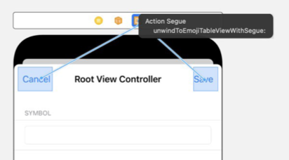
  - Build and run your application to verify that the AddEditEmojiTableViewController properly dismisses.
- **Update Save Button**
  - The Save button should only be enabled if every text field contains a value. The simplest way to enable and disable the button is to have a single method that checks every text field for a value and enables the button only if all four fields are not empty. Create an outlet for the Save button called `saveButton`, then implement a method that will check the text of every field.

    - ```swift
        func updateSaveButtonState() {
            let symbolText = symbolTextField.text ?? ""
            let nameText = nameTextField.text ?? ""
            let descriptionText = descriptionTextField.text ?? ""
            let usageText = usageTextField.text ?? ""
            saveButton.isEnabled = !symbolText.isEmpty && !nameText.isEmpty && !descriptionText.isEmpty && !usageText.isEmpty
        }
      ```

  - You should call this method in viewDidLoad() so that the button is disabled after being modally presented or enabled if you pushed to this view controller.

    - ```swift
        override func viewDidLoad() {
            super.viewDidLoad()
         
            if let emoji = emoji {
                symbolTextField.text = emoji.symbol
                nameTextField.text = emoji.name
                descriptionTextField.text = emoji.description
                usageTextField.text = emoji.usage
                title = "Edit Emoji"
            } else {
                title = "Add Emoji"
            }
         
            updateSaveButtonState()
        }
      ```

  - How do you continually check to see if the Save button should be enabled or disabled? You can call `updateSaveButtonState` after each key press. Create an @IBAction in code that will call the method.

    - ```swift
        @IBAction func textEditingChanged(_ sender: UITextField) {
            updateSaveButtonState()
        }
      ```

  - Next, open your storyboard and the assistant editor. Select a text field in the static table view and open the Connections inspector. Drag from the `Editing Changed` event to the `textEditingChanged(_:)` method. Repeat this step for the other text fields. 
  - Build and run the app and try adding text into the four fields. The Save button should only be enabled when all four fields contain text.
  - This is a good start, but it's not perfect: The symbolTextField should only allow a single emoji character. Input validation is a very important topic in software development — invalid inputs can cause your software to do unexpected things. 
  - Add the following method that checks whether the provided UITextField contains a single emoji character.

    - ```swift
        func containsSingleEmoji(_ textField: UITextField) -> Bool {
            guard let text = textField.text, text.count == 1 else {
                return false
            }
         
            let isCombinedIntoEmoji = text.unicodeScalars.count > 1 && text.unicodeScalars.first?.properties.isEmoji ?? false
            let isEmojiPresentation = text.unicodeScalars.first?.properties.isEmojiPresentation ?? false
         
            return isEmojiPresentation || isCombinedIntoEmoji
        }
      ```

  - This implementation uses methods, properties, and concepts you probably aren't familiar with, but you can often find solutions to small - scoped problems like this in reference documentation or on the internet.
  - Update the updateSaveButtonState() method to use this new validation.

    - ```swift
        func updateSaveButtonState() {
            let nameText = nameTextField.text ?? ""
            let descriptionText = descriptionTextField.text ?? ""
            let usageText = usageTextField.text ?? ""
            saveButton.isEnabled = containsSingleEmoji(symbolTextField) && !nameText.isEmpty && !descriptionText.isEmpty && !usageText.isEmpty
        }
      ```

  - Build and run the app to test out your input validation code. Confirm that the Save button is disabled unless the Name, Description, and Usage fields contain text and the Symbol field contains a single emoji character.

- **Save Emoji**
  - When the Save button is pressed, the saveUnwind segue is performed. Before the segue is triggered, you should use the text field values to construct a new Emoji instance and set it to your emoji property. In the unwind segue, the property can be used to update the emojis collection.
  - In `AddEditEmojiTableViewController`, add the `prepare(for segue:)` method. Ensure that the `saveUnwind` segue is being performed (you don't want to do any work when Cancel is pressed), then update the emoji property. Since you've performed validation with the Save button, don't be too concerned that you have to handle the optional values from text fields — your validation ensures they'll never be empty.

    - ```swift
        override func prepare(for segue: UIStoryboardSegue, sender: Any?) {
            guard segue.identifier == "saveUnwind" else { return }
         
            let symbol = symbolTextField.text!
            let name = nameTextField.text ?? ""
            let description = descriptionTextField.text ?? ""
            let usage = usageTextField.text ?? ""
            emoji = Emoji(symbol: symbol, name: name, description: description, usage: usage)
        }
      ```

  - Back in the `unwindToEmojiTableView(segue:)` method, verify that the saveUnwind segue was triggered. If so, check whether the table view still has a selected row. If it does, then you're unwinding after editing a particular Emoji. If it does not, then a new Emoji is being created. To add a new entry into emojis, you'll need to calculate the index path for the new row and add the item to the end of the collection. Update the table view accordingly.

    - ```swift
        @IBAction func unwindToEmojiTableView(segue: UIStoryboardSegue) {
            guard segue.identifier == "saveUnwind",
                let sourceViewController = segue.source as? AddEditEmojiTableViewController,
                let emoji = sourceViewController.emoji else { return }
         
            if let selectedIndexPath = tableView.indexPathForSelectedRow {
                emojis[selectedIndexPath.row] = emoji
                tableView.reloadRows(at: [selectedIndexPath], with: .none)
            } else {
                let newIndexPath = IndexPath(row: emojis.count, section: 0)
                emojis.append(emoji)
                tableView.insertRows(at: [newIndexPath], with: .automatic)
            }
        }
      ```

  - Build and run your app. You should now be able to add new emoji or edit existing ones.
- **Automatic Row Height**
  - If you enter a long piece of text into descriptionTextField, you may have noticed that the text is truncated. The first step toward resolving this issue is to set the bottom label's number of lines to 0 in the Attributes inspector. But if you build and run the app, there's no change. What's going on?
  - Even though the description label's text can cover multiple lines, the cell height still defaults to 44. You could implement `tableView(_:heightForRowAt:)` and manually calculate the height that a cell should be to display all the text, but that would be very cumbersome and error-prone. Instead, you can tell the table view that its row height should be determined automatically based on the contents of the cell.
  - To begin, add the following lines of code into the `viewDidLoad()` method of EmojiTableViewController. This will tell the table view that it needs to calculate the cell height but also give it a sensible estimate for how tall the average cell will be, to improve performance.

    - ```swift
        tableView.rowHeight = UITableView.automaticDimension
        tableView.estimatedRowHeight = 44.0
      ```

  - If you have constraints properly placed on both the top and bottom of your views, UITableView can automatically calculate the height that each cell needs to be to display all the content inside its views. However, if you want to avoid warnings in Interface Builder, you might still need to help the Auto Layout engine know which view's content to prioritize.
- **Compression Resistance**
  - Interface Builder does not have access to your code, so it doesn't know that the cell height will be calculated automatically. From its perspective, you have a cell with a constant height and two labels. The Auto Layout engine is unsure what should happen if the text length extends past the current size of the label, so it's up to you to resolve the ambiguity.
  - Every view has a compression resistance value that represents how resistant the view is to shrinking. This is similar to the content hugging priority in that it is a relative value. The default is 750. In the Size inspector, set the Name Label's Vertical Compression Resistance to 751, telling the Auto Layout engine that it has a higher priority than everything else — including the cell itself — to avoid shrinking. Set the Description Label's Vertical Compression Resistance to 752 so that it is resistant to shrinking as well (a value of 751 would create ambiguity between the two labels).
  - Now, since the vertical stack view still has a compression resistance value of 750, the Auto Layout engine understands that the stack view should grow to accommodate a larger amount of text. The stack view height increase will be taken into account when the table view calculates the cell height via UITableView.automaticDimension.
  - Build and run you app, supplying long text into the descriptionTextField. You should see the cell height increase.

#### Lab - Favorite Books

- **Object**
  - The objective of this lab is to implement intermediate table view features into an app that keeps track of your favorite books.
  - You'll find a starter project called “FavoriteBooks” in your student resources folder. Take a minute to look it over and run it to see how it behaves. You'll notice that it contains a table view controller that segues to a regular view controller. The regular view controller contains a form that allows the user to enter details about a book. In this lab, you'll replace the form with a static table view, add the capability to delete books from the main list of books, and create a custom table view cell to better display the details of each book in the main list.
- **Step 1. Create a Static Table View**
  - Drag a table view controller onto the storyboard. With the table view selected, use the Attributes inspector to set the Content to `Static Cells` and the Style to `Grouped`.
  - You'll be creating a form that models your existing form, where each text field is in its own cell and each cell is in its own section. You'll want five sections. In the storyboard, you can set the section header titles to “Title,” “Author,” “Genre,” and “Length.” The last section will be for the Save button.
  - Place a text field in each of the top four cells and a button in the last cell — setting appropriate constraints.
  - Create a new Cocoa Touch Class file named “BookFormTableViewController” and make sure it subclasses UITableViewController.
  - Your static table view doesn't need most of the boilerplate code that's included with this new subclass. Go ahead and delete all of it except for viewDidLoad().
  - Set the class of your table view controller in the storyboard and create outlets for your text fields and an action for your Save button.
- **Step 2 Replace BookFormViewController ​with BookFormTableViewController**
  - To transfer the functionality of BookFormViewController to BookFormTableViewController, you can copy and paste the entire implementation of BookFormViewController over — but you will need to rewire the text field outlets and save action to your new scene in the storyboard.
  - The `saveButtonTapped(_:)` method performs an unwind segue. For the unwind segue to work, you'll need to connect it to your BookFormTableViewController in the storyboard and give the segue the `UnwindToBookTable` identifier. You'll also need to update the implementation of `prepareForUnwind(segue:)` in BookTableViewController: Where segue.source is cast to BookFormViewController, this now needs to be BookFormTableViewController.
    - In the storyboard, Control-Drag from BookFormTableViewController to the Exit and select `prepareForUnwindWithSegue`. Click the Unwind segue in the Document Outline and type the Identifier in the Attribute Inspector to `UnwindToBookTable`.
  - In the storyboard, remove the original form view controller and add the table view controller in its place. Remember the segues that existed with the view controller you just deleted? Re-create the same two segues to this table view controller and wire up the Edit segue to the `editBook(_:sender:)` @IBSegueAction in BookTableViewController.
    - Control-Drag from the Add button and BookCell to BookFormTableViewController, and select Show in the Action segue.
    - Type the identifier in the Attribute inspector to `AddBook` and `EditBook` respectively.
    - To insert a segue action, Control-Drag from EditBook segue in the storyboard to BookTableViewController and the Name is editBook.
    - Copy and past the code into it.

      - ```swift
          guard let cell = sender as? UITableViewCell, let indexPath = tableView.indexPath(for: cell) else {
              return nil
          }
          
          let book = books[indexPath.row]
          
          return BookFormTableViewController(coder: coder, book: book)
        ```

  - Run the app to make sure it behaves as it did before, only with a different visual form.
- **Step 3 Delete Books**
  - What if the user wants to remove a book from the list? Go to your BookTableViewController and add the table view method `tableView(_:commit:forRowAt:)`.
  - To this method, add control flow that will check whether the editing style is `.delete`; if it is, remove the Book object in the Books array that corresponds to the index path in question, then remove the table view row at the same index path.

    - ```swift
        override func tableView(_ tableView: UITableView, commit editingStyle: UITableViewCell.EditingStyle, forRowAt indexPath: IndexPath) {
            if editingStyle == .delete {
                books.remove(at: indexPath.row)
                tableView.deleteRows(at: [indexPath], with: .automatic)
            }
        }
      ```

  - Run the app and confirm that you can delete books from the list.
- **Step 4 Create a Custom Book Cell**
  - Maybe you want to customize the display of your books' information. In your BookTableViewController, change the Style of the prototype cell to Custom.
  - You can now configure the cell however you'd like. For example, at the top, you might want a label for the book title; under it, you might want labels for author, genre, and length that are somewhat smaller and slightly indented. Or you could have six labels, in addition to the title label, arranged into three rows of two, where the labels on the left say “Author,” “Genre,” and “Length,” and the labels on the right contain the actual values corresponding to author, genre, and length. Go ahead and design your own custom prototype cell. Make sure it displays all the information contained in a Book object.
  - To create outlets for your labels, you'll need a custom UITableViewCell subclass. Create a new file that subclasses UITableViewCell named “BookTableViewCell.”
  - In the storyboard, set the type of your custom cell to be a BookTableViewCell, then create outlets for the labels.

    - ```swift
        @IBOutlet var titleTextField: UILabel!
        @IBOutlet var authorTextField: UILabel!
        @IBOutlet var genreTextField: UILabel!
        @IBOutlet var lengthTextField: UILabel!
      ```

  - In BookTableViewCell, create a method called `update(with book: Book)` that will set the labels properly for each book cell.

    - ```swift
        func update(with book: Book) {
            titleTextField.text = book.title
            authorTextField.text = book.author
            genreTextField.text = book.genre
            lengthTextField.text = book.length
        }
      ```

  - Back in your BookTableViewController, make some slight changes to the implementation for `tableView(_:cellForRowAt:)`. 
    - First, force-cast the cell that's dequeued as a BookTableViewCell. Then, instead of setting cell.textLabel?.text and cell.detailTextLabel?.text, you can just call your custom cell's update(with:) method and pass in the Book object.

      - ```swift
          override func tableView(_ tableView: UITableView, cellForRowAt indexPath: IndexPath) -> UITableViewCell {
              let cell = tableView.dequeueReusableCell(withIdentifier: "BookTableViewCell", for: indexPath) as! BookTableViewCell

              let book = books[indexPath.row]
              cell.update(with: book)
              cell.showsReorderControl = true
              
              return cell
          }
        ```

  - Run the app and see how the appearance of your cells has changed.
  - Congratulations! The intermediate table view concepts you just added to FavoriteBooks will provide a much better experience to the user. Make sure you save your final product in your project folder.

### Lesson 1.7 Saving Data

- As a programmer, you'll need to design your apps so that they save user data between launches. Imagine if a user wrote a note in the Notes app only to have it disappear when they relaunched the app. Whether ten seconds or ten months later, users expect all their data to still be there.
- In a previous lesson, you learned about MVC as a way to design the classes, structures, and flow of data in your app. You'll recall that model data represents the information in your app, views display the information, and a controller object acts as the intermediary, or communication layer, between the model and the views.
- When you add the ability to save data, you're adding a storage layer to your MVC architecture. In most cases, you'll use controller objects to access the storage layer.
With iOS, you have several ways to persist, or save, information in your app. In this lesson, you'll learn one approach: saving information to the device by archiving model data to a file saved on the disk. In the future, you'll learn about more advanced data storage tools, such as SQLite and Core Data.
- Regardless of the approach you choose, your behind-the-scenes data store will sit in the same place in the MVC diagram. As your app is running, it pulls information from the data store, works with it, and saves it back to the data store when the data is modified or when the app closes.

#### Encoding and Decoding with Codable

- In a previous lesson, you learned about the `Codable` protocol. The Codable protocol declares two methods that a class must implement so that its instances can be encoded and decoded, or serialized, into data that can be written to a file on disk. This lesson will walk you through encoding an object into a special format called a Property List, or plist, which is similar to a representation of a Dictionary in a file that can be saved to disk.
- In the earlier lesson, you learned that an object should be responsible for encoding and decoding its own instance variables. For a model object to be encoded or decoded, it must adopt the Codable protocol.
- Here's an example declaration of a Note model object that adopts the Codable protocol: `class Note: Codable {...}`
- Once an object conforms to the Codable protocol, an Encoder object can be used to encode the object as a data representation that can be saved to disk. Similarly, a Decoder object can be used to turn that encoded data into its corresponding model object. The `encode(_:)` method on an Encoder returns a Data object, and the `decode(_:from:)` method on a Decoder takes a Data object and returns an instance of the Codable object in question. (Data is a Swift structure that represents data stored as bytes. Data provides instance methods for writing to and reading from a file.)
- Conforming to the Codable protocol is simple. A class must adopt two methods: `init(from:)` and `encode(to:)`, which take a Decoder and an Encoder as a parameter, respectively. However, in most cases the Swift compiler makes it even easier to conform to the Codable protocol. If a model object only declares properties of types that already conform to Codable, an automatic conformance is triggered that satisfies all the protocol requirements.
- In other words, if all your object's properties are Codable, then all your object needs to do to adopt the Codable protocol is to include Codable in its declaration.
- The discussion that follows works through an example of encoding an object as Data and writing it to a file. To practice implementing Codable using the example, create a new iOS playground in Xcode (File > New > Playground) called “PersistencePractice.”

  - ```swift
      struct Note: Codable {
          let title: String
          let text: String
          let timestamp: Date
      }
    ```

- The code above declares a simple Note model object, similar to the objects you've declared previously. It also adopts the Codable protocol. Notice that the compiler is not displaying any errors. String and Date are Swift types that conform to Codable, so despite not explicitly having the two required methods for the protocol, Note automatically conforms to Codable.
- Create an instance of Note that can be encoded: `let newNote = Note(title: "Grocery run", text: "Pick up mayonnaise, mustard, lettuce, tomato, and pickles.", timestamp: Date())`
- Now look at the following example to see how to use an Encoder object to encode a value to a plist.

  - ```swift
      let propertyListEncoder = PropertyListEncoder()
      if let encodedNote = try? propertyListEncoder.encode(newNote) {
          print(encodedNote)
      }
    ```

- You might remember from the earlier lesson on protocols that PropertyListEncoder's `encode(_:)` method is a throwing function, requiring you to use either the do-try-catch syntax or the keyword `try?`. Because `try?` is used in this example, `encode(_:)` will simply return optional Data instead of throwing any errors. If you look at the console, you will see that printing encodedNote prints the number of bytes stored in the Data object. You have successfully encoded newNote.
- Decoding your data appears similar to the previous code, but is done in reverse and uses a PropertyListDecoder. Put the following lines of code inside your if-let block, below the existing print statement:

  - ```swift
      let propertyListDecoder = PropertyListDecoder()
      if let decodedNote = try? propertyListDecoder.decode(Note.self, from: encodedNote) {
          print(decodedNote)
      }
    ```

- You first create a PropertyListDecoder and then use it to decode encodedNote into a Note object. The `decode(_:from:)` method took as parameters `Note.self` and the note data. **Passing in Note.self passes in the actual Swift type of Note instead of any specific Note object**, which simply lets the method know what type of object it is trying to create from the data. PropertyListDecoder's `decode(_:from:)` method is also a throwing function, so the code uses `try?` and unwraps the resulting optional. By printing decodedNote to the console, you can see that you have successfully decoded the data.
- At this point your whole playground should look as follows:

  - ```swift
      struct Note: Codable {
          let title: String
          let text: String
          let timestamp: Date
      }
       
      let newNote = Note(title: "Grocery run", text: "Pick up mayonnaise, mustard, lettuce, tomato, and pickles.", timestamp: Date())
       
      let propertyListEncoder = PropertyListEncoder()
      if let encodedNote = try? propertyListEncoder.encode(newNote) {
          print(encodedNote)
       
          let propertyListDecoder = PropertyListDecoder()
          if let decodedNote = try?
            propertyListDecoder.decode(Note.self, from: encodedNote) {
              print(decodedNote)
          }
      }
    ```

#### Writing Data to a File

- Now what's left is to write your data to a file once it has been encoded and to read from that file before decoding. To do this, you'll need to learn a bit about the iOS file system.
- **Sandboxing and the Documents Directory**
  - In many operating systems, applications are given access to read and write files anywhere on the disk. So an application like Numbers might be able to open a spreadsheet from any folder, and a web browser might be able to write files to any directory.
  - This behavior is inherently insecure. A poorly written app could accidentally (or intentionally) delete important data that it has no business touching. Imagine if you downloaded an app to edit a music file, and it deleted all your photos.
  - Around the time iOS came on the scene, some operating systems introduced the concept of “sandboxing,” meaning giving programs access only to resources that they'd created or that they specifically requested access to. In this model, each app has its own environment where it can create, modify, or delete data — its own sandbox — and it doesn't have access to resources outside of the sandbox.
  - iOS apps work in the sandbox model. The operating system may allow access to resources outside of your app, but only when your app receives explicit permission from the user. For example, your app can load the user's contacts only after the user has given it permission to access them.
  - As part of the sandbox model, your app has a few directories that it can use to save data. One of those directories is called the Documents directory, and it's where you're allowed to save and modify information related to your app.
  - Another feature of the sandbox security model is that the file path to the Documents directory will change each time your app is loaded into memory. You can think of a file path as an address, similar to a URL, for locating the data. The contents of the directory will stay the same, but the address changes — preventing a variety of potential security issues.
  - How can you work with files within your sandboxed app? The Foundation framework defines a FileManager class that's used for interacting with the files on disk. It has a function that gives your app access to the Documents directory (wherever it is) and enables it to read and write files in that directory.
  - Back in your playground file, add the following line: `let documentsDirectory = FileManager.default.urls(for: .documentDirectory, in: .userDomainMask).first!`
  - Option-click the urls method to view its declaration. You can see that the function returns an array of URLs for the specified directory in the requested domains. For a list of available iOS directories, check out the [documentation for the FileManager.SearchPathDirectory enumeration](https://developer.apple.com/documentation/foundation/filemanager/searchpathdirectory#).
  - For this lesson, you're interested in the `.documentDirectory` — which you'll pass as the search parameter. The `.userDomainMask` refers to the user's home folder, the folder that holds the user's apps and all their data.
  - The result of the function you entered above is an array of URL objects, which point to the directories that match your search. But there's only one Documents directory, so you request the first result of the search to assign to the variable.
  - As a result, the documentsDirectory variable will hold a URL that points to the directory, or folder, where you can read and write data. Now you need a full path that provides a filename and extension as well, which you can get by appending those elements to the directory:

    - ```swift
        let documentsDirectory = FileManager.default.urls(for: .documentDirectory, in: .userDomainMask).first!
        let archiveURL = documentsDirectory.appendingPathComponent("notes_test").appendingPathExtension("plist")
      ```

  - If you look at the results sidebar for these two directories, you'll see that the first ends in /Documents/ and the second ends in Documents/notes_test.plist. This is the full path where you will write your Note object's data to file.
- **Writing the Data**
  - Now that you know how to access the Documents directory, you can use methods on Data to write directly to and from files in that directory.
  - Back in your playground, remove your previous code for encoding and decoding. Then, at the end of what is left, create a new PropertyListEncoder and encode newNote without unwrapping the result. Your code should look like the following:

    - ```swift
        struct Note: Codable {
            let title: String
            let text: String
            let timestamp: Date
        }
         
        let newNote = Note(title: "Grocery run", text: "Pick up mayonnaise, mustard, lettuce, tomato, and pickles.", timestamp: Date())
         
        let documentsDirectory = FileManager.default.urls(for: .documentDirectory, in: .userDomainMask).first!
        let archiveURL = documentsDirectory.appendingPathComponent("notes_test").appendingPathExtension("plist")
         
        let propertyListEncoder = PropertyListEncoder()
        let encodedNote = try? propertyListEncoder.encode(newNote)
      ```

  - Now that you have a file path at which to save encodedNote, you can use the `write(to:options:)` method on Data to write to that path: `try? encodedNote?.write(to: archiveURL, options: .noFileProtection)`
  - Notice that `write(to:options:)` is also a throwing function and requires the `try?` keyword. This method will create a file at the specified URL with the data in encodedNote. By adding `.noFileProtection` as a parameter, you allow the file to be overwritten in the future should your Note object change and need to be saved again.
  - To retrieve the data from the file, you can initialize a Data object using its throwing initializer `init(contentsOf:)` and pass it the URL at which the data is stored. You can then decode the data:

    - ```swift
        let propertyListDecoder = PropertyListDecoder()
        if let retrievedNoteData = try? Data(contentsOf: archiveURL),
            let decodedNote = try? propertyListDecoder.decode(Note.self, from: retrievedNoteData) {
            print(decodedNote)
        }
      ```

  - You have successfully encoded, saved, loaded, and decoded your note.

- **Saving an Array of Model Data**
  - In many cases, your app will need to archive and unarchive collections of model data, not just a single instance. For example, you'll want the app to save all the user's notes, not just a single note.
  - To persist an array of model objects, you'll use the same methods you used previously, just on an array of objects instead of a single object. Encoder and Decoder objects can encode and decode arrays as long as their elements conform to Codable.
  - To put this concept into practice, enter several notes in your playground. Add the notes to a [Notes] array, then update your code to encode the array and write the resulting data to file.

    - ```swift
        let note1 = Note(title: "Note One", text: "This is a sample note.", timestamp: Date())
        let note2 = Note(title: "Note Two", text: "This is another sample note.", timestamp: Date())
        let note3 = Note(title: "Note Three", text: "This is yet another sample note.", timestamp: Date())
        let notes = [note1, note2, note3]
         
        let documentsDirectory = FileManager.default.urls(for: .documentDirectory, in: .userDomainMask).first!
        let archiveURL = documentsDirectory.appendingPathComponent("notes_test").appendingPathExtension("plist")
         
        let propertyListEncoder = PropertyListEncoder()
        let encodedNotes = try? propertyListEncoder.encode(notes)
         
        try? encodedNotes?.write(to: archiveURL, options: .noFileProtection)
         
        let propertyListDecoder = PropertyListDecoder()
        if let retrievedNotesData = try? Data(contentsOf: archiveURL),
            let decodedNotes = try? propertyListDecoder.decode(Array<Note>.self, from: retrievedNotesData) {
            print(decodedNotes)
        }
      ```

  - That's it! You've saved a collection of notes to a file and loaded the data from the file back into your program. Persistence is a key feature for many apps you'll build in the future.
- **Translating from a Playground to a Project**
  - In this lesson, you've created a playground to implement basic persistence using the Codable protocol.
  - How does this practice translate into a full Xcode project? Where does all the code go? When implementing persistence in your projects, keep three things in mind:
    1. Your model objects should implement the Codable protocol, similar to your implementation in the playground.
    2. Writing to and reading from files can be implemented as static methods on the model. Be sure to make these method names descriptive, like `saveToFile()` and `loadFromFile()`. Any time you add, remove, or modify your model data, you'll want to update the file. You can accomplish this by calling your `saveToFile()` in appropriate locations. When your app launches, you'll want to load data from the disk. To do so, call your `loadFromFile()` method at an early stage of your app launch. This could be in the `AppDelegate` or in the `viewDidLoad()` method of your first view controller.
    3. You'll want to save your objects in the correct app delegate life cycle events, such as when the app enters the background or is terminated.

#### Lab - Remember Your Emojis

- The objective of this lab is to use the Codable protocol, the FileManager, and methods on Data to persist information between app launches. Start with the EmojiDictionary project that you developed in earlier table view lessons. Take a few minutes to refamiliarize yourself with the code. If you run the app, you will see that any additions and changes you make to the default list of emoji are lost when the app is restarted. In this lab, you'll add persistence to your Emoji objects.

##### Step 1 Implement Saving on Emoji

- To persist your app's information across app launches, you need to be able to write its information to a file on disk. Start by making your Emoji struct adopt the Codable protocol in its declaration.
- Remember that you can implement saving and loading as static methods on the model. Add the static method signature for a `saveToFile(emojis:)` function in the Emoji class. It should take an array of Emoji objects as a parameter. Now add a static `loadFromFile()` method. It shouldn't take any parameters, but should return an array of Emoji objects.
- In each of these methods, you'll use either a PropertyListEncoder to encode your Emoji object or a PropertyListDecoder to decode it. But to write data to a file, you need to have a file path. Add a static property archiveURL to your Emoji class that returns the file path for Documents/emojis.plist. If you need a refresher on how to do this, go back and read this lesson's section on sandboxing.
- Now that you have a path for saving your Emoji object, fill in the method bodies of saveToFile(emojis:) and loadFromFile(), using Emoji.archiveURL as the file path. Your saveToFile(emojis:) method should save the supplied emojis array by encoding it and then writing it to Emoji.archiveURL. Your loadFromFile() method should read the data from the file, decode it as an [Emoji] array, and return the array.
- Create a static sampleEmojis method that returns a predefined [Emoji] collection. You can use the list assigned to emojis in EmojiTableViewController as your list of items.

##### Step 2 Save and Load When Appropriate

- Update emojis to be initialized to an empty collection rather than a large sample collection. When the viewDidLoad() method is called, you should check the Documents directory for any previously saved Emoji objects using loadFromFile(). If they're found, assign them to emojis. If not, assign emojis to Emoji.sampleEmojis.
- Take a moment to think about when it might be appropriate to save your Emoji objects.
In this case, the central spot for your data is the emojis array on the EmojiTableViewController—which means it would be appropriate to call saveToFile(emojis:) whenever the emojis property is changed.
- Next, think about when it might be appropriate to load your archived Emoji objects. Again, in this simple case, there's really only one point where the archived data will need to be unarchived—when the first view loads. You should already be calling this method in the first view controller's viewDidLoad().
- By now, your emoji data should be properly saving and loading. Run your app. Try adding a new emoji and tapping the Save button. Then close the app, reopen it, and observe whether the emoji persists in the table view. Repeat this process for editing an already existing emoji.
- On `Emoji.swift`

  - ```swift
      import Foundation

      struct Emoji: Codable {
          var symbol: String
          var name: String
          var description: String
          var usage: String
          
          static var documentsDirectory = FileManager.default.urls(for: .documentDirectory, in: .userDomainMask).first!
          static let archiveURL = documentsDirectory.appendingPathComponent("emojis").appendingPathExtension("plist")
          
          
          static func saveToFile(emojis: [Emoji]) {
              let propertyListEncoder = PropertyListEncoder()
              let encodedEmojis = try? propertyListEncoder.encode(emojis)
              
              try? encodedEmojis?.write(to: archiveURL, options: .noFileProtection)
          }
          
          static func loadFromFile() -> [Emoji]? {
              let propertyListDecoder = PropertyListDecoder()
              guard let retrivedEmojisData = try? Data(contentsOf: archiveURL) else {return nil}
              return try? propertyListDecoder.decode(Array<Emoji>.self, from: retrivedEmojisData)
          }
          
          static func sampleEmojis() -> [Emoji] {
              let emojis: [Emoji] = [
                  Emoji(symbol: "😀", name: "Grinning Face", description: "A typical smiley face.", usage: "happiness"),
                  ...
              ]
              
              return emojis
          }
      }
    ```

- On `EmojiTableViewController.swift`

  - ```swift
      import UIKit
      class EmojiTableViewController: UITableViewController {
          var emojis = [Emoji]()

          override func viewDidLoad() {
              super.viewDidLoad()              
              if let savedEmojis = Emoji.loadFromFile() {
                  emojis = savedEmojis
              } else {
                  emojis = Emoji.sampleEmojis()
              }
              
              navigationItem.leftBarButtonItem = editButtonItem
              tableView.rowHeight = UITableView.automaticDimension
              tableView.estimatedRowHeight = 44.0
              
          }

          @IBSegueAction func addEditEmoji(_ coder: NSCoder, sender: Any?) -> AddEditEmojiTableViewController? {
              if let cell = sender as? UITableViewCell,
                let indexPath = tableView.indexPath(for: cell) {
                  let emojiToEdit = emojis[indexPath.row]
                  return AddEditEmojiTableViewController(coder: coder, emoji: emojiToEdit)
              } else {
                  return AddEditEmojiTableViewController(coder: coder, emoji: nil)
              }
          }
          
          override func numberOfSections(in tableView: UITableView) -> Int {
              return 1
          }

          override func tableView(_ tableView: UITableView, numberOfRowsInSection section: Int) -> Int {
              return emojis.count
          }

          override func tableView(_ tableView: UITableView, cellForRowAt indexPath: IndexPath) -> UITableViewCell {
              let cell = tableView.dequeueReusableCell(withIdentifier: "EmojiCell", for: indexPath) as! EmojiTableViewCell
              let emoji = emojis[indexPath.row]
              
              cell.update(with: emoji)
              cell.showsReorderControl = true
              
              return cell
          }

          override func tableView(_ tableView: UITableView, didSelectRowAt indexPath: IndexPath) {
              let emoji = emojis[indexPath.row]
              print("\(emoji.symbol) \(indexPath)")
          }
          override func tableView(_ tableView: UITableView, moveRowAt fromIndexPath: IndexPath, to: IndexPath) {
              let movedEmoji = emojis.remove(at: fromIndexPath.row)
              emojis.insert(movedEmoji, at: to.row)
              
              tableView.reloadData()
              Emoji.saveToFile(emojis: emojis)
          }

          override func tableView(_ tableView: UITableView, editingStyleForRowAt indexPath: IndexPath) -> UITableViewCell.EditingStyle {
              return .delete
          }
          
          override func viewWillAppear(_ animated: Bool) {
              super.viewWillAppear(animated)
              tableView.reloadData()
          }
          
          override func tableView(_ tableView: UITableView, commit editingStyle: UITableViewCell.EditingStyle, forRowAt indexPath: IndexPath) {
              if editingStyle == .delete {
                  emojis.remove(at: indexPath.row)
                  tableView.deleteRows(at: [indexPath] , with: .automatic)
                  Emoji.saveToFile(emojis: emojis)
              }
          }
          @IBAction func unwindToEmojiTableView(segue: UIStoryboardSegue) {
              guard segue.identifier == "saveUnwind",
                    let sourceViewController = segue.source as? AddEditEmojiTableViewController,
                    let emoji = sourceViewController.emoji
              else { return }
              
              if let selectedIndexPath = tableView.indexPathForSelectedRow {
                  emojis[selectedIndexPath.row] = emoji
                  tableView.reloadRows(at: [selectedIndexPath], with: .none)
              } else {
                  let newIndexPath = IndexPath(row: emojis.count, section: 0)
                  emojis.append(emoji)
                  tableView.insertRows(at: [newIndexPath], with: .automatic)
              }
              
              Emoji.saveToFile(emojis: emojis)
          }
      }
    ```

- Congratulations! Persisting data isn't an easy thing to learn, but it's a concept you'll probably use in every app you build. Be sure to save this new version of your app to your project folder.

### Lesson 1.8 System View Controllers

- If you're an iOS user, you're likely already familiar with interfaces that allow you to access, present, and share content in an iOS app. When you enter your password for App Store purchases, use the Camera app to take a profile picture, or share an article through the Messages app, you're probably using a system view controller.
As a developer, you can use these familiar view controllers to extend the functionality of your apps. For example, you might want to access a user's photo library, share data to other apps, or respond to certain user choices.
- In this lesson, you'll learn the following:
  - How to use UIActivityViewController to share content to other installed apps
  - How to use SFSafariViewController to present information from the internet without exiting the app
  - How to use UIAlertController to present new information and options, as well as how to respond to the user's actions
  - How to use UIImagePickerController to access the device's camera and photo library and allow the user to select an image
  - How to use MFMailComposeViewController to send emails from within the app
- You'll work through the lesson by creating a project that uses these system view controllers and combines them to provide a better, more familiar user experience. The number of view controllers in that list might feel a bit overwhelming, but you'll learn that it's quite easy to build them into your app.

#### Create the Project

- Create a new project called "SystemViewControllers" using the iOS App template. When creating the project, make sure the interface option is set to "Storyboard."
- In the Main storyboard, drag an image view from the Object library to the view controller. Add a photo to the Asset Catalog and set your image view to display it, as you have done in previous lessons. Later in this lesson, you'll learn how to use different system view controllers to share the image. When you learn about the image picker view controller, you'll allow the user to set the image from the photo library.
- Next, add four buttons and set their text to reflect the system view controllers they'll be calling: “Share,” “Safari,” “Camera,” and “Email.” (You might want to use a stack view to help manage the layout.)
- Create an outlet for the image view called imageView. Set your image and create four actions, one for each button tap.
- If you have an iOS device available for testing, you might want to use it for this lesson instead of Simulator. Running this app on your device will allow you to access your own photos and share content with other apps on the device. You can switch from Simulator to a physical device with the schemes menu in the top-left corner of Xcode.

#### Share with the Activity Controller

- Have you ever been using an app and seen an image that you wanted to send to a friend? Have you ever wondered how you were able to share content between different apps? You can add sharing to your app easily using the `UIActivityViewController`. Fairly simple to implement, an activity controller provides a familiar experience that allows the user to share content from one app with other apps on their device.
- You'll begin by creating an instance of UIActivityViewController when the Share button is tapped. The initializer for an activity view controller asks for a parameter called `activityItems`, an array of type `Any`. The sharing interface will show any app that can accept the activity items you've included in the array.
- To share an item — such as text, an image, a URL, or other content — you'll pass it into the activityItems array. In this case, you will unwrap the image view's image and include it in the array of activity items in the initializer.
- The initializer also has a parameter for `applicationActivities` that represents any custom services that your app might support. For this project, you'll set it to `nil`. Once the activity view controller has been created, don't forget to present it to the user. Here's how this works:

  - ```swift
      @IBAction func shareButtonTapped(_ sender: UIButton) {
          guard let image = imageView.image else { return }
          let activityController =  UIActivityViewController(activityItems: [image],
            applicationActivities: nil)
          activityController.popoverPresentationController?.sourceView = sender
          present(activityController, animated: true, completion: nil)
      }
    ```

- Why is the `popoverPresentationController` property being modified? On an iPad, a UIActivityViewController will be presented inside a popover, and all popovers emanate from a particular view. Popovers are best presented from the button that triggered the presentation — in this case, sender. This line of code will have no effect on smaller iOS devices.
- Run your project and tap the Share button. If you're running the project in Simulator, you may only see one or two apps. But if you're running on your device and you have a lot of apps, you may discover quite a number of apps where you can share your content.
- You can experiment with the array of activity items. What happens when you replace the image with a string? What about when you include an image and a string? You'll find that the available apps change to match the types of activity items you want to share.

#### Use Safari Services to Display Web Content

- You've just learned how to take content from your app and share it with other apps on your device. What if you wanted to build an app that would present your user with content from the web while keeping them inside your app? `SFSafariViewController` allows you to open a webpage on a Safari web browser inside your app.
- Have a look at the [documentation for SFSafariViewController](https://developer.apple.com/documentation/safariservices/sfsafariviewcontroller) to learn about some of its features, which include a safe and familiar interface for browsing the web, a read-only address field, Reader, AutoFill, Fraudulent Website Detection, and content blocking.
- While you're in the documentation, see if you can identify which framework allows you to use Safari view controllers. Most of what you've worked with until now has been in either the Foundation or UIKit framework. SFSafariViewController, however, is in the `SafariServices` framework. To open a Safari view controller, you'll need to import this framework into your project by adding it to the top of your view controller file, beneath the line that imports UIKit.

  - ```swift
      import UIKit
      import SafariServices
    ```

- Now you're ready to present your own Safari view controller. You may have noticed in the documentation that the Safari view controller has a read-only address field, which means you'll need to specify which website the sure will be visiting when you initialize the view controller.

- To make an instance of Safari view controller, you have three things to do. 
  - First, create a URL from a string; this is the site you'll present to the user. You'll notice the `URL(string:)` initializer returns an optional, so you'll need to unwrap it. 
  - Next, create an instance of SFSafariViewController with the URL you just created. 
  - And last, present the Safari view controller to the user. The code is quite simple. Here's how to make it happen:

  - ```swift
      @IBAction func safariButtonTapped(_ sender: UIButton) {
          if let url = URL(string: "https://www.apple.com") {
              let safariViewController = SFSafariViewController(url: url)
              present(safariViewController, animated: true, completion: nil)
          }
      }
    ```

- Run the app and tap the Safari button. You've successfully opened a Safari view controller in your app. Tapping the Done button in the upper-left corner or swiping right from the edge of the screen will navigate back to the original view controller. You can use any URL when presenting a Safari view controller.

#### Present an Alert Controller

- You've now shared content through the activity controller, and you've presented websites with the Safari view controller. But so far, all the content has been predetermined. How can you open up the experience to the user? How can you use system view controllers to allow them to interact with your app?
- A great way to present your user with different options is with the `UIAlertController`. You've seen alert controllers before. iOS presents low battery alerts when you are running low and software update alerts when a new version of the operating system is available. You can use alert controllers to capture the attention of the user and give them options to choose from. As the programmer, you can determine the text of the alert, the available options, and the code that runs when the user chooses each option.
- In the [documentation for UIAlertController](https://developer.apple.com/documentation/uikit/uialertcontroller), read through the different symbols and consider how you might configure an alert controller.
- For this app, you'll use the alert controller to ask the user whether they would like to take a new photo or select an existing photo from their photo library to set as the new image for the image view. So you'll start by implementing the alert controller inside the `cameraButtonTapped` function.
- When you initialize a UIAlertController, you specify a title, message, and a preferred presentation style — which also determines the placement of the alert. Choosing `.alert` will place the alert in the center of the screen, while `.actionSheet` will place the alert at the bottom of the screen.
- Try it out. Create an alert controller and set the style to `.actionSheet`. Add an alert action to cancel, or dismiss, the alert controller. And, finally, present the alert controller to the user. Just like the activity view controller, you should set the sourceView property so that the popover presents in the proper location on an iPad. You can put it all together with the following code:

  - ```swift
      @IBAction func cameraButtonTapped(_ sender: UIButton) {
          let alertController = UIAlertController(title: "Choose Image Source", message: nil, preferredStyle: .actionSheet)

          let cancelAction = UIAlertAction(title: "Cancel", style: .cancel, handler: nil)
          alertController.addAction(cancelAction)
          alertController.popoverPresentationController?.sourceView = sender

          present(alertController, animated: true, completion: nil)
      }
    ```

- You're now presenting the alert, but how can you respond to the user's action? Create a UIAlertAction and give it the title "Camera" and a style of .default. The alert action has a property called handler, which is where you'll write the code that will be executed if the user selects that option. The handler is a closure, or block of code, that will execute if its action has been selected. You'll learn more about closures in a future lesson.
- For now, when you encounter a closure parameter, you can select the placeholder and press Return, which will automatically generate the closure syntax you'll need to add the code you want to execute. You can see an example of the closure syntax in the next code sample.
- Imagine that you want the handler to print out the user's selection. Once you've created that alert action, you'll add it to the alert controller. Create another button that will allow the user to select a picture from the photo library and add it to the alert controller.
- Here's how all that will work:

  - ```swift
      @IBAction func cameraButtonTapped(_ sender: UIButton) {
          let alertController = UIAlertController(title: "Choose Image Source", message: nil, preferredStyle: .actionSheet)
       
          let cancelAction = UIAlertAction(title: "Cancel", style: .cancel, handler: nil)
          let cameraAction = UIAlertAction(title: "Camera", style: .default, handler: { action in 
              print("User selected Camera action")
          })
       
          let photoLibraryAction = UIAlertAction(title: "Photo Library",
            style: .default, handler: { action in
              print("User selected Photo Library action")
          })
       
          alertController.addAction(cancelAction)
          alertController.addAction(cameraAction)
          alertController.addAction(photoLibraryAction)
          alertController.popoverPresentationController?.sourceView = sender
       
          present(alertController, animated: true, completion: nil)
      }
    ```

- Run the project on your device and present the alert controller. Select one of the action alerts, and notice that the string prints to the console. Now that you've presented an alert and responded to the user's actions, you're ready to step it up a notch.

#### Access the Camera

- You've used an activity controller to share content, presented web content through a Safari view controller, and even responded to a user's actions from an alert controller. Now you can use these same tools to work with user - generated content by accessing the user's photos and camera.
- When might you want to access a device's camera? Maybe you're building a photo - sharing app or an app where users can choose a profile picture. To access the user's camera or photo library, you'll use `UIImagePickerController`.
- To use an image picker controller, you must adopt two protocols:
  - `UIImagePickerControllerDelegate` will transfer the selected image's information back into your app.
  - `UINavigationControllerDelegate` will handle the responsibility for dismissing the image picker view.
- Update your ViewController class to adopt both `UIImagePickerControllerDelegate` and `UINavigationControllerDelegate`: `class ViewController: UIViewController, UIImagePickerControllerDelegate, UINavigationControllerDelegate {...}`
- In your `cameraButtonTapped` action, create an instance of `UIImagePickerController` and set your view controller as the delegate. Place this code above the alert controller initializer.

  - ```swift
      @IBAction func cameraButtonTapped(_ sender: UIButton) {
          let imagePicker = UIImagePickerController()
          imagePicker.delegate = self
       
          //...
      }
    ```

- With the delegate set, it's time to present the user with a choice of photo sources. In this case, you'll use the handlers for the alert action items you created in the previous section.
- You'll only want to present the user with the options they can actually choose. For example, if the app is running on Simulator, you only want to present the Photo Library option, because Simulator does not have a camera. If you try to open the camera in Simulator, the app will crash with a fatal error.
- You can use the class method `UIImagePickerController.isSourceTypeAvailable(_:)`, which will return a Bool indicating whether the source type can be used on that device.
- Now create an alert controller and check whether the camera and photo library are available source types. If one or both are supported, create alert actions accordingly. Add the actions to the alert controller, remembering to set the source type in the action's handler. Finally, present the image picker. Your code should resemble the following:

  - ```swift
      @IBAction func cameraButtonTapped(_ sender: UIButton) {
          let imagePicker = UIImagePickerController()
          imagePicker.delegate = self
       
          let alertController = UIAlertController(title: "Choose Image Source", message: nil, preferredStyle: .actionSheet)
       
          let cancelAction = UIAlertAction(title: "Cancel", style: .cancel, handler: nil)
          alertController.addAction(cancelAction)
       
          if UIImagePickerController.isSourceTypeAvailable(.camera) {
              let cameraAction = UIAlertAction(title: "Camera", style: .default, handler: { action in
                  imagePicker.sourceType = .camera
                  self.present(imagePicker, animated: true, completion: nil)
              })
              alertController.addAction(cameraAction)
          }
       
          if UIImagePickerController.isSourceTypeAvailable(.photoLibrary) {
              let photoLibraryAction = UIAlertAction(title: "Photo Library", style: .default, handler: { action in
                  imagePicker.sourceType = .photoLibrary
                  self.present(imagePicker, animated: true, completion: nil)
              })
              alertController.addAction(photoLibraryAction)
          }
       
          alertController.popoverPresentationController?.sourceView = sender
       
          present(alertController, animated: true, completion: nil)
      }
    ```

- Build and run your app. What happened when you selected the photo library or camera? If you ran the app on an iOS device and followed all the steps above, your app probably crashed when you chose the camera. Take a look in the console, and you'll see an error message that reads: `This app has crashed because it attempted to access privacy-sensitive data without a usage description. The app's Info.plist must contain an NSCameraUsageDescription key with a string value explaining to the user how the app uses this data.`
- This message appears because your app must request permission before trying to access the user's private information — in this case, the camera. The operating system handles presenting the user with the option to allow access. The `NSCameraUsageDescription` key is used to tell the user why your app wants to access their camera.
- Open the Info file in the Project navigator and enter a new key for `NSCameraUsageDescription`
- For the value, enter how you'll use the user's data — for example, `To share photos from the camera.` (1)
  - 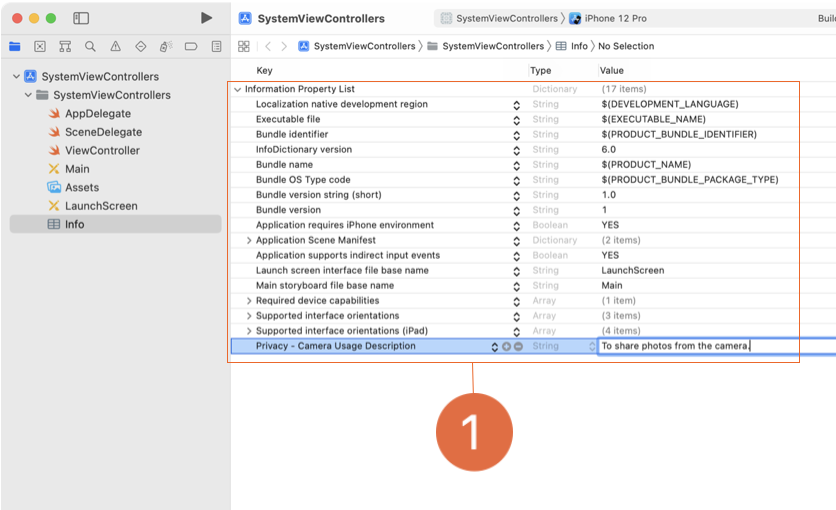
- Now the operating system can ask the user for permission and present the camera accordingly. Run the app again. You'll notice an alert asking permission to access your camera.
- Go ahead and select a photo from the library. What happened? Not much; you're just back at your view controller's view. You'll need a way to grab the selected photo and bring it into your app. You do this by implementing the delegate method `imagePickerController(_:didFinishPickingMediaWithInfo:)`. This method tells the delegate that the user has picked a photo (or other media), and it includes the photo in the info dictionary. Add the method to your view controller:

  - ```swift
      @IBAction func cameraButtonTapped(_ sender: UIButton) {...}
       
      func imagePickerController(_ picker: UIImagePickerController, didFinishPickingMediaWithInfo info: [UIImagePickerController.InfoKey : Any]) {
       
      }
    ```

- In the body of this method, you can access the media through the info dictionary. The dictionary keys are of type UIImagePickerController.InfoKey and give you access to information regarding the user's image picking session. For now, you'll simply use the `.originalImage` key to get the image selected by the user. However, you should look at the [documentation for UIImagePickerController.InfoKey](https://developer.apple.com/documentation/uikit/uiimagepickercontroller/infokey) to see what other information is available.
- Because the info dictionary is of the type `[UIImagePickerController.InfoKey: Any]`, the value for the original image key won't be of type UIImage. You can typecast the value to be a UIImage — but remember that by doing so you will make it an optional `(UIImage?)`. Once you've unwrapped the optional image, you can set it to display in your view controller. To dismiss the image picker, simply call `dismiss(animated:completion:)` at the end. Here's how it should look:

  - ```swift
      @IBAction func cameraButtonTapped(_ sender: UIButton) {...}
       
      func imagePickerController(_ picker: UIImagePickerController,  didFinishPickingMediaWithInfo info: [UIImagePickerController.InfoKey : Any]) {
          guard let selectedImage = info[.originalImage] as? UIImage else { return }
       
          imageView.image = selectedImage
          dismiss(animated: true, completion: nil)
      }
    ```

- Build and run the app. You can now open the photo library and select a photo or take a picture with the camera for your view controller to display.

#### Send Email from Your App

- The last system view controller you'll learn about in this lesson is the `MFMailComposeViewController`, which allows you to send emails from within your app. The mail compose view controller is in the `MessageUI` framework, which provides an interface for sending email and text messages. Add an import statement to the top of your view controller, beneath the other import statements.
- Have a look at the [documentation for MFMailComposeViewController](https://developer.apple.com/documentation/messageui/mfmailcomposeviewcontroller#) before moving forward.
- Just like the other view controllers, you're going to present the MFMailComposeViewController from the relevant button's action. But before doing anything: Is the user's device capable of sending email? Similar to the verification you performed with the image picker, you'll use the function `canSendMail()` to determine whether the device has available mail services. If not, you'll print a message to the console and return out of the function:

  - ```swift
      @IBAction func emailButtonTapped(_ sender: UIButton) {
          guard MFMailComposeViewController.canSendMail() else {
              print("Can not send mail")
              return
          }
      }
    ```

- You may have noticed in the documentation the symbol for accessing the delegate. Similar to the `UIImagePickerControllerDelegate`, the `mailComposeDelegate` is responsible for dismissing the mail compose view controller at the appropriate time. To set the delegate, you'll need to adopt the `MFMailComposeViewControllerDelegate` protocol: `class ViewController: UIViewController, UIImagePickerControllerDelegate, UINavigationControllerDelegate, MFMailComposeViewControllerDelegate {...}`
- Now that your view controller conforms to the protocol, you're ready to implement the mail compose view controller. Create an instance of `MFMailComposeViewController` and set the view controller as the `mailComposeDelegate`:

  - ```swift
      @IBAction func emailButtonTapped(_ sender: UIButton) {
          guard MFMailComposeViewController.canSendMail() else { return }
       
          let mailComposer = MFMailComposeViewController()
          mailComposer.mailComposeDelegate = self
      }
    ```

- Notice that the guard statement returns silently if canSendMail returns false. This wouldn't be a good design in a real world app. You should disable — or just not show — the email option if the user can't send email on their device (for example, on an iPhone with no email account set up). Or you could display a message explaining the situation.
- You can go even further with email functionality. With the `MFMailComposeViewController`, you can configure different parts of an email in your code: the recipients, the subject, the message body, and even attachments. One of the parameters used in setting the message body is the parameter `isHTML`, a Bool for checking whether your message should be interpreted as plain text or HTML. In this email, you won't be sending HTML, so the `isHTML` parameter is set to false. Once the email's details are configured, present the mail compose view controller to the user. Here's how the code goes:

  - ```swift
      mailComposer.setToRecipients(["example@example.com"])
      mailComposer.setSubject("Look at this")
      mailComposer.setMessageBody("Hello, this is an email from the app I made.", isHTML: false)
       
      if let image = imageView.image, let jpegData = image.jpegData(compressionQuality: 0.9) {
          mailComposer.addAttachmentData(jpegData, mimeType: "image/jpeg", fileName: "photo.jpg")
      }

      present(mailComposer, animated: true, completion: nil)
    ```

- When the user has finished sending an email, they'll need a way to dismiss the mail compose view controller and return to the app. You can use the delegate method `mailComposeController(didFinishWith:)` to dismiss the view:

  - ```swift
      @IBAction func emailButtonTapped(_ sender: UIButton) {...}
       
      func mailComposeController(_ controller: MFMailComposeViewController, didFinishWith result: MFMailComposeResult, error: Error?) {
          dismiss(animated: true, completion: nil)
      }
    ```

- If you have an iOS device, try running the app to see this system view controller at work. (Simulator doesn't have an email app, so tapping the button there won't do anything.)

- Wrap-Up
  - Now that you've successfully implemented the activity view controller, Safari view controller, alert controller, image picker controller, and mail compose view controller, you're ready to incorporate one or all of them into your apps.
  - In addition to extending the functionality of your apps, these system view controllers add an element of familiarity to the apps you create and provide a sense of continuity across the iOS platform.
- Challenge
  - Read the [documentation for MFMessageComposeViewController](https://developer.apple.com/documentation/messageui/mfmessagecomposeviewcontroller) and implement the message compose view controller in your app.

- ViewController.swift

  - ```swift
      import UIKit
      import SafariServices
      import MessageUI

      class ViewController: UIViewController, UIImagePickerControllerDelegate, UINavigationControllerDelegate, MFMailComposeViewControllerDelegate {
          @IBOutlet var imageView: UIImageView!
          
          override func viewDidLoad() {
              super.viewDidLoad()
          }

          @IBAction func shareButtonTapped(_ sender: UIButton) {
              guard let image = imageView.image else {return}
              let activityController = UIActivityViewController(activityItems: [image], applicationActivities: nil)
              activityController.popoverPresentationController?.sourceView = sender
              present(activityController, animated: true, completion: nil)
          }
          @IBAction func safariButtonTapped(_ sender: UIButton) {
              if let url = URL(string: "https://www.apple.com") {
                  let safariViewController = SFSafariViewController(url: url)
                  present(safariViewController, animated: true, completion: nil)
              }
          }
          @IBAction func cameraButtonTapped(_ sender: UIButton) {
              let imagePicker = UIImagePickerController()
              imagePicker.delegate = self
              let alertController = UIAlertController(title: "Choose Image Source", message: nil, preferredStyle: .actionSheet)
          
              let cancelAction = UIAlertAction(title: "Cancel", style: .cancel, handler: nil)
              alertController.addAction(cancelAction)
          
              if UIImagePickerController.isSourceTypeAvailable(.camera) {
                  let cameraAction = UIAlertAction(title: "Camera",
                    style: .default, handler: { action in
                      imagePicker.sourceType = .camera
                      self.present(imagePicker, animated: true, completion: nil)
                  })
                  alertController.addAction(cameraAction)
              }
          
              if UIImagePickerController.isSourceTypeAvailable(.photoLibrary) {
                  let photoLibraryAction = UIAlertAction(title: "Photo Library",
                    style: .default, handler: { action in
                      imagePicker.sourceType = .photoLibrary
                      self.present(imagePicker, animated: true, completion: nil)
                  })
                  alertController.addAction(photoLibraryAction)
              }
          
              alertController.popoverPresentationController?.sourceView = sender
          
              present(alertController, animated: true, completion: nil)
          }
          func imagePickerController(_ picker: UIImagePickerController, didFinishPickingMediaWithInfo info: [UIImagePickerController.InfoKey : Any]) {
              guard let selectedImage = info[.originalImage] as? UIImage else { return }
              imageView.image = selectedImage
              dismiss(animated: true, completion: nil)
          }
          @IBAction func emailButtonTapped(_ sender: UIButton) {
              guard MFMailComposeViewController.canSendMail() else {
                  print("Can not send mail")
                  return
              }
              
              let mailComposer = MFMailComposeViewController()
              mailComposer.mailComposeDelegate = self
              mailComposer.setToRecipients(["example@example.com"])
              mailComposer.setSubject("Look at this")
              mailComposer.setMessageBody("Hello, this is an email from the app I made.", isHTML: false)
              
              if let image = imageView.image, let jpegData = image.jpegData(compressionQuality: 0.9) {
                  mailComposer.addAttachmentData(jpegData, mimeType: "image/jpeg", fileName: "photo.jpg")
              }
              present(mailComposer, animated: true, completion: nil)
          }
          
          func mailComposeController(_ controller: MFMailComposeViewController, didFinishWith result: MFMailComposeResult, error: Error?) {
              dismiss(animated: true, completion: nil)
          }
      }
    ```

#### Lab - Home Furniture Sharing

- The objective of this lab is to use system view controllers in an app that lists rooms and furniture and allows users to share furniture items with other apps on their device. Make sure to build and run your app on a physical iOS device if you have one — rather than on Simulator — so you'll have more apps that permit image and text sharing.
- Your app has been started for you. Open the project called “HomeFurniture” in your student resources folder. Take a few minutes to get familiar with the project. Run the app and navigate to the detail screen of a furniture item. Notice that the button in the middle of the screen says “Choose Photo,” but that it doesn't do anything when you tap it. The button at the bottom left also does nothing. Your task in this lab is to add functionality to these two buttons.

##### Step 1 Add a UIAlertController

- To present the right `UIImagePickerController` state, you'll need to know whether the user wants to choose an existing image from the device's photo library or take a new image using the camera. To enable the user's choice, you'll use a `UIAlertController` to present an action sheet from the bottom of the screen.
- In the `choosePhotoButtonTapped(_:)` method in `FurnitureDetailViewController`, you'll need to create and present your action sheet. First, create an instance of a UIAlertController. You can make the title and message parameters `nil`, but you'll need to set the preferredStyle to `UIAlertControllerStyle.actionSheet`.
- Next, create a `UIAlertAction` for canceling the alert and add it to your instance of `UIAlertController`. As you've learned, a handler executes code after the button is tapped. By default, a button tapped in a `UIAlertController` will dismiss the alert, so the `handler` parameter can be `nil`.
- You'll need to add two more `UIAlertAction` instances: one for choosing an image from the photo library and another for using the camera to take a new image. Use the autocompletion feature in Xcode to get the right syntax for including the `handler` parameter on these actions. You can leave the bodies of the handlers empty for now, but you'll need to put in code later to ensure the image picker uses the right source. Be sure to add these actions to your alert controller.
- Present the alert controller at the end of the method.

  - ```swift
      @IBAction func choosePhotoButtonTapped(_ sender: Any) {
          let alertController = UIAlertController(title: "Choose Image Source", message: nil, preferredStyle: .actionSheet)

          let cancelAction = UIAlertAction(title: "Cancel", style: .cancel, handler: nil)
          alertController.addAction(cancelAction)
          
          let cameraAction = UIAlertAction(title: "Camera", style: .default, handler: {})
          alertController.addAction(cameraAction)

          let photoLibraryAction = UIAlertAction(title: "Photo Library", style: .default, handler: {})
          alertController.addAction(photoLibraryAction)
          
          present(alertController, animated: true, completion: nil)
      }
    ```

##### Step 2 Add a UIImagePickerController

- Now that you have your alert controller set up, you'll need to add the functionality for presenting the image picker. Make an instance of a `UIImagePickerController` before the line of code that creates your alert controller (but still in your `choosePhotoButtonTapped(_:)` method).
- Set your image picker's delegate property to self. If your view controller doesn't conform to the `UINavigationControllerDelegate` and `UIImagePickerControllerDelegate` protocols, you'll get an error at this point. You can fix the error by adding these protocols to the class declaration.
- In the handlers for your actions, set the corresponding source type on your image picker and present the image picker.
- Right now, if you run the app on Simulator and try to present the camera, the app will crash (since Simulator has no camera). To avoid giving users the option to choose a source that doesn't exist, add an if statement before your image-picking actions to check whether the source type is available. For example:

  - ```swift
      if UIImagePickerController.isSourceTypeAvailable(.photoLibrary) {
          let photoLibraryAction = UIAlertAction(title:
            "Photo Library", style: .default, handler: { (_) in
              imagePicker.sourceType = .photoLibrary
          })
          alertController.addAction(photoLibraryAction)
      }
    ```

- There are two more pieces of image-picking functionality to write. You'll need to provide a way to retrieve the image the user has selected as well as a way to dismiss the image picker if the user decides against picking an image. Start by implementing two delegate methods, `imagePickerController(_:didFinishPickingMediaWithInfo:)` and `imagePickerControllerDidCancel(_:)`, in your view controller.
- In `imagePickerControllerDidCancel(_:)`, simply dismiss the image picker with `dismiss(animated: true, completion: nil)`.
- In `imagePickerController(_:didFinishPickingMediaWithInfo:)`, you'll use the key `.originalImage` to retrieve the image from the info dictionary, then you'll unwrap the result and cast it as a UIImage.
- Once you've retrieved the image, call the image's `jpegData(compressionQuality:)` method with a value of `0.9` and set the `imageData` property on `furniture` to the result. The `UIImage` instance method `jpegData(compressionQuality:)` returns a `Data` representation of the image. Then dismiss the image picker and call `updateView()` in the completion.
- To use the camera on a device, your app will need explicit permission from the user. Enter the reason you need access in the Info file by adding the `NSCameraUsageDescription` key with a brief phrase.
- Run the app. Navigate to the detail view for one of the furniture items and try selecting an image.

  - ```swift
      @IBAction func choosePhotoButtonTapped(_ sender: Any) {
          let imagePicker = UIImagePickerController()
          imagePicker.delegate = self

          let alertController = UIAlertController(title: "Choose Image Source", message: nil, preferredStyle: .actionSheet)
          let cancelAction = UIAlertAction(title: "Cancel", style: .cancel, handler: nil)
          alertController.addAction(cancelAction)
          
          if UIImagePickerController.isSourceTypeAvailable(.camera) {
              let cameraAction = UIAlertAction(title: "Camera", style: .default, handler: { (_) in
                  imagePicker.sourceType = .camera
                  self.present(imagePicker, animated: true, completion: nil)
              })
              alertController.addAction(cameraAction)
          }
          
          if UIImagePickerController.isSourceTypeAvailable(.photoLibrary) {
              let photoLibraryAction = UIAlertAction(title: "Photo Library", style: .default, handler: { (_) in
                  imagePicker.sourceType = .photoLibrary
                  self.present(imagePicker, animated: true, completion: nil)
              })
              alertController.addAction(photoLibraryAction)
          }
          
          present(alertController, animated: true, completion: nil)
      }

      func imagePickerController(_ picker: UIImagePickerController, didFinishPickingMediaWithInfo info: [UIImagePickerController.InfoKey : Any]) {
          guard let selectedImage = info[.originalImage] as? UIImage else {return}
          
          if let furniture = furniture, let jpegData = selectedImage.jpegData(compressionQuality: 0.9) {
              furniture.imageData = jpegData
              updateView()
          }
          dismiss(animated: true, completion: nil)
      }
      
      func imagePickerControllerDidCancel(_ picker: UIImagePickerController) {
          dismiss(animated: true, completion: nil)
      }
    ```

##### Step 3 Share Furniture with the UIActivityViewController

- From the `actionButtonTapped(_:)` method, use the `UIActivityViewController` to add the ability to share the image and description from the `Furniture` item.
- Great work! Your user can now choose an image from an image source and add it to the app. They can also share information with other apps on their device. Be sure to save this project to your project folder.

  - ```swift
      @IBAction func actionButtonTapped(_ sender: UIButton) {
          guard let furniture = furniture else {return}
          
          let activityController = UIActivityViewController(activityItems: [furniture.imageData, furniture.name, furniture.description], applicationActivities: nil)
          activityController.popoverPresentationController?.sourceView = sender
          
          present(activityController, animated: true, completion: nil)
      }
    ```

##### Issue - showing up text on a label on the simulator, but not showing it up on an actual device

- If Dark mode is enabled on the actual device, the text color will appear white.

### Lesson 1.9 Complex Input Screens

- Take a look at the standard iOS apps preinstalled on your device. You'll notice that they display various input screens for collecting information. A good example is the interface for adding a new event in Calendar. This input screen relies on several types of controls — including text fields, date pickers, and switches — neatly organized in a table view controller. Another example is the interface for entering a new contact in the Contacts app.
- Whether tapping interface elements or using the keyboard, inputting information can be a tedious process. When you design views that require complex or large amounts of user input, your end goal should always be to make the process easier for users.

#### Model

- Data input screens are tightly coupled with an app's model data. Imagine you're building an app to track cars on a dealer's lot. You'd probably need an input screen for adding details about each car. You'd have a text field to input the VIN, two date pickers to input the date acquired and the date sold, and maybe a segmented control to indicate whether the car is new or used.
- As you progress through this lesson, you'll build an app for the fictional Hotel Manzana. Hotel staff will use the app to register guests when they arrive at the hotel. As you build the app, try to configure your scenes in Interface Builder to look exactly the way you want your input screens to be displayed. This will minimize the amount of customization code you'll need to do later, while giving you a visual representation of the forms as you're creating them.
- To start, create an Xcode project using the iOS App template and name it “Hotel Manzana." When creating the project, make sure the interface option is set to "Storyboard." Go ahead and delete the ViewController file and the associated scene in the storyboard; this app doesn't need them.
- Your client at Hotel Manzana has given you a list of the information they'd like to collect: the guest's first name, last name, and email; the check-in and check-out dates; the number of adults and children in the room; whether the guest wants Wi-Fi access; and the guest's room choice. Hotel Manzana has three different room choices: a room with two queen beds, a room with one king bed, and a suite with two king bedrooms. Each room type has a name, a short name (fewer than three characters), and price. You'll also include an ID number in your data model - invisible to the user - to make it easy to check whether two room type instances are equal.
- Before reading ahead, try to plan out the necessary models for your client's app. Maybe you came up with something like the following:

  - ```swift
      struct Registration {
          var firstName: String
          var lastName: String
          var emailAddress: String
       
          var checkInDate: Date
          var checkOutDate: Date
          var numberOfAdults: Int
          var numberOfChildren: Int
       
          var wifi: Bool
          var roomType: RoomType
      }
       
      struct RoomType: Equatable {
          var id: Int
          var name: String
          var shortName: String
          var price: Int
       
          //Equatable Protocol Implementation for RoomType

          static func ==(lhs: RoomType, rhs: RoomType) -> Bool {
              return lhs.id == rhs.id
          }
      }
    ```

- Remember that there's never one and only one right answer in programming. Your approach might be one of many workable solutions. For example, in this exercise, you may have assigned the properties slightly different names or types. What matters is that you have a way to store everything your app will be tracking.
- For the purposes of this lesson, though, you'll work with the structures defined above.

#### Input Screens

- An input screen is a form with controls for inputting data. As you've learned, a good option for a form is a table view, with each cell representing a different piece of data to be entered. With table views, you can group information into logical sections and use section headers and footers to give instructions. And because table views scroll, you can fit in more inputs than you can on regular view controllers.
- Most table views used for form input have static cells. Static cells allow the table view controller subclass to have outlets directly on each of the input controls, making it much simpler to access the control's values. In contrast, a dynamic table view requires a table view cell subclass to access the views on a cell.
- To build the input screen for Hotel Manzana, you'll use a table view controller.
- In your app's storyboard, add a navigation controller with a table view controller as the root view controller. Set the navigation controller as the initial view controller. Set the navigation item title for the table view controller to "New Guest Registration". In the Attributes inspector, set the table view Content to `Static Cells` and the Style to `Grouped`.
- With the table view appropriately configured, you'll need to add and configure your cells. The type of cells is highly dependent on the data you're trying to collect. Based on the type, you'll use the appropriate control to collect that data. For a refresher on controls, you can check out the “Controls in Action” lesson.
- 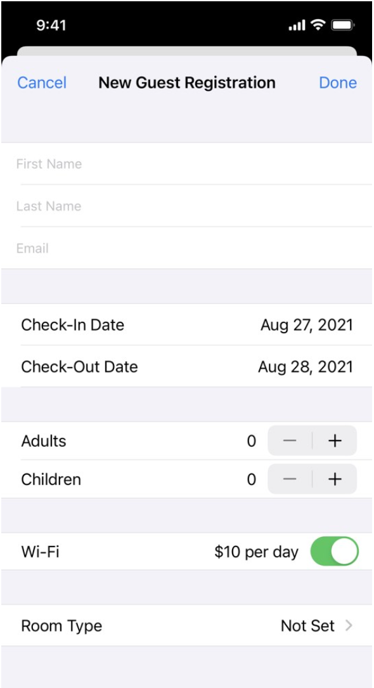

#### Collect Strings

- For Hotel Manzana, you'll need to collect three pieces of String data: the guest's first name, last name, and email address. You'll generally use text fields for collecting strings, with the placeholder text property indicating the text field's purpose. If your string might take multiple lines, a text view could be a better choice (even though it's not technically a control).
- In the storyboard, add a text field to each of three cells, one for each string you're collecting. Pin all four edges of the text fields and set the placeholder text in the Attributes inspector.
- To implement the logic behind your input screen, you'll need a class file to add your code. Add a new Cocoa Touch Class called `AddRegistrationTableViewController` that inherits from `UITableViewController`. Since you're implementing a static table view, you don't need to implement the data source. In fact, if you'd like, you can delete the boilerplate data source code that comes with a `UITableViewController` subclass.
  - Delete `numberOfSections` method and `tableView(numberOfRowsInSection:)` method, or update the return
- Make sure the identity of the table view controller in the storyboard is set to your newly created table view controller subclass.
  - Click `New Guest Registration` on the Document Outline, choose Class to `AddRegistrationTableViewController` in the Identity inspector.
- Next, add outlets for the text fields, so you can reference them in code. Here's how that works:

  - ```swift
      class AddRegistrationTableViewController: UITableViewController {
          @IBOutlet var firstNameTextField: UITextField!
          @IBOutlet var lastNameTextField: UITextField!
          @IBOutlet var emailTextField: UITextField!
          //...
      }
    ```

- In the storyboard, add a bar button item to the right bar button item slot on the AddRegistrationTableViewController's navigation bar. In the Attributes inspector, set the new button to the `Done` system item.
- Hook up an @IBAction to your `Done` button and name the function `doneBarButtonTapped(_:)`. Add code to this method to print any data in the text fields when the button is tapped.

  - ```swift
      @IBAction func doneBarButtonTapped(_ sender: UIBarButtonItem) {
          let firstName = firstNameTextField.text ?? ""
          let lastName = lastNameTextField.text ?? ""
          let email = emailTextField.text ?? ""
       
          print("DONE TAPPED")
          print("firstName: \(firstName)")
          print("lastName: \(lastName)")
          print("email: \(email)")
      }
    ```

- You've now collected the first three pieces of data from your input view.

#### Collect Dates

- The Hotel Manzana app will also collect two dates. Dates are actually a very complex type. With the date type, you're representing a single point in time (both the day and the time of day), and that representation has several variable characteristics, like a time zone and a calendar (for example, Gregorian or Hebrew). How can you communicate a date in a way that's meaningful to all users?
- Apple has many tools for clearly presenting dates, one of which is the date picker. The date picker makes date input easy to implement. When collecting a date, you'll typically use two cells. The first cell is a right detail cell (or a similar custom cell), where the title label describes the date (such as “Check-In Date,” “Appointment Date,” or “Inspection Date”) and the detail label shows the currently selected date. The second cell contains the date picker.
  - 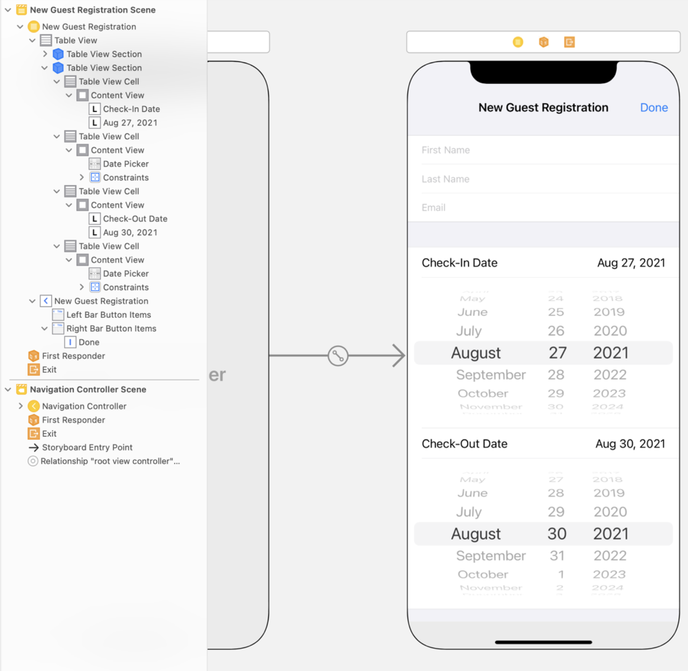
- In your storyboard, add a new section with two sets of date input cells: one set for the check-in date and one set for the check-out date. Each set should have two cells: one to display the selected date and one to display the date picker.
- Referencing the previous image, add two date pickers from the Object library and use Auto Layout to position them. You'll want to set the constraints relative to the content view rather than the margins for the date pickers. The layout constraints and the intrinsic size of the date pickers will cause the rows to size automatically to the correct size.
- Next, set each date picker's `Preferred Style` to `Wheels` and `Mode` to `Date` in the Attributes inspector. Setting the Mode to Date changes the display of the date picker so that the user doesn't have the option to enter a time.
- For the label cells (rows 0 and 2), click the `Table View Cell` and set the `Style` to `Right Detail`. Set the font size for all of the labels to 17 points. Set the title labels to read "Check-In Date" and "Check-Out Date," and set the detail labels to some random date. You'll configure the date label's text programmatically in the next steps.
- With your date input cells set up in the storyboard, you'll need to write code to update the date labels to match the user's input. As with your text fields, you'll need to have access to the date pickers and to the labels that will update. Add outlets for those four views. (You don't need outlets for the Check-In Date and Check-Out Date labels, since they won't change.)

  - ```swift
      class AddRegistrationTableViewController: UITableViewController {
          @IBOutlet var checkInDateLabel: UILabel!
          @IBOutlet var checkInDatePicker: UIDatePicker!
          @IBOutlet var checkOutDateLabel: UILabel!
          @IBOutlet var checkOutDatePicker: UIDatePicker!
          //...
      }
    ```

- With most controls, you can respond when the control's value changes. In the Hotel Manzana app, your code will need to update the detail label every time the date selected in a date picker changes. Before you add your @IBAction method, write an instance function called `updateDateViews()` in `AddRegistrationTableViewController`.
- On the Hotel Manzana form, you'll want the date to read as a string. The date type can be a little tricky to represent, but date formatting can help you out. Using `Date`'s `formatted` method, you can create string representations of dates. The way the formatted string will read is controlled by the parameters that you pass to the `formatted` method.
- The `formatted` method with no arguments will produce a date in a default format. You can supply additional arguments to show only the date or time and to adjust the style (such as displaying the month using a number or a spelled-out name, or omitting seconds from the time display).
- For the Hotel Manzana app, the `.abbreviated` option will work well for dates. Because the hotel doesn't care about the time of day, you can use the `.omitted` option for the time.
- In `updateDateViews()`, add the following code to update the date label text:

  - ```swift
      checkInDateLabel.text = checkInDatePicker.date.formatted(date: .abbreviated, time: .omitted)
      checkOutDateLabel.text = checkOutDatePicker.date.formatted(date: .abbreviated, time: .omitted)
    ```

- Next, you'll configure your date pickers to only allow valid input and to initialize the `date` property when the view loads. Date pickers have a `minimumDate` property and a `maximumDate` property, which work together to prevent the user from selecting a date outside the range. In the Hotel Manzana app, it would make sense to set a minimum date for both pickers: the current day for the check-in date, and one day ahead of the check-in date picker's date for the check-out date.
- The check-in minimum date doesn't change — it's always today — so you can set it in `viewDidLoad()`. You'll also initialize the check-in date in `viewDidLoad()`. However, the check-out minimumDate will change based on the check-in date. You'll set its minimumDate and date in the `updateDateViews()` method. Here's how all of that works together:

  - ```swift
      // In viewDidLoad()
      let midnightToday = Calendar.current.startOfDay(for: Date())
      checkInDatePicker.minimumDate = midnightToday
      checkInDatePicker.date = midnightToday
       
      // At the top of updateDateViews()
      checkOutDatePicker.minimumDate = Calendar.current.date(byAdding: .day, value: 1, to: checkInDatePicker.date)
    ```

- Take a closer look at this code. What's a Calendar? Without knowing the details, you should be able to tell that you're getting the current calendar, which lets you calculate dates using the `date(byAdding:value:to:)` method. In updateDateViews(), you're using that method to **add 1 day to the value of checkInDatePicker.date**.
- Now that the updateDateViews() method is complete, remember you'll need to add an action to both date pickers. In the implementation of the function, call the updateDateViews() method:

  - ```swift
      @IBAction func datePickerValueChanged(_ sender: UIDatePicker) {
          updateDateViews()
      }
    ```

Because your static table view doesn't rely on a data source, it won't “load” when it's first displayed. So it's a good idea to also call the updateDateViews() method in viewDidLoad().
- Remember the doneBarButtonTapped(_:) method? Add some code that will print the date properties of your new controls:
 
@IBAction func doneBarButtonTapped(_ sender: UIBarButtonItem) {
    let firstName = firstNameTextField.text ?? ""
    let lastName = lastNameTextField.text ?? ""
    let email = emailTextField.text ?? ""
    let checkInDate = checkInDatePicker.date
    let checkOutDate = checkOutDatePicker.date
 
    print("DONE TAPPED")
    print("firstName: \(firstName)")
    print("lastName: \(lastName)")
    print("email: \(email)")
    print("checkIn: \(checkInDate)")
    print("checkOut: \(checkOutDate)")
}

- Build and run your app. You should be able to use date pickers to input your date information, and your labels should update accordingly.

- The table view was not displayed.
  - It was because of `numberOfSections` returned `0`.
  - Since you're implementing a static table view, you don't need to implement the data source. In fact, if you'd like, you can delete the boilerplate data source code that comes with a `UITableViewController` subclass.
  - Delete `numberOfSections` method and `tableView(numberOfRowsInSection:)` method, or update the return.

- **Adjust Cell Heights**
  - Have you noticed that your two date picker cells take up a significant portion of an iPhone screen? Date pickers can make it difficult to scroll a table view. Since swiping up on the date picker scrolls the picker wheel, it won't scroll the table view. While this is expected if the user intentionally swipes up on the date picker, it's a large enough control that a user may intend to scroll the table view and inadvertently scroll the picker.
  - How do other apps handle this problem? In Calendar, the date pickers are hidden until the user selects the label row. Plus, the date picker appears right below the labels. When one date picker is shown, any others collapse - so you'll see only one date picker at a time.
  - You will implement a similar interface here, using the table view delegate methods `tableView(_:heightForRowAt:)`, to adjust the height, and `tableView(_:didSelectRowAt:)`, to respond to user interaction and dynamically modify the row's height at runtime. But first, you'll need a few variables to track the state of your views. Add the following properties to your `AddRegistrationTableViewController` class:

    - ```swift
        let checkInDatePickerCellIndexPath = IndexPath(row: 1, section: 1)
        let checkOutDatePickerCellIndexPath = IndexPath(row: 3, section: 1)
         
        var isCheckInDatePickerVisible: Bool = false {
            didSet {
                checkInDatePicker.isHidden = !isCheckInDatePickerVisible
            }
        }
         
        var isCheckOutDatePickerVisible: Bool = false {
            didSet {
                checkOutDatePicker.isHidden = !isCheckOutDatePickerVisible
            }
        }
      ```

  - What's going on in the code above? The first two properties store the index path of the date pickers for easy comparison in the delegate methods. The next two properties store whether or not the date pickers will be shown and then appropriately show or hide them when the properties are set. (They don't adjust the cell height, though. That's coming next.) Both date pickers start as not shown.
  - Now that you have variables to track the visibility of your date pickers, you can implement the `tableView(_:heightForRowAt:)` method. This table view delegate method queries for the row's height when your table view rows are displayed. As the developer, your job is to return the height based on the index path.
  - How will you implement `tableView(_:heightForRowAt:)` in the Hotel Manzana app? By using a switch on indexPath, you can include cases for the two date picker rows with a where clause for each to further define when the case is matched. (A where clause works like an if clause.) Specifically, you'll want to return a height of 0 for the date picker cells when they are not shown. Then you'll use the default for all other situations to let the cells determine their height automatically. Here's what that looks like:

    - ```swift
        override func tableView(_ tableView: UITableView, heightForRowAt indexPath: IndexPath) -> CGFloat {
            switch indexPath {
            case checkInDatePickerCellIndexPath where isCheckInDatePickerVisible == false:
                return 0
            case checkOutDatePickerCellIndexPath where isCheckOutDatePickerVisible == false:
                return 0
            default:
                return UITableView.automaticDimension
            }
        }
      ```

  - The rows with the date pickers also need to have a specific estimated row height and can't use `UITableView.automaticDimension`. You can return the correct estimated row height for each row using the `tableView(_:estimatedHeightForRowAt:)` method. The exact value returned for the date cell rows isn't important (as long as it's not 0), because Auto Layout will ensure the correct height is used. A quick check of the Size inspector for the date pickers' cells shows that 190 is a good estimate for the row height when the cells are visible. Notice that you don't want to use the where clause in this case:

    - ```swift
        override func tableView(_ tableView: UITableView, estimatedHeightForRowAt indexPath: IndexPath) -> CGFloat {
            switch indexPath {
            case checkInDatePickerCellIndexPath:
                return 190
            case checkOutDatePickerCellIndexPath:
                return 190
            default:
                return UITableView.automaticDimension
            }
        }
      ```

  - Build and run your app. Because the default value of the visibility variables for the date picker is false, you'll no longer see the date pickers. To show them, you'll need to respond to the user tapping the date label cell.

#### Show or Hide Date Pickers

- As you learned in the first table view lesson, you can respond to a user's cell selection with the delegate method `tableView(_:didSelectRowAt:)`.
- When the user taps a cell in the Hotel Manzana app, you'll first need to deselect the cell — that is, remove its gray highlight. This is a common pattern in the `tableView(_:didSelectRowAt:)` method when tapping the cell performs an action rather than a navigational push/modal, because it wouldn't make sense for the cell to remain highlighted after the action is performed. In the case of a navigation event, it's nice to leave the cell highlighted so when the user returns to the list they'll briefly see the highlighted cell to remind them what they had selected. `UITableViewController` subclasses handle this automatically for you, and you can see the subtle effect in apps like Settings. In the case of an app that allows multiple cell selection, that indication should be managed through accessory views, not the highlighted state of the cell.
- It may be helpful to create properties for `checkInDateLabelCellIndexPath` and `checkOutDateLabelCellIndexPath` to compare with the selected IndexPath.

  - ```swift
      let checkInDateLabelCellIndexPath = IndexPath(row: 0, section: 1)
      let checkOutDateLabelCellIndexPath = IndexPath(row: 2, section: 1)
    ```

- If the index path corresponds to one of the date label cells, you'll toggle the appropriate date picker and update the table view. The requirements of this feature boil down to the following:
  - When both pickers are not visible, selecting a label toggles the visibility of the corresponding picker.
  - When one picker is visible, selecting its own label toggles its visibility; selecting the other label toggles the visibility of both pickers.
- This can be represented by a relatively concise if/else if statement. Finally, when the visibility of a picker is toggled, you must instruct the table view to update itself so that the height for each row is recalculated. This can be done by calling the following methods: `tableView.beginUpdates()` and `tableView.endUpdates()`
- Here is one way to write the logic:

  - ```swift
      override func tableView(_ tableView: UITableView, didSelectRowAt indexPath: IndexPath) {
          tableView.deselectRow(at: indexPath, animated: true)

          if indexPath == checkInDateLabelCellIndexPath && isCheckOutDatePickerVisible == false {
              // Check-in label selected, check-out picker is not visible, toggle check-in picker
              isCheckInDatePickerVisible.toggle()
          } else if indexPath == checkOutDateLabelCellIndexPath && isCheckInDatePickerVisible == false {
              // Check-out label selected, check-in picker is not visible, toggle check-out picker
              isCheckOutDatePickerVisible.toggle()
          } else if indexPath == checkInDateLabelCellIndexPath || indexPath == checkOutDateLabelCellIndexPath {
              // Either label was selected, previous conditions failed meaning at least one picker is visible, toggle both
              isCheckInDatePickerVisible.toggle()
              isCheckOutDatePickerVisible.toggle()
          } else {
              return
          }

          tableView.beginUpdates()
          tableView.endUpdates()
      }
    ```

- Build and run your app. At this point, in addition to guest information, you should be able to enter check-in and check-out dates while displaying only one date picker at a time.

- The datepicker's height didn't work well. I modified `tableVew(_,heightForRowAt)`

  - ```swift
      override func tableView(_ tableView: UITableView, heightForRowAt indexPath: IndexPath) -> CGFloat {
          switch indexPath {
          case checkInDatePickerCellIndexPath:
              if isCheckInDatePickerVisible {
                  return 232
              } else {
                  return 0
              }
          case checkOutDatePickerCellIndexPath:
              if isCheckOutDatePickerVisible {
                  return 232
              } else {
                  return 0
              }
          default:
              return UITableView.automaticDimension
          }
      }
    ```

#### Collect Numbers

- The next type of data you'll collect is numbers. You can use different controls — steppers, sliders, even text fields — depending on the kind of numbers your app will collect.
  - For example, you'll use a stepper when you need precise control of discrete and incremental adjustments to the value.
  - You'll use a slider when you want continuous adjustments over a defined range.
  - And you'll use text fields when a keypad might be more useful to input the number, such as for entering a very large number — and then use a number formatter (similar to a date formatter) to convert the string into a number.
- In the Hotel Manzana app, the staff needs to know how many adults and children are staying at the hotel. Since both these values can be represented with discrete increments of 1, steppers are a good choice. In this case, you'll need two cells, one for entering the number of adults and another for the number of children. Each cell will have three objects: a label describing the entry, another label displaying the value of the stepper, and the stepper itself.
- Using the following image as an example, add a new section with two cells to your table view.
  - 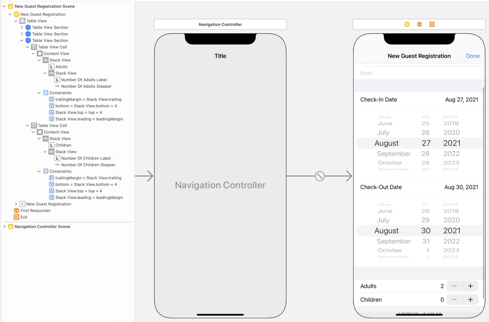
- Next, you'll need outlets for the value labels and steppers:

  - ```swift
      @IBOutlet var numberOfAdultsLabel: UILabel!
      @IBOutlet var numberOfAdultsStepper: UIStepper!
      @IBOutlet var numberOfChildrenLabel: UILabel!
      @IBOutlet var numberOfChildrenStepper: UIStepper!
    ```

- To update your new views, add a method called `updateNumberOfGuests`. This method will be called initially to synchronize the views and again any time the stepper value changes.

  - ```swift
      func updateNumberOfGuests() {
          numberOfAdultsLabel.text = "\(Int(numberOfAdultsStepper.value))"
          numberOfChildrenLabel.text = "\(Int(numberOfChildrenStepper.value))"
      }
    ```

- To respond to a change in stepper value, add an `@IBAction` that calls your `updateNumberOfGuests` function. You'll also call `updateNumberOfGuests` in `viewDidLoad()` to set up the views correctly on the first load.

  - ```swift
      @IBAction func stepperValueChanged(_ sender: UIStepper) {
          updateNumberOfGuests()
      }
      override func viewDidLoad() {
          //...
          updateNumberOfGuests()
          //...
      }
    ```

- Back in your `doneBarButtonTapped(_:)` method, add logic to print the entered values:

  - ```swift
      @IBAction func doneBarButtonTapped(_ sender: UIBarButtonItem) {
          // ...
          let numberOfAdults = Int(numberOfAdultsStepper.value)
          let numberOfChildren = Int(numberOfChildrenStepper.value)
       
          // ...
          print("numberOfAdults: \(numberOfAdults)")
          print("numberOfChildren: \(numberOfChildren)")
      }
    ```

- Build and run your app. You should now be able to adjust the number of guests for each registration and see the labels update accordingly. You should also be able to click the Done button to see the console print the values you entered.

#### Collect Binary Input

- At Hotel Manzana, guests have the option of purchasing Wi-Fi access for $10 per day. This is an example of binary data, where there are two options: yes or no. Switches are perfect for inputting this type of data. For example, in Calendar, you use a switch to indicate whether an event is an all-day event or a timed event.
- The cell will have three objects: a label describing the control, another label listing the price, and the switch itself. Using the image as a reference, add a new section with one cell to your table view.
  - 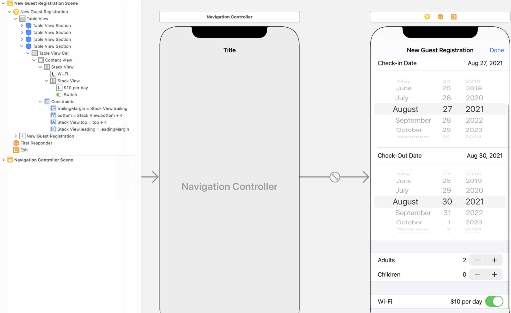
- Next, add an outlet for the switch to `AddRegistrationTableViewController` so you can access the value when the user taps the Done button: `@IBOutlet var wifiSwitch: UISwitch!`
- What happens when the value of the switch changes? Add an empty action for now. You'll have the opportunity to add functionality for this part of your UI in the challenge at the end of the lesson.

  - ```swift
      @IBAction func wifiSwitchChanged(_ sender: UISwitch) {
          //implemented later
      }
    ```

- Finally, add logic to your `doneBarButtonTapped(_:)` method to print the state of the switch when the user submits the form.

  - ```swift
      @IBAction func doneBarButtonTapped(_ sender: UIBarButtonItem) {
          // ...
          let hasWifi = wifiSwitch.isOn
       
          // ...
          print("wifi: \(hasWifi)")
      }
    ```

- Build and run your app. Verify that you're able to see the correct binary choice displayed in the console.

#### Collect Predefined Options

- What if you need to collect input from a set of predefined options? For example, an e-commerce app may need to know the purchaser's state for shipping, or a college registration app may ask students to select multiple classes for the next term. You could use a segmented control if (and only if) all of these conditions are met: the number of options is small (say, fewer than five), all options have a short name, and the user will choose only one option. But that's a fairly narrow use case.
- What if you need to allow for multiple selections? What if you have a large number of options or they require long descriptions? In these cases, you'll often use an additional table view to present the options and a custom protocol to communicate the user's choice(s). To make it easier to change the displayed choices, programmers will often use dynamic table views for these selection table views.
- If you haven't already added the definition for the RoomType struct introduced at the beginning of this lesson, add a new Swift file to the project named "RoomType" and add the struct definition:

  - ```swift
      struct RoomType: Equatable {
          var id: Int
          var name: String
          var shortName: String
          var price: Int

          // Equatable Protocol Implementation for RoomType
          static func ==(lhs: RoomType, rhs: RoomType) -> Bool {
              return lhs.id == rhs.id
          }
      }
    ```

- Back at the Hotel Manzana, staff will record the guest's room choice on check-in. Add an array of room types as a type property on `RoomType`.

  - ```swift
      static RoomType: Equatable {
          // ...

          static var all: [RoomType] {
              return [
                  RoomType(id: 0, name: "Two Queens", shortName: "2Q", price: 179),
                  RoomType(id: 1, name: "One King", shortName: "K", price: 209),
                  RoomType(id: 2, name: "Penthouse Suite", shortName: "PHS", price: 309)
              ]
          }
      }
    ```

- In the storyboard, add a new `table view controller`, which you'll use to display the room choices and to allow staff to collect the guest's choice. Add a Cocoa Touch Class file for your new controller called “SelectRoomTypeTableViewController.swift.” Set the identity of the new table view controller to the new subclass you just created.
- Next, set up your prototype cell. Change its Style to `Right Detail`. You'll use the title label for the room type, the detail label for the price, and the accessory view to indicate selection. Set the reuse identifier to `RoomTypeCell`.
  - 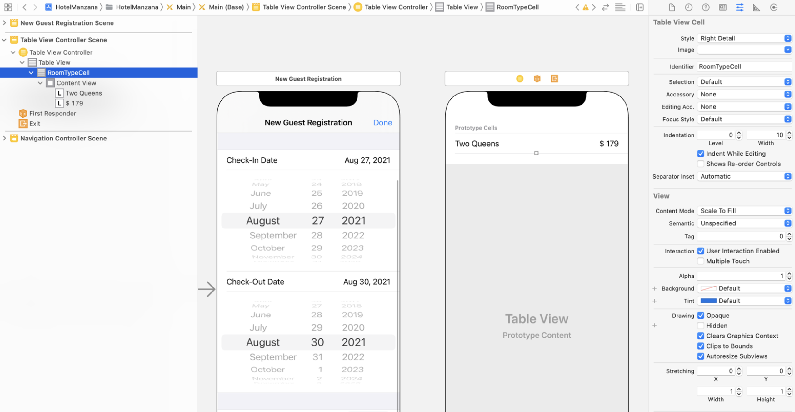
- In `SelectRoomTypeTableViewController`, implement the data source. Use the newly created array in the RoomType class to populate the table view. If you need a refresher, check out the first lesson on table views.

  - ```swift
      // MARK: - Table view data source
       
      override func numberOfSections(in tableView: UITableView) -> Int {
          return 1
      }
       
      override func tableView(_ tableView: UITableView, numberOfRowsInSection section: Int) -> Int {
          return RoomType.all.count
      }

      override func tableView(_ tableView: UITableView, cellForRowAt indexPath: IndexPath) -> UITableViewCell {
          let cell = tableView.dequeueReusableCell(withIdentifier: "RoomTypeCell", for: indexPath)
          let roomType = RoomType.all[indexPath.row]

          var content = cell.defaultContentConfiguration()
          content.text = roomType.name
          content.secondaryText = "$ \(roomType.price)"
          cell.contentConfiguration = content
          return cell
      }
    ```

- Finally, in Interface Builder, move the arrow designating the initial view controller to `SelectRoomTypeTableViewController`, then run the app. You should now be able to see your populated table view.

#### Implement Selection

- Remember using `tableView(_:didSelectRowAt:)` to make changes when the user selected a date label cell? You'll use the same method to respond to the user's selection in `SelectRoomTypeTableViewController`.
- Start by adding a variable to `SelectRoomTypeTableViewController` to hold the currently selected room type. Make it an optional, because it's possible the staff won't have collected the room choice yet: `var roomType: RoomType?`
- Next, add and implement the `tableView(_:didSelectRowAt:)` delegate method. Start the implementation by deselecting the selected row (removing the gray highlight). Then set the roomType property to the room type that corresponds to the index path. Finally, reload your table view.

  - ```swift
      override func tableView(_ tableView: UITableView, didSelectRowAt indexPath: IndexPath) {
          tableView.deselectRow(at: indexPath, animated: true)
          roomType = RoomType.all[indexPath.row]
          tableView.reloadData()
      }
    ```

- To indicate the currently selected room type, you'll use the checkmark accessory type. In `tableView(_:cellForRowAt:)`, add logic to configure the cell's accessory type. If the room type for the row is equal to the selected room type, the accessory type is .checkmark. If not, the accessory type is .none. Here's how to write the logic:

  - ```swift
      if roomType == self.roomType {
          cell.accessoryType = .checkmark
      } else {
          cell.accessoryType = .none
      }
    ```

- Build and run your app. If you still have the initial view controller set to SelectRoomTypeTableViewController, you'll be able to see your populated table view and to select a room type.

#### Communicate Selection

- What happens next? Once the selection has been made, you'll need to pass the guest's room choice back to the main table view controller. To do this, you'll create a custom protocol. Recall that protocols define functions and properties that another class will implement. In this case, your selection table view will define a function that's implemented by the main table view controller. The function gives the main table view controller access to any of the parameters of the function — and it allows you write to custom code.
- In the Hotel Manzana app, you'll add a protocol to the `SelectRoomTypeTableViewController` class file called `SelectRoomTypeTableViewControllerDelegate`. In the delegate, define a function called `selectRoomTypeTableViewController(_:didSelect:)` that takes in two parameters: the `SelectRoomTypeTableViewController` and a `RoomType` instance.
- Notice how the naming of this delegate method follows a pattern similar to the ones you're familiar with from implementing `UITableViewDelegate`. When defining delegate and data source methods, it's good practice to include relevant items in the passed arguments. This helps conformers better identify what the method is for in their implementation. Had you chosen to define the delegate method as `didSelect(roomType:)`, it might not have been clear that this method will be called by a `SelectRoomTypeTableViewController` when a room is selected, and someone might have been tempted to start calling the method for other reasons.
- Since another class will implement the protocol, you'll need to define a property to hold the reference to the implementing instance:

  - ```swift
      protocol SelectRoomTypeTableViewControllerDelegate: AnyObject {
          func selectRoomTypeTableViewController(_ controller: SelectRoomTypeTableViewController, didSelect roomType: RoomType)
      }
       
      class SelectRoomTypeTableViewController: UITableViewController {
          weak var delegate: SelectRoomTypeTableViewControllerDelegate?
          //...
      }
    ```

- Now, when the user selects a room type, you can call your new delegate method. In `didSelectRow`, add a call to `selectRoomTypeTableViewController(_:didSelect:)`:

  - ```swift
      override func tableView(_ tableView: UITableView, didSelectRowAt indexPath: IndexPath) {
          tableView.deselectRow(at: indexPath, animated: true)
          let roomType = RoomType.all[indexPath.row]
          self.roomType = roomType
          delegate?.selectRoomTypeTableViewController(self, didSelect: roomType)
          tableView.reloadData()
      }
    ```

- Next, you'll add `SelectRoomTypeTableViewController` to the app's navigation hierarchy, displaying the view controller when the user taps the associated cell.
- In the `AddRegistrationTableViewController` scene, add a new section with one cell and set the cell's Style to `Right Detail`. You'll use the title label to display a description of the requested information (“Room Type”) and the detail label to display the guest's choice (the room type's name). Set the Accessory to `Disclosure Indicator`. The small chevron indicates that a tap of this cell will push to a new view controller with options. You'll also add an outlet for the detail label, because it will update based on the selected room type: `@IBOutlet var roomTypeLabel: UILabel!`
- Add a property to hold the selected room type: `var roomType: RoomType?`
- Next, add a function to update the room type labels:

  - ```swift
      func updateRoomType() {
          if let roomType = roomType {
              roomTypeLabel.text = roomType.name
          } else {
              roomTypeLabel.text = "Not Set"
          }
      }
    ```

- Add a call to the update room type function in `viewDidLoad()`.
- These properties and methods allow for the selected room type to be displayed and to be updated as the user makes a different selection. The call to `updateRoomType()` in the `viewDidLoad()` method initializes the table view when it first loads.
- Next, you'll conform to the custom protocol of the `SelectRoomTypeTableViewController` and implement the required method, `selectRoomTypeTableViewController(_:didSelect:)`. In the implementation, set the `roomType` property of the `AddRegistrationTableViewController` and update the room type labels. Here are those two steps:

  - ```swift
      class AddRegistrationTableViewController: UITableViewController, SelectRoomTypeTableViewControllerDelegate {
          func selectRoomTypeTableViewController(_ controller: SelectRoomTypeTableViewController, didSelect roomType: RoomType) {
              self.roomType = roomType
              updateRoomType()
          }
          //...
      }
    ```

- Now you'll need to add a show segue from the room type cell to the `SelectRoomTypeTableViewController`. If your initial view controller is still `SelectRoomTypeTableViewController`, change it back to the navigation controller.
- Create an `@IBSegueAction` in `AddRegistrationTableViewController` from your new show segue called `selectRoomType`, with no arguments.
- Finally, in `AddRegistrationTableViewController`, implement the `selectRoomType(_:)` method to set the delegate property and the roomType property of the `SelectRoomTypeTableViewController` if a selection has already been made:

  - ```swift
      @IBSegueAction func selectRoomType(_ coder: NSCoder) -> SelectRoomTypeTableViewController? {
          let selectRoomTypeController = SelectRoomTypeTableViewController(coder: coder)
          selectRoomTypeController?.delegate = self
          selectRoomTypeController?.roomType = roomType
       
          return selectRoomTypeController
      }
    ```

- You've now set up your custom protocol. Here's a review of how it works to communicate the user's choice of room type:
  1. The user taps a cell to make a selection, triggering `didSelectRow`.
  2. The `tableView(_:didSelectRowAt:)` method calls the delegate method `selectRoomTypeTableViewController(_:didSelect:)`, using two things: 
     1. the receiver stored in the delegate property (your `AddRegistrationTableViewController` instance) 
     2. and the index path to the selected room type (which will be used as the parameter of the `selectRoomTypeTableViewController(_:didSelect:)` method).
  3. In the `AddRegistrationTableViewController`, the `selectRoomTypeTableViewController(_:didSelect:)` method provides access to the room type parameter and updates the `AddRegistrationTableViewController` property that's holding the selected room type. This is the implementation of the method called in step 2.
- Before you test your app, don't forget to add the logic to print the room selection when the Done button is tapped:

  - ```swift
      @IBAction func doneBarButtonTapped(_ sender: UIBarButtonItem) {
          //...
          let roomChoice = roomType?.name ?? "Not Set"
          //...
          print("roomType: \(roomChoice)")
      }
    ```

- Build and run your app. You should now see your completed form, and you should be able to select a room type and see it displayed in both table views.

#### Create a New Model Object Instance

- Now that you have an elegant and orderly custom input screen, you'll need to use the entered data to generate your model object. For Hotel Manzana, you'll create a new Registration object when the staff submits the guest information. This model object can be stored using Codable or converted to JSON to transfer to a web server. (You'll learn about JSON in the next unit.) And then it can be passed around to view controllers for manipulation and display.
- An easy way to make a model object instance is to add a computed property to the table view controller of your form. This property will create and return a model object from all the view outlets and view controller properties. You can then use the computed property in an unwind segue to add the new model object to your storage system.
- If you haven't already added the definition for the Registration struct introduced at the beginning of this lesson, add a new Swift file to the project named "Registration" and add the struct definition:

  - ```swift
      struct Registration {
          var firstName: String
          var lastName: String
          var emailAddress: String
       
          var checkInDate: Date
          var checkOutDate: Date
          var numberOfAdults: Int
          var numberOfChildren: Int
       
          var wifi: Bool
          var roomType: RoomType
      }
    ```

- In your `AddRegistrationTableViewController`, add a computed property called registration that returns a `Registration?`. Use the code from the `doneBarButtonTapped(_:)` method to help you initialize a new registration object. If the `roomType` isn't set, return `nil`; otherwise, return a valid Registration object. Here's how to work that:

  - ```swift
      var registration: Registration? {
          guard let roomType = roomType else { return nil }
       
          let firstName = firstNameTextField.text ?? ""
          let lastName = lastNameTextField.text ?? ""
          let email = emailTextField.text ?? ""
          let checkInDate = checkInDatePicker.date
          let checkOutDate = checkOutDatePicker.date
          let numberOfAdults = Int(numberOfAdultsStepper.value)
          let numberOfChildren = Int(numberOfChildrenStepper.value)
          let hasWifi = wifiSwitch.isOn
       
          return Registration(firstName: firstName,
                              lastName: lastName,
                              emailAddress: email,
                              checkInDate: checkInDate,
                              checkOutDate: checkOutDate,
                              numberOfAdults: numberOfAdults,
                              numberOfChildren: numberOfChildren,
                              wifi: hasWifi,
                              roomType: roomType)
      }
    ```

- At this point in the Hotel Manzana app, you'll be able to quickly generate your model object — collecting all the data submitted through the input screen — by simply referencing the `registration` property.

#### Incorporate the Form into a Workflow

- Your input screens are very nice. But if you think about how the hotel staff might use this app, you can imagine that these input screens represent a small part of their overall workflow. For example, after the staff registers a guest, they'd probably like to see and access the information entered.
- These registration objects might be displayed in a table view for quick reference. To incorporate your `AddRegistrationTableViewController` into a full app workflow, you'll be adding a table view that displays the registrations entered and allows the staff to access the `AddRegistrationTableViewController` input screen you built.
- Back in your storyboard, add a navigation controller from the Object library. Set the initial view controller to be the new navigation controller. This table view will display all the registrations that the staff have submitted. Add a Cocoa Touch Class file called “RegistrationTableViewController.swift” and update the new table view controller's identity to match the new class.
- To display each registration, select the prototype cell and set its Style to `Subtitle` and its identifier to `RegistrationCell`. In your new `RegistrationTableViewController` scene, set the navigation item title to Registrations and add an Add bar button item to the right slot of the navigation bar. To display the input screen, add a modal segue from the Add bar button to the navigation controller of the `AddRegistrationTableViewController`.
- In the `RegistrationTableViewController`, add a property that holds an array of Registration objects and set its default value to be empty: `var registrations: [Registration] = []`
- Use the array of Registration objects to implement the data source for the `RegistrationTableViewController`. The registration cells will display the full name of the guest on the title label. The subtitle label will display the check-in date, the check-out date, and the room type. Before using the following code, practice implementing the data source on your own.
- Here's the code for the registration table view data source:

  - ```swift
      override func numberOfSections(in tableView: UITableView) -> Int {
          return 1
      }
       
      override func tableView(_ tableView: UITableView, numberOfRowsInSection section: Int) -> Int {
          return registrations.count
      }
       
      override func tableView(_ tableView: UITableView, cellForRowAt indexPath: IndexPath) -> UITableViewCell {
          let cell = tableView.dequeueReusableCell(withIdentifier: "RegistrationCell", for: indexPath)
       
          let registration = registrations[indexPath.row]
       
          var content = cell.defaultContentConfiguration()
          content.text = registration.firstName + " " + registration.lastName
          content.secondaryText = (registration.checkInDate..<registration.checkOutDate).formatted(date:​ .numeric, time: .omitted) + ": " + registration.roomType.name
          cell.contentConfiguration = content
       
          return cell
      }
    ```

- The assignment of the `content.secondaryText` is using the formatted method to format multiple dates. In this case, you're using a range to capture and format both `checkInDate` and `checkOutDate`. It's a bit cleaner than writing the same formatting code for both dates separately and concatenating the strings.
- Next, add an unwind segue method to `RegistrationTableViewController` so that the `AddRegistrationTableViewController` can return to the `RegistrationTableViewController`. In the implementation, get the source view controller (`AddRegistrationTableViewController`) to access the registration property. If this property isn't `nil`, you'll add it to the registrations array and reload the table view:

  - ```swift
      @IBAction func unwindFromAddRegistration(unwindSegue: UIStoryboardSegue) {
          guard let addRegistrationTableViewController =
            unwindSegue.source as? AddRegistrationTableViewController,
          let registration = addRegistrationTableViewController.registration else
            { return }
       
          registrations.append(registration)
          tableView.reloadData()
      }
    ```

- For the last step, you'll need to adjust the actions sent by the Done bar button on the `AddRegistrationTableViewController`. In the storyboard, select the Done button and open the Connections inspector. In Sent Actions, click the small “x” to delete the action. Instead, hook the unwind segue to the Done button by Control-dragging from the button to the Exit icon of the view controller and choosing `unwindFromAddRegistrationWithUnwindSegue`.
- At this point, you don't need the `doneBarButtonTapped(_:)` method — so go ahead and delete it. (The purpose of the `doneBarButtonTapped(_:)` method was to allow you to test your input screen as you were building it. Now that you've created the Registration object, you no longer need the print statements.)
- What if the user wants to cancel an entry? Drag a bar button item from the Object library to the left bar button slot in the `AddRegistrationTableViewController` scene. Set its System Item to `Cancel`. Add an action that will dismiss the view controller when the button is tapped:

  - ```swift
      @IBAction func cancelButtonTapped(_ sender: Any) {
          dismiss(animated: true, completion: nil)
      }
    ```

- Build and run your app. You should now be able to add new registration objects and see them appear in the table view.
- Nice work! User input can become very difficult to handle. Learning to properly gather and manage this information is an incredibly important part of becoming an app developer. As you come up with your own app ideas, be sure to consider how you can use what you learned in this lesson to better handle user input.

#### Complex Input Screens - Challenge

- Update the `RegistrationTableViewController` with a segue that allows the user to select and view the details of a registration in the `AddRegistrationTableViewController` scene.
- Update the AddRegistrationTableViewController to disable or enable the Done button based on having all of the required information for a reservation. (Hint: Disable the button if self.registration is nil.)
- Add a new section to the table view to display a summary of charges that updates dynamically as the staff enters information.
  - 

#### Lab - Employee Roster

- The objective of this lab is to create a screen that accepts complex user input. You'll use a date picker and a custom delegate to build an employee roster that keeps track of employee information.
- The majority of the app has already been built. You'll find a starter project in your student resources folder. Take a few minutes to look through the project and see what has already been implemented. Go ahead and run the app. You might notice that you can add a new employee and edit existing employees, but you can't edit an employee's birthday or type. You'll add functionality to these fields as you go through the lab.

##### Step 1. Add Birthday Input

- To capture or edit an employee's birthday, you'll need a date picker. In the storyboard, add a third cell to the first section of the `EmployeeDetailTableViewController`. 
  - Drag a date picker to this cell and constrain its top, leading, trailing, and bottom edges to the cell. Set the date picker's Preferred Style to `Wheels` and Mode to `Date` in the Attributes inspector. Create an outlet from the date picker to `EmployeeDetailTableViewController` called `dobDatePicker`.
- You'll want to hide the cell until the user selects it. Start by adding a property to `EmployeeDetailTableViewController` that keeps track of whether the picker should be visible. 
  - Add `isEditingBirthday` and set its initial value to `false`. Add a `didSet` to the property that calls `tableView.beginUpdates()` and `tableView.endUpdates()`. These steps will ensure that the table view calls its delegate methods whenever the value of `isEditingBirthday` changes.
- In addition, you'll need to expand or hide the date picker cell every time the value of `isEditingBirthday` changes. 
  - Start by declaring the table view delegate method `tableView(_:heightForRowAt:)`. In the body of the method, return the height for the cell at the specified index path. 
  - If `indexPath` is equal to the date picker cell's index path and `isEditingBirthday` is `false`, return `0` to hide the picker. Otherwise return `UITableView.automaticDimension` to allow the cells to size themselves.
- Has the user selected the birthday cell on the table view? You now need a way to change the value of `isEditingBirthday` based on the user's selection. 
  - Start by declaring the table view delegate method `tableView(_:didSelectRowAt:)`. In the body of the method, deselect the selected row (regardless of the row) using `tableView.deselectRow(at: indexPath, animated: true)`. 
  - If the index path is the same as the date label's index path, you'll set `isEditingBirthday` to the opposite of what it was previously using `isEditingBirthday.toggle()`. This is a good place to change the text color of the `dobLabel` to `.label` and to use the `formatted` method on the date to set the text on `dobLabel` to the date on the date picker.
- Now, open the storyboard and the assistant editor and create an action from the date picker to `EmployeeDetailTableViewController`. 
  - Set the Event to `Value Changed` so that the action will be called any time the user changes the date on the date picker. In the body of this method, set the text of `dobLabel` to the new selected date.
- Finally, look at the action method saveButtonTapped. Currently, it creates a new Employee object using `Date()`, which returns the current date. Change this method to use the date from the date picker.
- Run the app. Ensure that you can now open the date picker and that the selected date is saved to the new Employee object.

  - ```swift
      @IBOutlet var dobDatePicker: UIDatePicker!
      
      var isEditingBirthday: Bool = false {
          didSet {
              tableView.beginUpdates()
              tableView.endUpdates()
          }
      }

      @IBAction func saveButtonTapped(_ sender: Any) {
          // ...
          let employee = Employee(name: name, dateOfBirth: dobDatePicker.date, employeeType: .exempt)
          // ...
      }

      @IBAction func dobDatePickerChanged(_ sender: UIDatePicker) {
          dobLabel.text = dobDatePicker.date.formatted(date: .numeric, time: .omitted)
      }
      override func tableView(_ tableView: UITableView, heightForRowAt indexPath: IndexPath) -> CGFloat {
          if indexPath == IndexPath(row:2, section: 0) && isEditingBirthday == false {
              return 0
          } else {
              return UITableView.automaticDimension
          }
      }

      override func tableView(_ tableView: UITableView, didSelectRowAt indexPath: IndexPath) {
          tableView.deselectRow(at: indexPath, animated: true)
          if indexPath == IndexPath(row: 1, section: 0) {
              isEditingBirthday.toggle()
              dobLabel.textColor = .label
          }
      }
    ```

##### Step 2. Add Input Screen for Employee Type

- Drag another table view controller from the Object library onto the canvas. This table view will contain a list of the different employee types and allow the user to check one of them.
- Create a show segue from the employee type cell to your new table view controller.
In your new table view controller, set the cell Style to `Basic` and give the cell an identifier.
- Create a new file called “EmployeeTypeTableViewController.swift” that subclasses `UITableViewController`. In the storyboard, set the new table view controller's class to be `EmployeeTypeTableViewController`.
- In `EmployeeTypeTableViewController`, add a property `employeeType` of type `EmployeeType?` to keep track of whether an employee type has been chosen.
- Use the array of `EmployeeType` objects, `EmployeeType.allCases`, to fill in the body of `tableView(_:numberOfRowsInSection:)`. This array is generated by way of the `CaseIterable` protocol on `EmployeeType`.
- In `tableView(_:cellForRowAt:)`, dequeue a cell with the identifier you set in the storyboard. Get the cell's default content configuration and set its text to be the string returned from the `description` property on the correct `EmployeeType` object. Then set the cell's `contentConfiguration` property to the updated content configuration. If the cell's `EmployeeType` object is the same as the one in the `employeeType` property, it's the selected employee type and should have a checkmark next to it; otherwise, it should not. Use the following code to set the checkmark:

  - ```swift
      let type = EmployeeType.allCases[indexPath.row]
       
      var content = cell.defaultContentConfiguration()
      content.text = type.description
      cell.contentConfiguration = content
       
      if employeeType == type {
          cell.accessoryType = .checkmark
      } else {
          cell.accessoryType = .none
      }
    ```

- Finally, implement the table view delegate method `tableView(_:didSelectRowAt:)` to set the employeeType property to the EmployeeType object that corresponds to the selected row and reload the table view.
- Run the app and navigate to the screen you just created. When you select a row, a checkmark should appear next to it. If you select a different row, the prior checkmark should disappear and a new checkmark should appear next to the row your just selected.

  - ```swift
      class EmployeeTypeTableViewController: UITableViewController {
          var employeeType: EmployeeType?
          
          override func viewDidLoad() {
              super.viewDidLoad()
          }

          override func numberOfSections(in tableView: UITableView) -> Int {
              return 1
          }

          override func tableView(_ tableView: UITableView, numberOfRowsInSection section: Int) -> Int {
              return EmployeeType.allCases.count
          }

          override func tableView(_ tableView: UITableView, cellForRowAt indexPath: IndexPath) -> UITableViewCell {
              let cell = tableView.dequeueReusableCell(withIdentifier: "employeeTypeCell", for: indexPath)

              let type = EmployeeType.allCases[indexPath.row]
              
              var content = cell.defaultContentConfiguration()
              content.text = type.description
              cell.contentConfiguration = content
              
              if employeeType == type {
                  cell.accessoryType = .checkmark
              } else {
                  cell.accessoryType = .none
              }
              return cell
          }

          override func tableView(_ tableView: UITableView, didSelectRowAt indexPath: IndexPath) {
              tableView.deselectRow(at: indexPath, animated: true)
              let employeeType = EmployeeType.allCases[indexPath.row]
              self.employeeType = employeeType
              tableView.reloadData()
          }
      }
    ```

##### Step 3. Add Custom Delegate for Employee Type

- But wait. Your selections in the employee type screen still don't transfer back to the previous screen. You'll need to create a custom delegate protocol to make this work. Declare a protocol named `EmployeeTypeTableViewControllerDelegate` in the `EmployeeTypeTableViewController` file, above its class declaration.
- Inside your new protocol, declare a method `employeeTypeTableViewController(_:didSelect:)` that takes the controller and an `EmployeeType` object and doesn't return anything. Any object that conforms to your custom protocol will be forced by the compiler to implement this method.

  - ```swift
      protocol EmployeeTypeTableViewControllerDelegate: AnyObject {
          func employeeTypeTableViewController(_ controller: EmployeeTypeTableViewController, didSelect employeeType: EmployeeType)
      }
    ```

- In `EmployeeTypeTableViewController`, add a property delegate of type `EmployeeTypeTableViewControllerDelegate?`: `var delegate: EmployeeTypeTableViewControllerDelegate?`
- In `tableView(_:didSelectRowAt:)`, call the delegate's `didSelect(employeeType:)` method after the code that sets the `employeeType` property.

  - ```swift
      override func tableView(_ tableView: UITableView, didSelectRowAt indexPath: IndexPath) {
          tableView.deselectRow(at: indexPath, animated: true)
          let employeeType = EmployeeType.allCases[indexPath.row]
          self.employeeType = employeeType
          delegate?.employeeTypeTableViewController(self, didSelect: employeeType)
          tableView.reloadData()
      }
    ```

- You now have code that will tell the delegate that a new employee type was selected, but you have no code assigning the delegate. The delegate will be the employee detail screen that presented the employee type screen. Create an `@IBSegueAction` with no arguments for the segue between the `EmployeeDetailTableViewController` and `EmployeeTypeTableViewController` scenes named `showEmployeeTypes`. In its implementation, initialize a new instance of `EmployeeTypeTableViewController` with the provided `coder`, set the delegate property to `self`, and return the new instance. 

  - ```swift
      @IBSegueAction func showEmployeeType(_ coder: NSCoder) -> EmployeeTypeTableViewController? {
          let employeeTypeTableViewController = EmployeeTypeTableViewController(coder: coder)
          employeeTypeTableViewController?.delegate = self
          
          return employeeTypeTableViewController
      }
    ```

- This should cause the compiler to throw an error, because `EmployeeDetailTableViewController` doesn't conform  to `EmployeeTypeTableViewControllerDelegate`. Fix this by adding `EmployeeTypeTableViewControllerDelegate` to the class declaration and implementing the `employeeTypeTableViewController(_:didSelect:)` method.
- `EmployeeDetailTableViewController` will also need a property `employeeType` of type `EmployeeType?` to keep track of the selected employee type. Add this now.
- In `employeeTypeTableViewController(_:didSelect:)`, assign the `employeeType` passed into the method to `self.employeeType`, update the text of `employeeTypeLabel`, and make sure the text color of `employeeTypeLabel` is now `.black` (since an employee type has been selected).

  - ```swift
      class EmployeeDetailTableViewController: UITableViewController, UITextFieldDelegate, EmployeeTypeTableViewControllerDelegate {
          func employeeTypeTableViewController(_ controller: EmployeeTypeTableViewController, didSelect employeeType: EmployeeType) {
              self.employeeType = employeeType
              employeeTypeLabel.text = employeeType.description
              employeeTypeLabel.textColor = .black
          }

          var employeeType: EmployeeType?

          // ...

          override func prepare(for segue: UIStoryboardSegue, sender: Any?) {
              guard let employeeTypeTableViewController = segue.destination as? EmployeeTypeTableViewController else {return}
              
              employeeTypeTableViewController.employeeType = employee?.employeeType
              employeeTypeTableViewController.delegate = self
          }
    ```

- In the `saveButtonTapped` action method, unwrap `employeeType` just after the code that unwraps the text from `nameTextField`. Then pass the unwrapped `EmployeeType` object into the initializer that's creating a new `Employee`.

  - ```swift
      @IBAction func saveButtonTapped(_ sender: Any) {
          guard let name = nameTextField.text, let employeeType = employeeType else {return}
          
          let employee = Employee(name: name, dateOfBirth: dobDatePicker.date, employeeType: employeeType)
          delegate?.employeeDetailTableViewController(self, didSave: employee)
      }
    ```

- Finally, since you've updated the requirements to save, you should update the `updateSaveButtonState()` method to only enable the Save button if `employeeType` contains a value. Also, call `updateSaveButtonState()` within `employeeTypeTableViewController(_:didSelect:)`.

  - ```swift
      private func updateSaveButtonState() {
          let shouldEnableSaveButton = (nameTextField.text?.isEmpty == false) && ((employeeType?.hashValue) != nil)
          saveBarButtonItem.isEnabled = shouldEnableSaveButton
      }
    ```

- Run the app and confirm that you can create a full Employee object that stores an employee's name, birthday, and type.
- Congratulations! You added complex input features to the Employee Roster, giving the user a much smoother and simpler experience. Be sure to save your final product to your project folder.

##### Challenge - User Experience Enhancement

- The date of the birth date picker defaults to today's date, but it's highly unlikely that you'll be adding an employee who was just born! What default values could reduce the required scrolling of the date picker? Hint: Employees are probably between the ages of 16 and 65 and can be born in any month and on any day.

  - ```swift
      func updateView() {
          if let employee = employee {
              // ...
          } else {
              navigationItem.title = "New Employee"
              dobDatePicker.maximumDate = Calendar.current.date(byAdding: .year, value: -16, to: Date())
              dobDatePicker.minimumDate = Calendar.current.date(byAdding: .year, value: -65, to: Date())
          }
      }
    ```

### Guided Project: List

- In this unit, you learned how to display lists using table views, build screens that allow for complex input, and save data to disk. In this guided project, you'll combine those skills to create an app that manages a list and stores it away for later retrieval. You can add, modify, and delete items in the list using a custom input screen. Depending on what type of items are on your list, you can choose from various controls to give your users the best possible form of input.

#### Part One - Project Planning

- Think of a collection of items that you'd like to manage with an app. Maybe you have a collection of baseball cards that you trade with your friends, and you need an easy way to add and remove cards from the list. Or maybe you want to keep track of homework assignments: What are their due dates, which have you finished, and which have been turned in to the teacher?
- In this guided project, you'll work with a to-do list of action items. Each to-do has a due date and a set of notes; it can be marked as complete, but remains in the list until the user deletes it. A more advanced to-do manager might include ways to sync the list across multiple devices or to notify the user as the due date approaches, but those capabilities are beyond the scope of this unit. You'll find examples of ways to enhance your app at the end of the guided project.
- Features
  - Nearly every app that manages a list of items will handle the following actions:
    1. Display the list
    2. Add items to the list
    3. Edit existing items on the list
    4. Delete items from the list
    5. Automatically save the list to disk
- What type of items will the list display? In most cases, your answer will affect the complexity of the second and third features. For example, if your app will manage a baseball card collection, it might need to store an image of each card, the card's quality, the card's market value, and the price paid for the card. The more properties you include per item, the more methods of input you'll need to build into your app.
- **Workflow**
  - What iOS apps include similar features to the list above? Take a look at the built-in Mail app. It displays a list of email messages and provides an easy way to delete messages. On the list screen, there's a button to create a new email, which will be added to the Sent folder once it's been sent. If you tap an email in the list of drafts, the interface to edit the draft is identical to the interface for creating a new email message.
  - Contacts is another app with a similar feature set. Contacts are displayed in a table, and at the top of the table view is a button for adding a new contact. Tapping a name in the table shows more details about each contact and provides an interface for editing contact info.
  - As you can see, there's nothing revolutionary about this type of app. Even though you might like to create something totally fresh and unique, it's actually a better idea to follow an approach that's easy and familiar to your users.
  - The app you'll build should adhere to these simple specs:
    - When the app opens, it displays a list of items.
    - The list screen has controls for adding and deleting items on the list.
    - Tapping an item displays more details about the item.
    - The detail screen permits editing.
    - The app saves the latest version of the list.
- **Controllers**
  - Are you ready to imagine the interface elements and how you'll put them together?
  - Since you'll be displaying items in a table view, you'll use a `UITableViewController` to manage the displaying, editing, and deletion of cells. What about a controller to manage the collection of items? You could create an `ItemController`, or something similar, to manage the array. But since this app will have a limited number of screens, the `UITableViewController` should be able to handle the collection that its table view represents. The same controller will be responsible for saving the items to disk whenever the list is updated — after inserting, editing, or deleting.
  - One last thing: If you include an image for each item, you'll need a `UIImagePickerController` to allow the user to add a photo to the table or to edit an existing one. In any case, your interface won't have more than a few controllers.
- **Views**
  - Depending on how much information you choose to display in each table cell, you may need to create a `UITableViewCell` subclass so that you can add additional labels, images, or controls to the cell. On the screen for adding and editing list items, you'll use a set of iOS input controls that best correspond to the item's properties. For example, if each item in the collection has a date associated with it, you'll want to use a date picker. If the item needs a description, you'll want to include a text field or text view, depending on the length of the description.
- **Models**
  - Your app is centered around one model — the particular type of item it will display and manage. This will be a ToDo model that will include a title, a due date, some extra notes, and a way to mark each to-do as complete. Since your collection must be stored to disk for future retrieval, your objects will need to adopt the Codable protocol that you learned about in this unit.

#### Part Two - Set Up Project and Display Model

- Create an Xcode project using the iOS App template and name it "ToDoList." When creating the project, make sure the interface option is set to "Storyboard." You've used this template many times in earlier lessons, so you know it handles a lot of up-front work for you. It starts you with a storyboard, an app delegate, and a custom view controller. Specifically, the Main storyboard has set the initial view controller to be of type ViewController, a subclass of UIViewController.
- But in the ToDoList app, your first screen will display a table, not a plain white screen. So you'll need to delete the existing view controller and add a UITableViewController inside a UINavigationController. These first few steps will configure the initial screen appropriately and prepare you to display a model in the table.
- Open the Main storyboard and drag a navigation controller from the Object library onto the canvas. Conveniently, this step also adds a UITableViewController with the UINavigationController attached. You can now delete ViewController, since you'll be creating new files with the appropriate subclass.
- If you were to build and run the app, you'd still see the single white screen. To fix this, adjust the initial view controller in the storyboard by dragging the entry point arrow to the navigation controller. Once you've made this connection, it's safe to delete the storyboard's original view controller.
- Now, if you run your app, you'll see an empty table with the title “Root View Controller” in the navigation bar. You can adjust the title by selecting the table view controller's navigation item in the Document Outline and updating its title in the Attributes inspector. Change the title to `My To-Dos`.
- Select the navigation controller's navigation bar and check the `Prefers Large Titles` box in the Attributes inspector. This will make your title display left-aligned and in a larger font.
- **Define the Model**
  - Before you can begin displaying your items in a table, you'll need to define the model. From the Xcode menu bar, choose File > New > File, then select "Swift File." You can name the file anything you like, but it's a good practice to give it the same name as your model. In this guided project, you'll use a type called `ToDo`.
  - Open the Swift file and create your ToDo struct: `struct ToDo { }`
  - What properties will each of your model objects require? If the model object is Homework, it may have a dueDate property of type Date and a subject property used in a custom Subject enumeration. If your model includes a UIImage property, you'll need to change the import Foundation line at the beginning of the Swift file to import UIKit. (The Foundation framework doesn't contain any platform-specific classes, and UIImage is specific to iOS.)
  - An example of the properties for a to-do list are shown below.

    - ```swift
        struct ToDo: Equatable {
            let id = UUID()
            var title: String
            var isComplete: Bool
            var dueDate: Date
            var notes: String?
         
            static func ==(lhs: ToDo, rhs: ToDo) -> Bool {
                return lhs.id == rhs.id
            }
        }
      ```

  - Note the use of `UUID()`. This is a system-provided type that is a universally unique value that can be used to identify types. Anytime you create one, you're theoretically guaranteed to get a different value, making it a reliable unique identifier. Apple's implementation conforms to [RFC 4122 version 4](https://datatracker.ietf.org/doc/html/rfc4122), if you're interested in learning more.
- **Configure the Table View Controller**
  - Now that you've defined the model, you need to create the `UITableViewController` subclass to display a collection of models. Create the new subclass and name it something that lends itself to the list you're creating. If you're not deviating from these instructions, name it `ToDoTableViewController`.
  - In addition to displaying the list in the table, the table view controller will manage the collection of items. Create an empty array of your model objects inside the class definition: `var toDos = [ToDo]()`
  - Does your table view have multiple sections to consider? In the Contacts app, cells are separated into sections based on the first letter of the first name or the first letter of the last name. In Mail, there are no separate sections for cells. Your app is probably more like Mail, so all cells will be displayed in a single section — hence, you can delete the `numberOfSections(in:)` delegate method.
  - If all model objects will be displayed in a cell and all cells are in the same section, `tableView(_:numberOfRowsInSection:)` can simply return the number of objects in your collection. In other words, there should be one table view cell for each entry in your array of models.

    - ```swift
        override func tableView(_ tableView: UITableView, numberOfRowsInSection section: Int) -> Int {
            return toDos.count
        }
      ```

  - The next method to override is `tableView(_:cellForRowAt:)`. This method is called whenever a cell is about to be displayed onscreen, and the method provides you the IndexPath that you'll use to determine which cell you're dealing with. Ignoring custom cells for now, you'll follow the standard implementation for this method that you learned in previous lessons:
    1. Dequeue a cell for the given index path.
    2. Get the model out of the array that corresponds to the cell being displayed.
    3. Update the cell's properties appropriately and return the cell from the method.
  - In the following code snippet, a standard `UITableViewCell` is dequeued, and its textLabel text is set to the title property of the corresponding ToDo. Even though the cell doesn't display other properties of the ToDo, it will help you verify that you've set up the table view controller correctly.

    - ```swift
        override func tableView(_ tableView: UITableView, cellForRowAt indexPath: IndexPath) -> UITableViewCell {
            let cell = tableView.dequeueReusableCell(withIdentifier: "ToDoCellIdentifier", for: indexPath)

            let toDo = toDos[indexPath.row]
            var content = cell.defaultContentConfiguration()
            content.text = toDo.title
            cell.contentConfiguration = content
            return cell
        }
      ```

  - Your table view controller subclass is not being utilized yet, because the storyboard is using a regular `UITableViewController`. Open the Main storyboard and select the table view controller. Using the Identity inspector, set the Custom Class to the `UITableViewController` subclass — in this case, `ToDoTableViewController`.
  - Now try building and running. You should see your table view controller inside a navigation controller with your own custom title.
- **Supply Initial Data**
  - The feature list for this project includes adding items to your collection and saving them to disk. But it doesn't make sense to write these features before you can see anything in the table. For now, you can populate the ToDo array with some initial data if no data is retrieved from disk.
  - First, write a static method in the ToDo structure that retrieves the array of items stored on disk, if there are any, and returns them. You'll write the body of this method later, when it comes time to store and retrieve items from disk. For now, simply return nil.
  
    - ```swift
        static func loadToDos() -> [ToDo]?  {
            return nil
        }
      ```

  - Next, write a static method that populates the array with sample data. You can create as many model objects as you wish, but don't go crazy — the user will eventually clear out these fake models to make room for their actual data. And don't worry about the values you give each property. With sample data, you just need enough information to distinguish one item from the next.
  - In this example, each ToDo has been given a different title property, since the cell will need to display this property:

    - ```swift
        static func loadSampleToDos() -> [ToDo] {
            let toDo1 = ToDo(title: "To-Do One", isComplete: false, dueDate: Date(), notes: "Notes 1")
            let toDo2 = ToDo(title: "To-Do Two", isComplete: false, dueDate: Date(), notes: "Notes 2")
            let toDo3 = ToDo(title: "To-Do Three", isComplete: false, dueDate: Date(), notes: "Notes 3")
         
            return [toDo1, toDo2, toDo3]
        }
      ```

  - Now that you have some model data to see, build and run your project. You'll find that the table still isn't displaying any information. Why not?
  - As you learned in earlier units, breakpoints are excellent for debugging problems, because they let you inspect the code as it's being executed. Try placing breakpoints in two of your `UITableViewController` methods: `tableView(_:numberOfRowsInSection) and tableView(_:cellForRowAt)`. Then run your app again. What do you notice?
  - The first method, which determines how many cells should be displayed, is called. But there are no items in the array, so the method returns 0 — and the second method is never called. Had the first method returned 3, `tableView(_:cellForRowAt:)` would have been called three times, and three items would have been displayed.
  - What you'll need to do is add some conditional logic inside viewDidLoad(). Try to load items from disk; if there aren't any, use the `loadSampleToDos()` method to fill the array with data:

    - ```swift
        override func viewDidLoad() {
            super.viewDidLoad()
         
            if let savedToDos = ToDo.loadToDos() {
                toDos = savedToDos
            } else {
                toDos = ToDo.loadSampleToDos()
            }
        }
      ```

  - One more thing. If you build and run the app now, it will crash with an assertion failure: Terminating app due to uncaught exception 'NSInternalInconsistencyException', reason: 'unable to dequeue a cell with identifier `ToDoCellIdentifier` - must register a nib or a class for the identifier or connect a prototype cell in a storyboard'. In `tableView(_:cellForRowAt:)`, the app was unable to dequeue a cell with the specified identifier, because the identifier hasn't been added to the storyboard.
  - Open the Main storyboard and select the prototype cell in the table view. In the Attributes inspector, use the same identifier string that you supplied in code. With the identifier in place, the sample data should now display.

#### Part Three - Add and Delete Controls

- Your app can now display data. It's time to create controls so that users can add items to the list and delete existing ones. To add items, you can use the + button — which you've probably noticed in the upper-right corner of the navigation bar on many iOS apps. A tap of the button will modally present a view controller that allows the user to enter model data. For quick removal of an item, you can use a cell's swipe-to-delete functionality. But you might also want to place an Edit button in the upper-left corner of the navigation bar, in case the user isn't familiar with swipe-to-delete. More on this later.
- **Add Items**
  - Open the Main storyboard and select the table view controller. Drag a bar button item from the Object library to the upper-right corner of the navigation bar's navigation item. To set the button to a + symbol instead of text, open the Attributes inspector and change the `System Item` to `Add`.
  - Tapping the + button should modally present a new view controller, which will use a static table view contained in a navigation controller. Drag a new navigation controller from the Object library onto the canvas. As before, this step will add both a navigation controller and a table view controller.
  - Control-drag from the + button to the new navigation controller and choose `Present Modally` in the popover. Take a moment to update the title of the new table view controller, making it clear that it's for creating new items. In this project, the title is “New To-Do.”  Select the new table view controller's navigation item and, from the `Large Title` dropdown, select `Never`. This will help make it clear to the user that this page is a sub-page of the primary to-do list.
- **Delete Items**
  - To add swipe-to-delete functionality to your table view controller's cells, you'll need to override the `tableView(_:canEditRowAt:)` method. You can use the `indexPath` property to choose which cells are editable. In this app, since all cells can be edited, you'll simply return `true`.
  - Open the `ToDoTableViewController` class definition and add (or uncomment) the following implementation:

    - ```swift
        override func tableView(_ tableView: UITableView, canEditRowAt indexPath: IndexPath) -> Bool {
            return true
        }
      ```

  - When the cell is swiped, a red Delete button appears to the right of the cell. You'll need to configure exactly how deletion will take place. Override the `tableView(_:commit:forRowAt:)` method. Inside its implementation, verify that the Delete button triggered the method call, then delete the model from the array and from the table view.

    - ```swift
        override func tableView(_ tableView: UITableView, commit editingStyle: UITableViewCell.EditingStyle, forRowAt indexPath: IndexPath) {
            if editingStyle == .delete {
                toDos.remove(at: indexPath.row)
                tableView.deleteRows(at: [indexPath], with: .automatic)
            }
        }
      ```

  - There's one last thing to complete the delete functionality: an Edit button. You could add a bar button item from the Object library and set its `System Item` property to `Edit`, but there's a better alternative. You can create an intelligent Edit button that will place the entire table view into editing mode, displaying - delete buttons to the left of each cell. When tapped, the button will switch its text from “Edit” to “Done” — and back again at the next tap.
  - Add the following line of code to the viewDidLoad() method of your table view controller: `navigationItem.leftBarButtonItem = editButtonItem`
  - Build and run your app and try clicking the Edit button. Notice how the button updates its title to Done and places the table view in edit mode. And when you tap a delete button, the item is removed from the collection.

#### Part Four - Static Table View Interface

- In this section, you'll learn the steps necessary for the user to populate the ToDo items. What kind of controls do you need to create? The answer depends on the properties you've included in your model.
- Before you begin to think through the controls, you'll need to adjust some attributes of the table view (not the table view controller) of New To-Do Controller. In the Attributes inspector, switch the `Content` type from `Dynamic Prototypes` to `Static Cells`. Then switch the `Style` to `Grouped`, so that each section you add is clearly separated from the other sections.
- How many sections will you need in the static table view? It depends on how many controls you'll add to the screen. You can easily adjust the number of sections using the `Sections` property in the Attributes inspector, then modify the `Rows` property in each section to change the number of rows. For the to-do list, each section will have only one row.
- The result interface is as follow:
  - 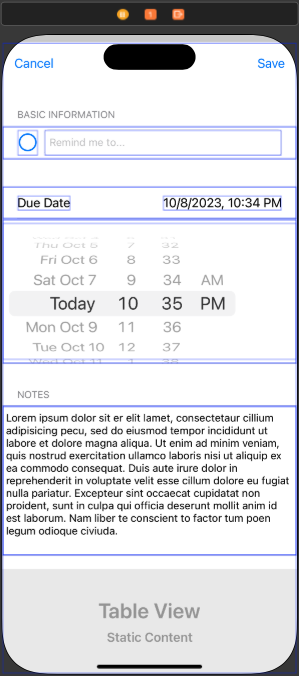
- **Save and Cancel Buttons**
  - After the user has entered a new item, they'll probably expect to tap a Save button to confirm its entry. Or, if they decide against an entry, they may look for a Cancel button. Whether saving or canceling, they'll expect to return to the table view.
  - You've learned that most modally presented view controllers need to include some sort of control to dismiss the current view and return to the screen from which it was presented. In this case, you'll return to the table view using an unwind segue.
  - Begin by adding a method in your `ToDoTableViewController` class that allows future button taps to unwind to this view controller. You'll probably recognize the following unwind segue from previous lessons: `@IBAction func unwindToToDoList(segue: UIStoryboardSegue) { }`
  - Open the Main storyboard and add two bar button items to the top of the new table view controller. Update the left bar button's System Item attribute to `Cancel` and the right bar button's System Item to `Save`. Then Control-drag from each button to the Exit control at the top of the table view controller and select the `unwindToToDoListWithSegue` method in the popover. To distinguish the two segues, give the unwind segue connected to the Save button an identifier of `saveUnwind`.  You don't need to enter an identifier for the Cancel button, because nothing additional needs to happen when it's tapped.
- **Basic Information**
  - Each ToDo has two basic pieces of information: a title and whether or not the to-do is complete. You can use a `UITextField` to add the `title` property. For `isComplete`, use a `UIButton` with two alternative images: an empty circle and a circle with a checkmark.
  - To create the cell that will contain the `title` and `isComplete`, select the section from the Document Outline and update its Header to “Basic Information.” Next, drag a `button` and a `text field` from the Object library onto the table view cell.
  - In the Attributes inspector for the button, set the Type to `Custom`, set the Style to `Default`, and set the Title to an `empty string`. Then set the State Config property to `Selected` and set the Image property to the `checkmark.circle.fill` system image. Under the Selected Symbol Configuration section, set Configuration to `Point Size` and Point Size to `24`. Last, change the State Config property back to `Default`, then set the Image property to the `circle` system image and use the same Symbol Configuration settings that you just used for the Selected state.
  - In the Attributes inspector for the text field, set the Placeholder to “Remind me to...” to clarify the purpose of the field.
- **Due Date**
  - The due date cells are a bit more dynamic than the basic information cell. When the screen is first displayed, there will be one visible cell that displays “Due Date” on the left and a short date and time on the right. When the cell is tapped, the date picker cell expands to reveal a UIDatePicker that allows the user to adjust the date and time. Selecting the cell again hides the date picker. 
  - In this section, you'll focus only on adding the labels and controls to the due date cell. You'll tackle hiding and showing the picker later.
  - Begin by adding a new section to your table view in the storyboard. This section should have two cells. Set the first cell's Style to `Right Detail` and configure it(set the font size for the labels to `17` points). Set the second cell's Style to `Custom` and add a date picker to it from the Object library. Add constraints to the top, trailing, bottom, and leading edges of the picker. Set the constraints to the superview, not to the margins. Use the Attributes inspector to set the Preferred Style of the date picker to `Wheels`.
- **Notes**
  - The ToDoList app will allows the user to add optional notes to a ToDo item.
  - To create this cell, select the section in the Document Outline and update its Header to “Notes.” Next, select the cell in the Document Outline and update its Row Height to `200`. Finally, drag a text view from the Object library onto the table view cell. Add four constraints to the text view that align its top, leading, bottom, and trailing edges to the edges of the cell. You can remove the placeholder text in text view using the Attributes inspector.
- **Additional Controls**
  - The checkmark button, date picker, and text view are just a few of the controls that you could include in your list tracker app. For example, if your app is managing a collection of baseball cards, you might want a cell with a `UISegmentedControl` that allows the user to select the card's condition: Mint, Near Mint, Fair, etc. Or maybe you want to allow the user to associate an image with the model object, which would require a `UIImagePickerController` for selecting an image from their photo library. Refer to the “Controls in Action” and “System View Controllers” lessons if you need help configuring these controls.

#### Part Five - Connect the Static Table View to Code

- Take a step back to review everything you've built so far. You have a table view controller that displays a list of items, and you've defined the properties for the model. Items from the list can be deleted, and you've created the interface for inputting data. Now it's time to add some code to make the buttons, labels, and controls in the static table view update properly.
- **Add View Controller Subclass**
  - Start by creating an additional subclass of UITableViewController called `ToDoDetailTableViewController` so that you can add outlets to the controls, read their values, add actions, and create a new model with the data that the user supplies. Since this is a static table view, you can remove the data source methods provided by Xcode's template.
    - Remove `numberOfSections(in:)` and `tableView(_:numberOfRowsInSection)`.
  - Now return to the Main storyboard. Update the Custom Class of the static table view controller to match the name of the class you just created. With the class set properly, you can use the assistant editor to create outlets, one for each control or view that you'll update in code or read values from to create your model object.
  - The outlets created for the ToDo cells are as follows:

    - ```swift
        @IBOutlet var titleTextField: UITextField!
        @IBOutlet var isCompleteButton: UIButton!
        @IBOutlet var dueDateLabel: UILabel!
        @IBOutlet var dueDateDatePicker: UIDatePicker!
        @IBOutlet var notesTextView: UITextView!
      ```

- **Disable the Save Button**
  - Every ToDo requires a title. If there's no text in the title text field, the user shouldn't be able to save the item.
  - To disable the Save button, start by creating an outlet in code: `@IBOutlet var saveButton: UIBarButtonItem!`
  - Next, write a helper method that updates the Save button depending on whether or not text exists in the text field. If the string is empty, disable the button; otherwise, enable it:

    - ```swift
        func updateSaveButtonState() {
            let shouldEnableSaveButton = titleTextField.text?.isEmpty == false
            saveButton.isEnabled = shouldEnableSaveButton
        }
      ```

  - You'll need to call this method in `viewDidLoad()` so that the button is disabled as soon as the user brings up the view controller to add a new item.

    - ```swift
        override func viewDidLoad() {
            super.viewDidLoad()
            updateSaveButtonState()
        }
      ```

  - The `updateSaveButtonState()` method should be called after each keyboard tap in the text field, ensuring that the state of the button is always up to date. Open the assistant editor, then Control-drag from the text field to an available spot in the view controller class definition. Create a new action called `textEditingChanged` that will fire whenever the `Editing Changed` control event takes place.
  - In the definition of `textEditingChanged`, call `updateSaveButtonState()`:

    - ```swift
        @IBAction func textEditingChanged(_ sender: UITextField) {
            updateSaveButtonState()
        }
      ```

  - You've now prevented the user from creating a ToDo without a title.
- **Dismiss Keyboard on Return**
  - If you run your app at this point, you'll find that when you are editing the title text field, the keyboard blocks the notes text view and part of the date picker. It would be great if the user could tap the Return key on the keyboard to dismiss the keyboard, making it easier to interact with the other controls.
  - With the assistant editor open, Control-drag again from the text field to an available spot in the view controller class definition. Create an action that will fire whenever the `Primary Action Triggered` control event takes place. In the case of `UITextField`, the action will fire when Return is tapped. When the action occurs, resign the text field from its role as the first responder:

    - ```swift
        @IBAction func returnPressed(_ sender: UITextField) {
            sender.resignFirstResponder()
        }
      ```

- **Switch Button Image**
  - Is the ToDo complete or not? Earlier, you set two images to reflect isCompleteButton's Default state and its Selected state. When the user taps the button, you want the image to toggle between the empty circle and the checkmark image.
  - Add an action to the button that changes the isSelected property whenever it's tapped: Control-drag from the button to an available space in the view controller definition and create an action called `isCompleteButtonTapped`.

    - ```swift
        @IBAction func isCompleteButtonTapped(_ sender: UIButton) {
            isCompleteButton.isSelected.toggle()
        }
      ```

  - Build and run the app. Clicking this button in the static table view will switch the isCompleteButton image from selected to unselected and vice versa.
- **Update Date Label**
  - The text for `dueDateLabel` should reflect the value the user entered in the date picker. As with the Save button, you'll update the value in `viewDidLoad()` so it's correct before being displayed to the user.
  - You'll use the formatted method on Date to generate the date string. Previously you have used `formatted(date:time:)`, but you can have even greater control over the way the date is formatted by passing a style argument to provide detailed settings for each field. In this case you'll use the `.dateTime` style and customize it to display the date and time in the most succinct format possible. For example, using: `date.formatted(.dateTime.month(.defaultDigits).day().year(.twoDigits).hour().minute())` would cause "January 1st, 1970, at 12:00am" to appear as "1/1/70, 12:00 AM." Note that the order of the fields does not matter as they will be ordered according to the locale in use at runtime.
  - Next, write a helper method in your detail table view controller to update `dueDateLabel` with the date passed into the method as a parameter. This method should be called in `viewDidLoad()` and whenever the date picker value changes:

    - ```swift
        override func viewDidLoad() {
            super.viewDidLoad()
            updateDueDateLabel(date: dueDateDatePicker.date)
            updateSaveButtonState()
        }
         
        func updateDueDateLabel(date: Date) {
            dueDateLabel.text = date.formatted(.dateTime.month(.defaultDigits).day().year(.twoDigits).hour().minute())
        }
      ```

  - To create an action that's fired whenever the user changes the date picker, Control-drag from the date picker to an available space in the view controller class definition, then tie the action to the `Primary Action Triggered` event.

    - ```swift
        @IBAction func datePickerChanged(_ sender: UIDatePicker) {
            updateDueDateLabel(date: sender.date)
        }
      ```

  - Now the due date label will display a string of text that matches the value in the date picker.
- **Update the Date Picker Starting Value**
  - At the moment, the date picker displays the current date and time when the view controller is first displayed. Does that makes sense for something that hasn't been done? A more reasonable starting value might be 24 hours from now.
  - In `viewDidLoad()`, you can set the date picker's date before updating the date label. The Date class makes it easy to calculate a date that's 24 hours in the future. Starting with `Date()`, which creates a date with the current date and time, you can use the `addingTimeInterval(_:)` method to add any number of seconds. How many seconds are in 24 hours? Multiply 24 by 60 to convert hours into minutes, then multiply by 60 again to convert minutes into seconds.

    - ```swift
        override func viewDidLoad() {
            super.viewDidLoad()
            dueDateDatePicker.date = Date().addingTimeInterval(24*60*60)
            updateDueDateLabel(date: dueDateDatePicker.date)
            updateSaveButtonState()
        }
      ```

  - Now when the static table view is displayed, the date picker will display a more logical starting value. Build and run the app to test your date picker.
- **Expand and Collapse the Date Picker Cell**
  - Having the date picker open all the time can make scrolling problematic for the table view. To avoid this, you can hide the picker until the user taps the date label cell, the same way you did in an earlier lesson.
  - To set the height of each cell dynamically, you can override the `tableView(_:heightForRowAt:)` method, rather than using the values you supplied in Interface Builder.
  - What's the right height for each cell? When a cell is visible, you should allow Auto Layout to handle the size, but when the date picker should be hidden, the height for that cell should be 0.
  - Your app will need a way to know if the date picker is hidden or not. Its initial state should be hidden, so you'll add a Bool property to the detail table view controller class and set it to `true`. While you are there, add properties to store the index paths for the date label and date picker cells:

    - ```swift
        var isDatePickerHidden = true
        let dateLabelIndexPath = IndexPath(row: 0, section: 1)
        let datePickerIndexPath = IndexPath(row: 1, section: 1)
        let notesIndexPath = IndexPath(row: 0, section: 2)
      ```

  - Next, you'll use a switch statement in the `tableView(_:heightForRowAt:)` delegate method to handle the date picker and notes index paths accordingly. In the case where the index path is the picker cell's and the picker is hidden, return `0`. For the notes index path, return `200`. Otherwise, you'll return `UITableView.automaticDimension` so that the other cells can size themselves.

    - ```swift
        override func tableView(_ tableView: UITableView, heightForRowAt indexPath: IndexPath) -> CGFloat {
            switch indexPath {
            case datePickerIndexPath where isDatePickerHidden == true:
                return 0
            case notesIndexPath:
                return 200
            default:
                return UITableView.automaticDimension
            }
        }
      ```

  - You'll also need to provide an estimated row height for each row in the table. In the case of the date picker index path, the value does not need to be exact-216 is close to the value in the Size inspector for the cell and is a good choice. For the notes index path, return `200`. Otherwise, you'll return `UITableView.automaticDimension`.

    - ```swift
        override func tableView(_ tableView: UITableView, estimatedHeightForRowAt indexPath: IndexPath) -> CGFloat {
            switch indexPath {
            case datePickerIndexPath:
                return 216
            case notesIndexPath:
                return 200
            default:
                return UITableView.automaticDimension
            }
        }
      ```

  - Next, your app will need to respond to the user tapping the Due Date cell, which will change `isDatePickerHidden` to `false`. You can override `tableView(_:didSelectRowAt:)` to handle the tap, but you're only concerned with this one cell. Similar to the previous method, you can check whether the index path matches up with the label cell's. If it does, your code will need to toggle `isDatePickerHidden`, then update the cell height. To animate a cell height adjustment, an easy trick is to call a table view's `beginUpdates` and `endUpdates` methods without any code between the two. This is also a good time to set the label to the date value on the picker.

    - ```swift
        override func tableView(_ tableView: UITableView, didSelectRowAt indexPath: IndexPath) {
            tableView.deselectRow(at: indexPath, animated: true)
            if indexPath == dateLabelIndexPath {
                isDatePickerHidden.toggle()
                updateDueDateLabel(date: dueDateDatePicker.date)
                tableView.beginUpdates()
                tableView.endUpdates()
            }
        }
      ```

  - Build and run your app. You should have a Save button that ensures the user provides a title before saving, a text field that dismisses the keyboard when Return is tapped, a functional checkmark button that switches images on each tap, and a date picker view that shows and hides with an animation.

#### Part Six - Create and Save the Model

- What have you created so far? You have a table view controller that displays your list of items, but the list is using some initial data rather than data created through the static table view. You've added controls that enable the user to set values for each property in your model, but the Save button dismisses the modal view controller without actually saving the data. In this section, you'll create a new model object using data from the controls and update your list accordingly.
- **Read Data from Controls**
  - At the moment, your Save button performs an unwind segue when tapped, but you need to do some more work before the segue is performed. In earlier lessons, you used the `prepare(for:sender:)` method to pass information from one view controller to another. You'll use the same method here.
  - First, on the `ToDoDetailTableViewController`, you'll need to verify that the `saveUnwind` segue is being performed, because you don't want to do any extra work when the Cancel button is tapped. Next, you'll read the values from the appropriate controls, store them into constants, and pass the values into your model's initializer:

    - ```swift
        override func prepare(for segue: UIStoryboardSegue, sender: Any?) {
            super.prepare(for: segue, sender: sender)
         
            guard segue.identifier == "saveUnwind" else { return }
         
            let title = titleTextField.text!
            let isComplete = isCompleteButton.isSelected
            let dueDate = dueDateDatePicker.date
            let notes = notesTextView.text
        }
      ```

  - Is it safe to force-unwrap the title's text property? If you set up the Save button properly, it should only be enabled when there's text in the title text field. Why does it need to be unwrapped at all? Recall that the title property of a ToDo is non-optional, so the constant needs to be of type String, not String?.
- **Pass Data Across the Unwind Segue**
  - Think about how you could pass information across the `prepare(for:sender:)` method. The segue has a destination property, and in your to-do app you could access the destination view controller's array of models and add a new entry to the array.
  - However, the static table view controller is only responsible for one ToDo at a time. It doesn't have to know that it was presented from a table view controller or that the data will eventually be saved to disk. It's always a good practice to keep the concerns of each view controller separate.
  - Since the static table view controller will deal with one model at a time, you'll add an optional model property to the class definition. (It's optional because the property will be `nil` until the Save button is tapped and the property can be given a value.)
    - `var toDo: ToDo?`
  - Next, you'll add a line to the bottom of `prepare(for:sender:)` that sets the property to a value: `toDo = ToDo(title: title, isComplete: isComplete, dueDate: dueDate, notes: notes)`
  - Now that the model is stored in a property, how does the list view controller access the property and add it to the collection? The unwind segue defined in the first table view controller can access data from the view controller that's being dismissed.
  - When the `unwindToToDoList(_:)` method is called, it has a segue parameter, similar to `prepare(for:sender:)`. Again, you'll want to verify that the `saveUnwind` segue is being called; otherwise, the Cancel button has been tapped and there isn't any work to perform. Next, you'll check to see whether a model object exists in the segue's source (the view controller that triggered the segue). If a model object exists, add it to the array, then add a table cell that represents the new data.

    - ```swift
        @IBAction func unwindToToDoList(segue: UIStoryboardSegue) {
            guard segue.identifier == "saveUnwind" else { return }
            let sourceViewController = segue.source as! ToDoDetailTableViewController
         
            if let toDo = sourceViewController.toDo {
                let newIndexPath = IndexPath(row: toDos.count, section: 0)
         
                toDos.append(toDo)
                tableView.insertRows(at: [newIndexPath], with: .automatic)
            }
        }
      ```

  - Notice that you needed to calculate the index path so that you could add a row at the correct position. Why would you use `count` for the row of the index path? Imagine your array contains 0 items. When you add a cell, you'd insert it in the first row — row 0. If your array contains 1 item, you'd insert it below the existing one, so in row 1. Using the array's count value guarantees that you add a cell at the bottom of the table view.
  - Build and run your app. When you click the Save button, creating a new entry in your collection, a new cell will be displayed.
