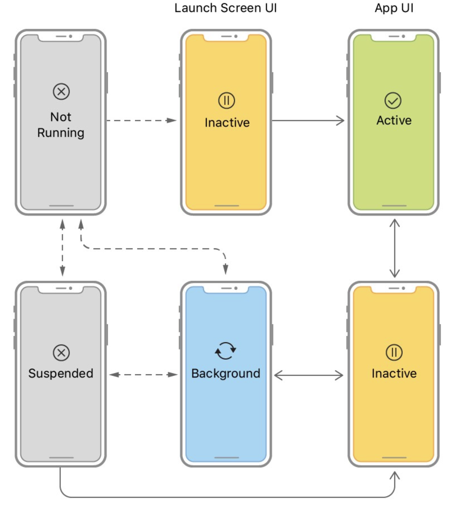

# Develop in Swift Data Collections

## Unit 1 Tables and Persistence

- In this unit, you'll learn three important sets of techniques in app development, which—taken together—will enable you to build more much complex apps.
  - First, you'll learn how to use tables to display lists of information, and to use the master-detail design pattern to allow users to interact with the information.
  - Second, you'll learn how to organize the files, structures, and classes in your apps, making it easier for you (or other developers) to work with them in the future.
  - Third, you'll learn about an approach for saving data to the device, so that any information the user enters or changes in your app will still be there the next time they open the app.
  - By the end of this unit, you'll be comfortable building many useful apps that display all kinds of information and that allow users to enter, edit, and save in-app information.

### Lesson 1.1 Protocols

- A protocol is a set of rules or procedures that define how things are done. Computers communicate with each other using protocols like HTTP (Hyper Text Transfer Protocol) and TCP/IP (Transmission Control Protocol/Internet Protocol).
  - HTTP is a standard that defines how website data is communicated between two computers.
  - TCP/IP is a communications standard that defines how computers find and send data to each other.
- In programming, a protocol defines the properties or methods that an object must have to complete a task. For example, the `Equatable` protocol says that a type must define a `==` method to check whether two instances are equal to each other.
- In this lesson, you'll learn what protocols are, when to use them, and how to write your own. You'll also learn about delegation, a pattern for enabling objects to communicate with each other.
- A protocol defines a blueprint of methods, properties, and other requirements that suit a particular task or piece of functionality. The protocol can then be adopted by another type, which provides the actual implementation for those requirements. Any type that satisfies the requirements of a protocol conforms to that protocol.
- The Swift standard library defines many protocols that you'll use when building apps. In the following sections, you'll look at four of them:
  - `CustomStringConvertible`, which allows you to control how your custom objects are printed to the console;
  - `Equatable`, which allows you to define how instances of the same type are equal to each other;
  - `Comparable`, which allows you to define how instances of the same type are sorted; and
  - `Codable`, which allows you to encode your type's properties as key/value pairs that can then be saved between app launches.
- When you adopt a protocol in Swift, you're promising to implement all the methods required by that protocol. The compiler will check that everything's in order and won't build your program if anything is missing.
- Why might you use protocols when building an app?
  - To share attributes and functionality across different types
  - To make custom types work well with system or debugging functionality
  - To enforce similarity and provide type functionality
  - To define events but delegate implementation to an instance of another type

#### Printing Information with `CustomStringConvertible`

- You can begin to understand the role of a protocol by considering how objects are printed to the console using the `print()` function. As you've learned, running the print() function on a variable will write the textual representation of the object to the console. You can print String values, Int values, and Bool values with predictable results.
- But what if you define a Shoe class?

  - ```swift
      class Shoe {
        let color: String
        let size: Int
        let hasLaces: Bool
       
        init(color: String, size: Int, hasLaces: Bool) {
          self.color = color
          self.size = size
          self.hasLaces = hasLaces
        }
      }
       
      let myShoe = Shoe(color: "Black", size: 12, hasLaces: true)
      let yourShoe = Shoe(color: "Red", size: 8, hasLaces: false)
      print(myShoe)
      print(yourShoe)
      Console Output:
      Shoe
      Shoe
    ```

- (Your print statement is likely prefixed by something like \_lldb_expr_1, which you can ignore.)
- As you can see, this print statement isn't at all helpful. Swift defines a protocol called CustomStringConvertible to address this kind of situation.
- CustomStringConvertible has one required computed property, description, which returns a String representation of the instance. If you adopt the protocol, you control exactly how your custom types are represented as printable String values.

  - First, adopt the protocol by adding a colon and the name of the protocol you want to adopt:

    - ```swift
        class Shoe: CustomStringConvertible {
          let color: String
          let size: Int
          let hasLaces: Bool
        }
      ```

  - Second, conform to the protocol by adding the required functions or variables. In this example, you'll add the description computed property. If you don't complete this step, the compiler will display an error that says you're not conforming to the protocol.
  - In the Strings lesson, you learned how to use string interpolation to interweave constants or variables into a String value. The description property in the following code uses string interpolation to create a String that includes each property of the Shoe instance.

    - ```swift
        class Shoe: CustomStringConvertible {
            let color: String
            let size: Int
            let hasLaces: Bool
         
            init(color: String, size: Int, hasLaces: Bool) {
                self.color = color
                self.size = size
                self.hasLaces = hasLaces
            }
         
            var description: String {
                return "Shoe(color: \(color), size: \(size), hasLaces: \(hasLaces))"
            }
        }
        let myShoe = Shoe(color: "Black", size: 12, hasLaces: true)
        let yourShoe = Shoe(color: "Red", size: 8, hasLaces: false)
        print(myShoe)
        print(yourShoe)

        Console Output:
        Shoe(color: Black, size: 12, hasLaces: true)
        Shoe(color: Red, size: 8, hasLaces: false)
      ```

  - Note that this code prints out what looks like an initializer for each object. That's a common practice, because it enables you to see each property on the object in a familiar, concise format. However, you can print anything you want:

    - ```swift
        var description: String {
            let doesOrDoesNot = hasLaces ? "does" : "does not"
            return "This shoe is \(color), size \(size), and \(doesOrDoesNot) have laces."
        }
         
        let myShoe = Shoe(color: "Black", size: 12, hasLaces: true)
        let yourShoe = Shoe(color: "Red", size: 8, hasLaces: false)
        print(myShoe)
        print(yourShoe)

        Console Output:
        This shoe is Black, size 12, and does have laces.
        This shoe is Red, size 8, and does not have laces.
      ```

#### Comparing Information with `Equatable`

- Imagine your team is building an employee directory app for your company. You're tasked with building the data model to represent all the employees, their job titles, and their phone numbers.

  - ```swift
      struct Employee {
        var firstName: String
        var lastName: String
        var jobTitle: String
        var phoneNumber: String
      }
       
      struct Company {
        var name: String
        var employees: [Employee]
      }
    ```

- While building the app, you're asked to build a feature that allows any employee to edit their own information and prevents them from editing anyone else's information. You'll accomplish this by displaying an Edit button when the user navigates to their own detail screen.
- But how can you make sure it's the right employee? Each time the current employee navigates to an employee detail screen, you'll need to compare that employee to the employee whose information is displayed.
- Imagine you have access to the current employee with a `Session.currentEmployee` variable, which returns an Employee instance matching the current user. The view controller in charge of displaying the employee detail screen has an employee property. When the app loads a new employee detail screen, you'll need to check whether Session.currentEmployee and employee are equal. If so, you'll enable the Edit button. If not, you'll hide the button.
- You might consider writing something like the following:

  - ```swift
      let currentEmployee = Session.currentEmployee
      // Employee(firstName: "Daren", lastName: "Estrada", jobTitle: "Product Manager", phoneNumber: "415-555-0692")

      let selectedEmployee = Employee(firstName: "James", lastName: "Kittel", jobTitle: "Marketing Director", phoneNumber: "415-555-9293")
       
      if currentEmployee == selectedEmployee {
        // Enable "Edit" button
      }
    ```

- The code above is a good thought. The == operator checks whether two values are equal. But because Employee is a custom type, you must tell Swift exactly how to compare two instances for equality. You'll do this by adopting the Equatable protocol.
- The Equatable protocol requires you to provide an implementation for the == operator on your custom type with a static == function that takes lhs (left-hand side) and rhs (right-hand side) parameters and returns a Bool that says whether the two values are equal:

  - ```swift
      struct Employee: Equatable {
        var firstName: String
        var lastName: String
        var jobTitle: String
        var phoneNumber: String
       
        static func ==(lhs: Employee, rhs: Employee) -> Bool {
          // Logic that determines whether the value on the left-hand side and right-hand side are equal
        }
       
      }
    ```

- Consider the example above with two employees. How might you determine whether the two employees are equal? The following code returns true if both the firstName and lastName values are the same for both employees:

  - ```swift
      struct Employee: Equatable {
        var firstName: String
        var lastName: String
        var jobTitle: String
        var phoneNumber: String
       
        static func ==(lhs: Employee, rhs: Employee) -> Bool {
          return lhs.firstName == rhs.firstName && lhs.lastName == rhs.lastName
        }
      }
    ```

- That wasn't a bad start at implementing an equality check. But it breaks down quickly. Consider two different employees with the same name:

  - ```swift
      let currentEmployee = Employee(firstName: "James", lastName: "Kittel", jobTitle: "Industrial Designer", phoneNumber: "415-555-7766")
      let selectedEmployee = Employee(firstName: "James", lastName: "Kittel", jobTitle: "Marketing Director", phoneNumber: "415-555-9293")
       
      if currentEmployee == selectedEmployee {
        // Enable "Edit" button
      }
    ```

- This code returns true, so the employees would be able to edit each other's information in the directory.
- How can you design a better check to see whether two Employee instances are equal? You can update the == method to check for each property:

  - ```swift
      struct Employee: Equatable {
        var firstName: String
        var lastName: String
        var jobTitle: String
        var phoneNumber: String
       
        static func ==(lhs: Employee, rhs: Employee) -> Bool {
            return lhs.firstName == rhs.firstName && lhs.lastName == rhs.lastName && lhs.jobTitle == rhs.jobTitle && lhs.phoneNumber == rhs.phoneNumber
        }
      }
    ```

- If you compare the first names, last names, job titles, and phone numbers, you'll get a more reliable result. As you grow as a programmer, you'll start to recognize these types of edge cases, and you'll learn how to account for them in your code.
- Sometimes, the requirements of a protocol can be autogenerated for you. For example, if you specify that one of your types adopts Equatable and don't write your own == method, the Swift compiler will autogenerate an implementation that compares all the instance properties, like the one you just saw. So if all your == method is going to do is compare all the instance properties, you don't have to write it. The compiler will take care of it for you.
- To use autogeneration, your type must be a `struct` or `enum` — classes do not support autogeneration. Also, each property's type must also conform to Equatable.

  - ```swift
      struct Employee: Equatable {
        var firstName: String
        var lastName: String
        var jobTitle: String
        var phoneNumber: String
      }
    ```

#### Sorting Information with `Comparable`

- Now imagine you're tasked with displaying a list of all the employees, sorted alphabetically by last name. Your manager gives you a sample list of five employees so you can experiment with writing code that will sort the list in the correct order.
- You start out with the following:

  - ```swift
      let employee1 = Employee(firstName: "Ben", lastName: "Stott", jobTitle: "Front Desk", phoneNumber: "415-555-7767")
      let employee2 = Employee(firstName: "Vera", lastName: "Carr", jobTitle: "CEO", phoneNumber: "415-555-7768")
      let employee3 = Employee(firstName: "Glenn", lastName: "Parker", jobTitle: "Senior Manager", phoneNumber: "415-555-7770")
      let employee4 = Employee(firstName: "Stella", lastName: "Lee", jobTitle: "Accountant", phoneNumber: "415-555-7771")
      let employee5 = Employee(firstName: "Daren", lastName: "Estrada", jobTitle: "Sales Lead", phoneNumber: "415-555-7772")
       
      let employees = [employee1, employee2, employee3, employee4, employee5]
    ```

- Note that the list above isn't in any particular order.
- Swift provides a protocol named `Comparable`, that allows you to define how to sort objects using the <, <=, >, or >= operators.
- `Comparable` has two requirements: It requires that the type also adopt the Equatable protocol, and it requires the type to implement the < operator, which returns a Bool for whether the left-hand value is less than the right-hand value.
- In this case, you want to sort the employees alphabetically by last name. The String type is itself Comparable and uses the < operator to sort strings alphabetically, so you can implement the < function on Employee to return true if the last name of the left-hand value comes before the last name of the right-hand value alphabetically:

  - ```swift
      struct Employee: Equatable, Comparable {
        var firstName: String
        var lastName: String
        var jobTitle: String
        var phoneNumber: String
       
        static func < (lhs: Employee, rhs: Employee) -> Bool {
            return lhs.lastName < rhs.lastName
        }
      }
    ```

- You can then use the `sorted(by:)` function to return the array of employees sorted by last name:

  - ```swift
      let employees = [employee1, employee2, employee3, employee4, employee5]
       
      let sortedEmployees = employees.sorted(by: <)
       
      for employee in sortedEmployees {
        print(employee)
      }

      Console Output:
      Employee(firstName: "Vera", lastName: "Carr", jobTitle: "CEO", phoneNumber: "415-555-7768")
      Employee(firstName: "Daren", lastName: "Estrada", jobTitle: "Sales Lead", phoneNumber: "415-555-7772")
      Employee(firstName: "Stella", lastName: "Lee", jobTitle: "Accountant", phoneNumber: "415-555-7771")
      Employee(firstName: "Glenn", lastName: "Parker", jobTitle: "Senior Manager", phoneNumber: "415-555-7770")
      Employee(firstName: "Ben", lastName: "Stott", jobTitle: "Front Desk", phoneNumber: "415-555-7767")


      let sortedEmployees2 = employees.sorted(by:>)
       
      for employee in sortedEmployees2 {
        print(employee)
      }
      Console Output:
      Employee(firstName: "Ben", lastName: "Stott", jobTitle: "Front Desk", phoneNumber: "415-555-7767")
      Employee(firstName: "Glenn", lastName: "Parker", jobTitle: "Senior Manager", phoneNumber: "415-555-7770")
      Employee(firstName: "Stella", lastName: "Lee", jobTitle: "Accountant", phoneNumber: "415-555-7771")
      Employee(firstName: "Daren", lastName: "Estrada", jobTitle: "Sales Lead", phoneNumber: "415-555-7772")
      Employee(firstName: "Vera", lastName: "Carr", jobTitle: "CEO", phoneNumber: "415-555-7768")
    ```

- Swift is smart. It can use both the == operator and the < operator that you defined for the Equatable and Comparable protocols to provide functionality for the !=, <=, >, and >= operators as well.

#### Encoding and Decoding Objects with `Codable`

- Many apps save user input so that the data still exists the next time the user opens the app. To save user data, the values that live in memory must to be encoded to a form of data that can be written to a file. The Codable protocol makes this simple by creating key/value pairs from your object's property names and values that can then be used by an Encoder or Decoder object.
- Most Swift types that you use from the standard library already conform to Codable. If all of your custom type's properties conform to Codable, then all you have to do is add Codable to the type declaration, and the Swift compiler will autogenerate the necessary implementation.

  - ```swift
      struct Employee: Equatable, Comparable, Codable {
          var firstName: String
          var lastName: String
          var jobTitle: String
          var phoneNumber: String
       
          static func < (lhs: Employee, rhs: Employee) -> Bool {
              return lhs.lastName < rhs.lastName
          }
      }
    ```

- This lets an Encoder or Decoder object know that your type has all of the information it needs to be able to encode your object to or decode it from a certain data format.
- Take `JSONEncoder` as an example. The JSON data format, commonly used when working with web services, is essentially a list of key/value pairs that represent information. A JSONEncoder can convert an object conforming to Codable to JSON, which can then easily be encoded as Data or displayed as a String showing the list of key/value pairs.
- The `encode(_:)` method on JSONEncoder is a throwing function — a special type of Swift function that can return specific types of errors. You'll see the `try?` syntax, which allows the function to return an optional value, in the following sample code. If there's no error, the optional will hold the expected value; if there is an error, the optional will be nil. You'll learn more about try? in another lesson. If you get an error saying "Use of unresolved identifier JSONEncoder," make sure you import `Foundation`, the framework in which JSONEncoder is defined.

  - ```swift
      import Foundation
       
      let ben = Employee(firstName: "Ben", lastName: "Stott", jobTitle: "Front Desk", phoneNumber: "415-555-7767")
       
      let jsonEncoder = JSONEncoder()
      if let jsonData = try? jsonEncoder.encode(ben),
          let jsonString = String(data: jsonData, encoding: .utf8) {
          print(jsonString)
      }
       
      {"firstName":"Ben","lastName":"Stott","jobTitle":"Front Desk","phoneNumber":"415-555-7767"}
    ```

- The string printed to the console gives you a glimpse of how your object was converted into a different format but still represents the same information. By using Codable, you can easily convert your app's information to and from a variety of formats. The Codable protocol will come in handy in future lessons when you are saving user data or working with web services.

#### Creating a Protocol

- You've learned about four protocols defined in the Swift standard library, but you can also write your own protocols.
- Remember how to define structures, classes, and enumerations? You define a protocol in a very similar way. Use the protocol keyword followed by the name you want to use, and then define the requirements in a set of curly braces.
- When requiring a property, you must define whether the property is read-only or read/write. Read-only means you can get the variable, but you can't set it. Read/write means you can both get and set the value. If a property is read-only, you can implement it using a computed property. If it's read/write, it should be a regular property.
- When requiring a method, you need to specify the name, parameters, and return type of the method.
- The following code defines a FullyNamed protocol that requires a fullName property and a sayFullName() method. You can see that it looks similar to a type definition:

  - ```swift
      protocol FullyNamed {
        var fullName: String { get }
        // settable property
        // var fullName: String { get set }

        func sayFullName()
      }
    ```

- Just like with the Swift protocols earlier in this lesson, your types can then adopt the protocol by adding a colon and appending the name of the protocol.

  - ```swift
      struct Person: FullyNamed {
        var firstName: String
        var lastName: String
      }
    ```

- The compiler recognizes that the Person struct has adopted the protocol, but also recognizes that the struct doesn't yet meet the protocol's requirements. If you adopt a protocol but don't meet its requirements, you won't be able to build or run your code until you address the error.
- Notice how simple it is to conform to the protocol in the following code. The Person struct is updated with a fullyNamed computed property and a sayFullName() function that prints the full name to the console.

  - ```swift
      struct Person: FullyNamed {
        var firstName: String
        var lastName: String
       
        var fullName: String {
          return "\(firstName) \(lastName)"
        }
       
        func sayFullName() {
          print(fullName)
        }
      }
    ```

- You may have noticed that the syntax for adopting a protocol is similar to the syntax for declaring a subclass. That's not coincidental. Protocols and class inheritance are two ways to adopt a shared set of properties and functionality. In fact, you can use a protocol to provide a default implementation, just as a class can inherit an implementation from a superclass. You'll learn more about protocols and default implementations as you learn more about Swift.

#### Delegation

- Delegation is a design pattern, or common practice, that enables a class or structure to hand off, or delegate, some of its responsibilities to an instance of another type.
- It can help to think about delegation in the real world. If you delegate a task, you assign it to another person and expect them to handle it. For example, a manager may delegate a presentation to one of her employees, who would then be expected to prepare and deliver the presentation. Or a parent may delegate vacuuming the floor to one of their children, who would then handle the chore.
- The important thing to understand is that there are two sides: the one who's delegating the task, and the delegate whose job it is to actually do the task.
- This relationship is the same in programming. You might have an object that needs a task done, but it might not be the object that actually implements the code to make it happen. Types that delegate implementation to other types typically do so by defining a protocol. The protocol defines the responsibilities that can be delegated, and the delegate adopts the protocol to execute the actual task.
- The delegate pattern is especially important for working with frameworks which have objects that define built-in functionality but require you to provide behavior specific to your app. UIKit and other iOS frameworks use delegation extensively. They provide objects such as `UIApplication`, `UITextField`, and `UITableView`, which use delegation to customize their behavior. For example, a `UIApplicationDelegate` can define how an app responds to remote notifications, a `UITextFieldDelegate` can validate text input, and a `UITableViewDelegate` can perform actions when a row is tapped.
- You'll work more with the delegate pattern in future lessons.
- Protocols are one of the more advanced Swift topics you'll use in this course. Don't be intimidated. You'll learn to master protocols as you use them while working your way through the course.

#### Lab

- App Exercise - Heart Rate Delegate
- These exercises reinforce Swift concepts in the context of a fitness tracking app.
- Your fitness tracking app will likely have a class dedicated to receiving information from the fitness tracking hardware. The HeartRateReceiver class below represents a very simplified example of what this may look like with monitoring heart rate. The function startHeartRateMonitoringExample will generate random heart rates and assign them to currentHR, simulating how an instance of HeartRateReceiver may pick up on new heart rate readings at specific intervals.
- HeartRateViewController below is a view controller that will present the heart rate information to the user. Throughout the exercises below you'll use the delegate pattern to pass information from an instance of HeartRateReceiver to the view controller so that anytime new information is obtained it is presented to the user.

  - ```swift
      class HeartRateReceiver {
          var currentHR: Int? {
              didSet {
                  if let currentHR = currentHR {
                      print("The most recent heart rate reading is \(currentHR).")
                  } else {
                      print("Looks like we can't pick up a heart rate.")
                  }
              }
          }

          func startHeartRateMonitoringExample() {
              for _ in 1...10 {
                  let randomHR = 60 + Int(arc4random_uniform(UInt32(15)))
                  currentHR = randomHR
                  Thread.sleep(forTimeInterval: 2)
              }
          }
      }

      class HeartRateViewController: UIViewController {
          var heartRateLabel: UILabel = UILabel()
      }
    ```

- First, create an instance of HeartRateReceiver and call startHeartRateMonitoringExample. Notice that every two seconds currentHR get set and prints the new heart rate reading to the console.

  - ```swift
      let receiver1 = HeartRateReceiver()
      receiver1.startHeartRateMonitoringExample()

      console:
      The most recent heart rate reading is 66.
      The most recent heart rate reading is 72.
      The most recent heart rate reading is 68.
      The most recent heart rate reading is 70.
      The most recent heart rate reading is 70.
      The most recent heart rate reading is 71.
      The most recent heart rate reading is 71.
      The most recent heart rate reading is 60.
      The most recent heart rate reading is 70.
      The most recent heart rate reading is 62.
    ```

- In a real app, printing to the console does not show information to the user. You need a way of passing information from the `HeartRateReceiver` to the `HeartRateViewController`. To do this, create a protocol called `HeartRateReceiverDelegate` that requires a method `heartRateUpdated(to bpm:)` where `bpm` is of type `Int` and represents the new rate as _beats per minute_. Since playgrounds read from top to bottom and the two previously declared classes will need to use this protocol, you'll need to declare this protocol above the declaration of `HeartRateReceiver`.

  - ```swift
      protocol HeartRateReceiverDelegate {
          func heartRateUpdated(to bpm: Int)
      }
    ```

- Now make `HeartRateViewController` adopt the protocol you've just created. Inside the body of the required method you should set the text of `heartRateLabel` and print "The user has been shown a heart rate of <INSERT HEART RATE HERE>."

  - ```swift
      protocol HeartRateReceiverDelegate {
          func heartRateUpdated(to bpm: Int)
      }
      class HeartRateViewController: UIViewController, HeartRateReceiverDelegate {
          var heartRateLabel: UILabel = UILabel()

          func heartRateUpdated(to bpm: Int) {
              heartRateLabel.text = "The user has been shown a heart rate of \(bpm)"
              print("The user has been shown a heart rate of \(bpm)")
          }
      }
    ```

- Now add a property called `delegate` to `HeartRateReceiver` that is of type `HeartRateReceiverDelegate?`. In the `didSet` of `currentHR` where `currentHR` is successfully unwrapped, call `heartRateUpdated(to bpm:)` on the `delegate` property.

  - ```swift
      class HeartRateReceiver {
          var currentHR: Int? {
              didSet {
                  if let currentHR = currentHR {
                      print("The most recent heart rate reading is \(currentHR).")
                      delegate?.heartRateUpdated(to: currentHR)
                  } else {
                      print("Looks like we can't pick up a heart rate.")
                  }
              }
          }
          var delegate: HeartRateReceiverDelegate?

          ...
      }
    ```

- Finally, return to the line of code just after you initialized an instance of `HeartRateReceiver`. Initialize an instance of `HeartRateViewController`. Then, set the `delegate` property of your instance of `HeartRateReceiver` to be the instance of `HeartRateViewController` that you just created. Wait for your code to compile and observe what is printed to the console. Every time that `currentHR` gets set, you should see both a printout of the most recent heart rate, and the print statement stating that the heart rate was shown to the user.

  - ```swift
      let receiver2 = HeartRateReceiver()
      let hrController = HeartRateViewController()
      receiver2.delegate = hrController
      receiver2.startHeartRateMonitoringExample()

      Console:
      The most recent heart rate reading is 61.
      The user has been shown a heart rate of 61
      The most recent heart rate reading is 61.
      The user has been shown a heart rate of 61
      The most recent heart rate reading is 68.
      The user has been shown a heart rate of 68
      The most recent heart rate reading is 64.
      The user has been shown a heart rate of 64
      The most recent heart rate reading is 64.
      The user has been shown a heart rate of 64
      The most recent heart rate reading is 63.
      The user has been shown a heart rate of 63
      The most recent heart rate reading is 64.
      The user has been shown a heart rate of 64
      The most recent heart rate reading is 67.
      The user has been shown a heart rate of 67
      The most recent heart rate reading is 62.
      The user has been shown a heart rate of 62
      The most recent heart rate reading is 70.
      The user has been shown a heart rate of 70
    ```

- The final

  - ```swift
      class HeartRateReceiver {
          var currentHR: Int? {
              didSet {
                  if let currentHR = currentHR {
                      print("The most recent heart rate reading is \(currentHR).")
                      delegate?.heartRateUpdated(to: currentHR)
                  } else {
                      print("Looks like we can't pick up a heart rate.")
                  }
              }
          }

          var delegate: HeartRateReceiverDelegate?

          func startHeartRateMonitoringExample() {
              for _ in 1...10 {
                  let randomHR = 60 + Int(arc4random_uniform(UInt32(15)))
                  currentHR = randomHR
                  Thread.sleep(forTimeInterval: 2)
              }
          }
      }

      class HeartRateViewController: UIViewController, HeartRateReceiverDelegate {
          var heartRateLabel: UILabel = UILabel()

          func heartRateUpdated(to bpm: Int) {
              heartRateLabel.text = "The user has been shown a heart rate of \(bpm)"
              print("The user has been shown a heart rate of \(bpm)")
          }
      }
      //let receiver1 = HeartRateReceiver()
      //receiver1.startHeartRateMonitoringExample()

      protocol HeartRateReceiverDelegate {
          func heartRateUpdated(to bpm: Int)
      }

      let receiver2 = HeartRateReceiver()
      let hrController = HeartRateViewController()
      receiver2.delegate = hrController
      receiver2.startHeartRateMonitoringExample()
    ```

### Lesson 1.2 App Anatomy and Life Cycle

- In this lesson, you'll learn more about the different life cycle states and the delegate hooks for executing logic as the app moves through each state.
- Most iOS apps run when the user opens them, and they stop running when the user returns to the Home screen, uses the app switcher, or otherwise switches to a different app.
- As a programmer, you have delegate methods, or hooks where you can execute code, at any of these events in your app's life cycle. For example, when the app launches, you may want to trigger a network call to fetch new data. When the app closes, you may want to save your user's progress. App and scene delegates also ensure your app works properly with iOS, multiple instances of your app, and with other iOS apps.
- In this lesson, you'll examine the AppDelegate.swift and SceneDelegate.swift files that Xcode creates with every new project. This will help you learn the most common delegate methods that are called as the app transitions through its life cycle, such as when it moves from the foreground to the background.
- But before digging into the code, you should understand the different stages of the app life cycle.
- Before digging into the code, you should understand the different stages of the app life cycle.

  | App State | Description |
  | --------- | ----------- |
  | Not running | The app has not been launched or has been terminated, either by the user or by the system. |
  | Inactive | The app is running in the foreground but isn't receiving touch events. (It may be executing other code, though.) An app usually stays inactive only briefly as it transitions to a different state. |
  | Active | The app is running in the foreground and receiving events. In the active state, an app has no special restrictions placed on it and should be responsive to the user. |
  | Background | The app is executing code but is not visible onscreen. When the user quits an app, the system moves the app to the background state briefly before suspending it. At other times, the system may launch the app into the background (or wake up a suspended app) and give it time to handle specific tasks. For example, the systemm may wake an app so that it can process background downloads, certain types of location events, remote notifications, and other events. An app in the background state should do as little work as possible. |
  | Suspended | The app is in memory but isn't executing code. The system will suspend apps that are in the background may purge suspended apps at any time, without waking them up, to make room for other apps. |

  - 
